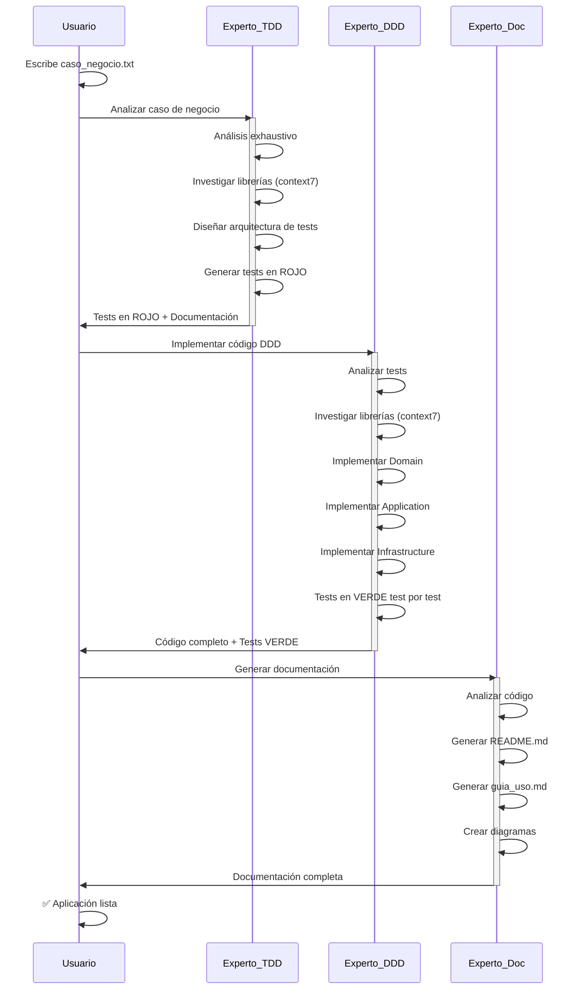
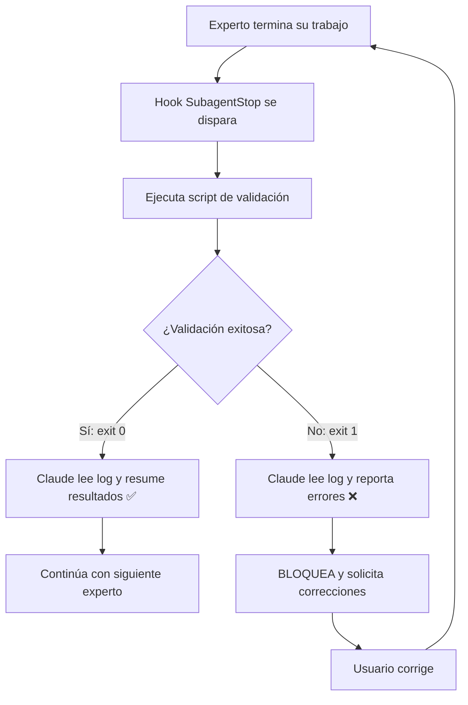

# Mi Equipo Autónomo de Desarrollo

## Descripción del Proyecto

Este proyecto implementa un equipo autónomo de desarrollo de software experto que utiliza Claude Code y metodologías TDD (Test-Driven Development) y DDD (Domain-Driven Design) para implementar casos de negocio de forma exhaustiva y profesional.

## Stack Tecnológico

- **Lenguaje**: Python 3.11+
- **Gestión de Proyectos**: uv (entornos virtuales, dependencias)
- **Testing**: pytest, pytest-cov, pytest-mock
- **Arquitectura**: Domain-Driven Design (DDD)
- **Metodología**: Test-Driven Development (TDD)
- **Documentación**: Markdown con diagramas mermaid

## Equipo de Desarrollo

### Experto TDD
**Ubicación**: `.claude/agents/experto-tdd.md`

**Responsabilidades**:
- Analizar casos de negocio de forma exhaustiva y minuciosa
- Identificar TODOS los requerimientos (funcionales y no funcionales)
- Investigar librerías Python usando context7
- Diseñar arquitectura de tests completa
- Generar tests en ROJO que cubran 100% de requerimientos
- Documentar análisis y decisiones

**Modelo**: Claude Opus 4.5 (máxima capacidad analítica)

**Herramientas**:
- Read, Write, Edit, Bash, Grep, Glob
- context7 para investigación de librerías

**Output**:
- `Documentacion/analisis_tdd.md` - Análisis exhaustivo del caso de negocio
- `Documentacion/herramientas_testing.md` - Librerías investigadas
- `Documentacion/guia_tests.md` - Guía de tests
- Estructura completa de tests en `/tests`
- Todos los tests en ROJO

### Experto DDD
**Ubicación**: `.claude/agents/experto-ddd.md`

**Responsabilidades**:
- Implementar código siguiendo DDD estricto
- Poner tests en VERDE test por test
- Investigar librerías usando context7
- Separar claramente capas (Domain, Application, Infrastructure)
- NO modificar tests bajo ninguna circunstancia
- Reportar incoherencias si las encuentra

**Modelo**: Claude Opus 4.5 (máxima capacidad de implementación)

**Herramientas**:
- Read, Write, Edit, Bash, Grep, Glob
- context7 para investigación de librerías

**Output**:
- Código fuente completo en `src/` con arquitectura DDD
- Todos los tests en VERDE
- `Documentacion/arquitectura_ddd.md`
- Cobertura >= 80%

### Experto Documentación
**Ubicación**: `.claude/agents/experto-documentacion.md`

**Responsabilidades**:
- Generar README.md profesional y completo
- Crear guía de uso exhaustiva paso a paso
- Documentar arquitectura con diagramas
- Crear ejemplos ejecutables
- FAQ y troubleshooting

**Modelo**: Claude Sonnet 4.5 (balance entre calidad y velocidad)

**Herramientas**:
- Read, Write, Grep, Glob, Bash

**Output**:
- `README.md` - Documentación principal
- `guia_uso.md` - Tutorial detallado
- `Documentacion/estructura_proyecto.md` - Organización del código
- Diagramas de arquitectura (mermaid)

## Flujo de Trabajo

### Flujo TDD/DDD Automatizado



### Comandos Disponibles

#### `/iniciar-proyecto <nombre>`
Crea un nuevo proyecto Python con estructura DDD completa.

**Uso**:
```bash
/iniciar-proyecto mi_nueva_app
```

**Resultado**:
- Proyecto inicializado con uv
- Estructura de directorios DDD creada
- Dependencias de testing instaladas
- Archivos `__init__.py` en todos los directorios

#### `/ejecutar-flujo-completo`
Ejecuta el flujo completo de desarrollo TDD/DDD.

**Prerequisito**: Debe existir `Documentacion/caso_negocio.txt`

**Uso**:
```bash
/ejecutar-flujo-completo
```

**Fases**:
1. **Experto TDD**: Genera tests en rojo
2. **Experto DDD**: Implementa código en verde
3. **Experto Documentación**: Genera documentación

**Resultado**:
- Aplicación completamente implementada
- Tests en verde (100% de cobertura de requerimientos)
- Documentación exhaustiva

## Cómo Funcionan los Agentes en Claude Code

### Autonomía y Contexto

Los **subagentes** son asistentes especializados de IA con:
- **Contexto aislado**: Cada agente mantiene su propia ventana de contexto separada
- **Herramientas específicas**: Solo tienen acceso a las herramientas definidas en su frontmatter
- **Ejecución autónoma**: Trabajan de forma independiente una vez invocados

### Comunicación entre Agentes

**IMPORTANTE**: Los agentes NO se comunican directamente entre sí.

La información se pasa mediante el **sistema de archivos**:

```
Experto TDD → Escribe en:
  - Documentacion/analisis_tdd.md
  - Documentacion/herramientas_testing.md
  - Documentacion/guia_tests.md
  - tests/ (todos los archivos de test)

Experto DDD → Lee de TDD y escribe en:
  - src/domain/
  - src/application/
  - src/infrastructure/
  - Documentacion/arquitectura_ddd.md

Experto Documentación → Lee todo y escribe en:
  - README.md
  - guia_uso.md
  - Documentacion/estructura_proyecto.md
```

### Ejecución Secuencial vs Paralela

Claude Code **NO soporta ejecución paralela** de agentes.

Los agentes se ejecutan **secuencialmente**:
1. Agente A se invoca y ejecuta
2. Agente A termina y retorna resultado
3. Agente B se invoca (puede leer outputs de A)
4. Agente B termina y retorna resultado
5. Y así sucesivamente...

El comando `/ejecutar-flujo-completo` implementa exactamente este patrón.

## Principios del Equipo

### 1. Exhaustividad
- El análisis de casos de negocio es minucioso
- Se identifican TODOS los requerimientos
- La cobertura de tests es del 100% de funcionalidades

### 2. Calidad
- Tests antes que código (TDD estricto)
- Arquitectura limpia (DDD)
- Documentación completa

### 3. Ejecución REAL (NO Simulación)

**CRÍTICO**: Los agentes deben EJECUTAR acciones reales, NO solo simularlas en el chat.

#### Herramientas MCP (context7)
- ✅ **BUENO**: Invocar `mcp__context7__resolve-library-id` con parámetros reales
- ✅ **BUENO**: Invocar `mcp__context7__get-library-docs` y leer documentación real
- ❌ **MALO**: "Voy a investigar pytest... [simulo que obtengo /pytest/pytest]"

#### Creación de Archivos
- ✅ **BUENO**: Usar Write tool para crear `tests/unit/test_usuario.py` realmente
- ✅ **BUENO**: Usar Edit tool para modificar archivos existentes
- ❌ **MALO**: Mostrar código en el chat sin usar Write/Edit

#### Ejecución de Comandos
- ✅ **BUENO**: Usar Bash tool para ejecutar `uv run pytest -v`
- ✅ **BUENO**: Leer la salida del comando y verificar resultados
- ❌ **MALO**: "Supongo que los tests pasaron..."

#### Verificación
- ✅ **BUENO**: Usar Read tool para verificar que archivos fueron creados
- ✅ **BUENO**: Confirmar contenido real de archivos
- ❌ **MALO**: Asumir que todo se creó correctamente

**Indicadores de simulación (PROHIBIDOS)**:
- "Voy a crear el archivo..." sin llamar a Write
- "Basándome en mi conocimiento de..." sin invocar context7
- "Los tests deberían pasar..." sin ejecutar pytest con Bash
- Mostrar código completo en markdown sin guardarlo

### 4. Sin Modificaciones a Tests
- Los tests son la especificación
- El Experto DDD NUNCA modifica tests
- Si hay incoherencias, se reportan al usuario

### 5. Coordinación mediante Archivos
- Los agentes se coordinan escribiendo y leyendo archivos REALES
- Cada agente documenta su trabajo usando Write tool
- El sistema de archivos es la "base de datos compartida"

## Convenciones de Código

### Estructura de Proyecto DDD

```
proyecto/
├── src/
│   ├── domain/              # Lógica de negocio pura
│   │   ├── entities/
│   │   ├── value_objects/
│   │   ├── aggregates/
│   │   ├── domain_services/
│   │   └── repositories/    # Interfaces
│   ├── application/         # Casos de uso
│   │   ├── use_cases/
│   │   ├── commands/
│   │   └── queries/
│   └── infrastructure/      # Implementación técnica
│       ├── persistence/
│       │   ├── orm/
│       │   └── repositories/  # Implementaciones
│       ├── adapters/
│       └── config/
├── tests/
│   ├── unit/
│   ├── integration/
│   └── functional/
└── Documentacion/
    ├── caso_negocio.txt
    ├── analisis_tdd.md
    ├── arquitectura_ddd.md
    └── ...
```

### Nomenclatura

- **Archivos**: `snake_case.py`
- **Clases**: `PascalCase`
- **Funciones/Métodos**: `snake_case()`
- **Constantes**: `UPPER_CASE`
- **Privados**: `_prefijo_guion_bajo`

### Estilo de Código

- PEP 8
- Type hints en firmas públicas
- Docstrings en formato Google
- Máximo 100 caracteres por línea

## Herramientas Especiales

### context7 (MCP)

**Propósito**: Obtener documentación actualizada de librerías Python mediante Model Context Protocol

**Configuración**:
El servidor MCP context7 se configura en [.mcp.json](.mcp.json):
```json
{
  "mcpServers": {
    "context7": {
      "command": "npx",
      "args": ["-y", "@upstash/context7-mcp"]
    }
  }
}
```

**Paquete NPM**: [@upstash/context7-mcp](https://www.npmjs.com/package/@upstash/context7-mcp) (versión 1.0.31+)

**Cómo invocar context7**:

Los agentes pueden invocar context7 usando las herramientas MCP disponibles:

1. **Resolver ID de librería**:
   ```
   Herramienta: mcp__context7__resolve-library-id
   Parámetro libraryName: "pytest"
   ```

2. **Obtener documentación**:
   ```
   Herramienta: mcp__context7__get-library-docs
   Parámetros:
   - context7CompatibleLibraryID: "/pytest/pytest"
   - mode: "code" (para API) o "info" (para conceptos)
   - topic: "fixtures" (opcional, para enfocarse)
   ```

**Ejemplo de uso en Experto TDD**:
```markdown
Primero resolveré el ID de pytest:
[Invoca mcp__context7__resolve-library-id con libraryName="pytest"]

Ahora obtendré documentación sobre fixtures:
[Invoca mcp__context7__get-library-docs con:
  - context7CompatibleLibraryID="/pytest/pytest"
  - mode="code"
  - topic="fixtures"
]
```

**Ejemplo de uso en Experto DDD**:
```markdown
Investigando pydantic para implementar value objects:
[Invoca mcp__context7__resolve-library-id con libraryName="pydantic"]
[Invoca mcp__context7__get-library-docs con:
  - context7CompatibleLibraryID="/pydantic/pydantic"
  - mode="code"
  - topic="dataclasses"
]
```

**Beneficios**:
- Documentación siempre actualizada (no depende del knowledge cutoff de Claude)
- Ejemplos de uso correctos directo de la fuente oficial
- Evita uso incorrecto de APIs deprecadas
- Información específica por versión de librería

## Configuración del Proyecto

Este proyecto utiliza varios archivos de configuración para Claude Code:

### [.mcp.json](.mcp.json)
Configura los servidores MCP (Model Context Protocol) disponibles para los agentes:
- **context7**: Servidor para obtener documentación actualizada de librerías Python
- Los agentes pueden invocar herramientas MCP con el prefijo `mcp__context7__`

### [.claude/settings.json](.claude/settings.json)
Configuración global del proyecto:
- **hooks**: Validación automática después de cada experto
- **permissions**: Configuración de permisos base
- **model**: Modelo por defecto (claude-opus-4-5)
- **outputStyles**: Estilos de salida personalizados

### [.claude/settings.local.json](.claude/settings.local.json)
Configuración local de desarrollo (no se sube a git):
- **permissions.allow**: Operaciones permitidas automáticamente
- **permissions.ask**: Operaciones que requieren confirmación
- **permissions.deny**: Operaciones bloqueadas
- Sobrescribe settings.json para desarrollo local

**IMPORTANTE**: Añade a [.gitignore](.gitignore):
```
.claude/settings.local.json
```

### Frontmatter de Agentes
Cada agente tiene configuración en su frontmatter:
```yaml
---
name: experto-tdd
description: |
  Descripción multilinea con "Úsame cuando necesites:"
tools: Read, Write, Edit, Bash, Grep, Glob, TodoWrite
model: claude-opus-4-5
---
```

### Frontmatter de Skills
Cada skill tiene configuración específica:
```yaml
---
name: auto-test
description: "Descripción del skill"
model: claude-sonnet-4-5
allowed-tools: Bash, Read, Grep
---
```

## Cómo Usar el Equipo

### Opción 1: Flujo Manual (Paso a Paso)

1. **Crear proyecto**:
   ```bash
   /iniciar-proyecto mi_proyecto
   ```

2. **Escribir caso de negocio**:
   Crea `Documentacion/caso_negocio.txt` con los requerimientos

3. **Ejecutar Experto TDD**:

   Puedes invocar al agente de dos formas:

   **Forma A - Invocación explícita por nombre**:
   ```
   "Usa el experto-tdd para analizar el caso de negocio"
   ```

   **Forma B - Usando el comando /agents**:
   ```bash
   /agents
   # Selecciona "experto-tdd" del menú interactivo
   ```

   Claude automáticamente delegará al Experto TDD usando el Task tool.

4. **Ejecutar Experto DDD**:

   **Forma A**:
   ```
   "Usa el experto-ddd para implementar el código DDD"
   ```

   **Forma B**:
   ```bash
   /agents
   # Selecciona "experto-ddd"
   ```

5. **Ejecutar Experto Documentación**:

   **Forma A**:
   ```
   "Usa el experto-documentacion para generar la documentación"
   ```

   **Forma B**:
   ```bash
   /agents
   # Selecciona "experto-documentacion"
   ```

### Opción 2: Flujo Automatizado (Todo en Uno)

1. **Crear proyecto**:
   ```bash
   /iniciar-proyecto mi_proyecto
   ```

2. **Escribir caso de negocio**:
   Crea `Documentacion/caso_negocio.txt`

3. **Ejecutar flujo completo**:
   ```bash
   /ejecutar-flujo-completo
   ```

El comando:
- Verifica que existe el caso de negocio
- Invoca al Experto TDD (espera a que termine)
- Invoca al Experto DDD (espera a que termine)
- Invoca al Experto Documentación (espera a que termine)
- Presenta resumen final

**IMPORTANTE**: Los agentes se ejecutan **secuencialmente**, NO en paralelo. Cada agente debe completar su trabajo antes de que el siguiente comience.

## Sistema de Validación Automática (Hooks)

Este proyecto incluye un sistema **exhaustivo y minucioso** de validación automática que se ejecuta después de que cada experto termina su trabajo.

### ¿Qué son los Hooks?

Los **hooks** son scripts que se ejecutan automáticamente en respuesta a eventos específicos. En este proyecto, usamos hooks del tipo `SubagentStop` que se disparan cuando un agente termina su ejecución.

### Scripts de Validación

Ubicados en [.claude/hooks/](.claude/hooks/), cada experto tiene su propio script de validación exhaustiva:

#### 1. [validate-experto-tdd.sh](.claude/hooks/validate-experto-tdd.sh)

**Se ejecuta automáticamente cuando el Experto TDD termina.**

Valida **TODOS** los aspectos del trabajo del Experto TDD:

- ✅ **Estructura de archivos**:
  - Documentacion/analisis_tdd.md
  - Documentacion/herramientas_testing.md
  - Documentacion/guia_tests.md

- ✅ **Contenido de documentación**:
  - Sección "Requerimientos Identificados" completa
  - Matriz de trazabilidad presente
  - Arquitectura de tests documentada
  - Cuenta requerimientos funcionales (RF-XXX) y no funcionales (RNF-XXX)

- ✅ **Estructura de tests**:
  - Directorio tests/ existe
  - Subdirectorios tests/unit/, tests/integration/, tests/functional/
  - Archivo tests/conftest.py presente

- ✅ **Archivos de test**:
  - Al menos un archivo test_*.py
  - Cada test tiene imports correctos
  - Cada test tiene funciones test_*()
  - Los tests tienen docstrings
  - Los tests usan assert

- ✅ **Configuración**:
  - pyproject.toml con configuración de pytest
  - Configuración de cobertura presente

- ✅ **Tests en ROJO**:
  - Ejecuta pytest para confirmar que los tests FALLAN
  - Cuenta tests fallidos

- ✅ **Trazabilidad**:
  - Verifica que cada requerimiento (RF-XXX, RNF-XXX) tiene al menos un test asociado

- ✅ **Calidad de documentación**:
  - Mínimo 50 líneas por documento
  - Estructura markdown correcta

**Resultado**: El script genera un reporte en [.claude/validation_tdd.log](.claude/validation_tdd.log) y retorna:
- `exit 0`: Todo perfecto ✅
- `exit 1`: Hay errores que bloquean continuar ❌

---

#### 2. [validate-experto-ddd.sh](.claude/hooks/validate-experto-ddd.sh)

**Se ejecuta automáticamente cuando el Experto DDD termina.**

Valida **TODOS** los aspectos de la implementación DDD:

- ✅ **Estructura DDD completa**:
  - src/domain/ con subdirectorios entities/, value_objects/, etc.
  - src/application/ con use_cases/
  - src/infrastructure/ (opcional)

- ✅ **Archivos Python**:
  - Todos los directorios tienen __init__.py
  - Cuenta archivos Python generados
  - Cada archivo tiene docstrings
  - Verifica clases y funciones
  - Valida PascalCase en clases
  - Verifica type hints

- ✅ **Principios DDD**:
  - Entidades tienen campo 'id'
  - Value Objects son inmutables (frozen=True)
  - Use Cases tienen método ejecutar() o execute()
  - Repositorios en Domain son interfaces (ABC, abstractmethod)

- ✅ **Dependencias entre capas**:
  - Domain NO importa de Application ni Infrastructure
  - Application NO importa directamente de Infrastructure
  - Detecta violaciones de arquitectura

- ✅ **Tests en VERDE**:
  - Ejecuta pytest -v y verifica que TODOS pasan
  - Cuenta tests pasados vs fallidos

- ✅ **Cobertura >= 80%**:
  - Ejecuta pytest --cov con --cov-fail-under=80
  - Extrae porcentaje exacto de cobertura

- ✅ **Documentación arquitectura**:
  - Documentacion/arquitectura_ddd.md existe
  - Documenta capas Domain y Application
  - Tiene diagramas mermaid

- ✅ **Integridad de tests**:
  - Verifica que los tests NO fueron modificados/eliminados

**Resultado**: Reporte en [.claude/validation_ddd.log](.claude/validation_ddd.log)

---

#### 3. [validate-experto-documentacion.sh](.claude/hooks/validate-experto-documentacion.sh)

**Se ejecuta automáticamente cuando el Experto Documentación termina.**

Valida **TODA** la documentación generada:

- ✅ **README.md**:
  - Secciones obligatorias: Descripción, Arquitectura, Instalación, Uso, Testing, Documentación
  - Tiene ejemplos de código (bloques ```)
  - Tiene diagramas mermaid
  - Tiene badges de estado (opcional)
  - Tabla de contenidos
  - Mínimo 100 líneas
  - Referencia el caso de negocio

- ✅ **guia_uso.md**:
  - Secciones: Introducción, Instalación, Configuración, Ejemplos, Casos de Uso, FAQ, Troubleshooting
  - Ejemplos ejecutables (Python y Bash)
  - Instrucciones paso a paso
  - Mínimo 200 líneas

- ✅ **Documentación adicional**:
  - Documentacion/estructura_proyecto.md (recomendado)
  - Verifica que se mantiene toda la documentación TDD
  - Verifica que se mantiene toda la documentación DDD

- ✅ **Formato Markdown**:
  - Todos los archivos .md tienen títulos
  - No hay enlaces vacíos []()
  - Bloques de código están cerrados correctamente

- ✅ **Enlaces y referencias**:
  - README enlaza a guia_uso.md
  - README enlaza a Documentacion/
  - Coherencia de títulos entre documentos

- ✅ **Ejemplos ejecutables**:
  - Los ejemplos Python tienen imports
  - Los ejemplos tienen comentarios

- ✅ **Cobertura del caso de negocio**:
  - Verifica que cada requerimiento (RF-XXX) está documentado en README o guía

- ✅ **Diagramas**:
  - Cuenta total de diagramas mermaid
  - Verifica tipos de diagramas (sequence, graph, class, etc.)
  - Valida sintaxis mermaid básica

- ✅ **Completitud**:
  - Todos los archivos obligatorios presentes
  - Archivos complementarios (LICENSE, .gitignore)

- ✅ **Calidad del contenido**:
  - No tiene TODOs pendientes
  - No tiene placeholders sin completar

**Resultado**: Reporte en [.claude/validation_doc.log](.claude/validation_doc.log)

---

### Configuración de Hooks en settings.json

Los hooks están configurados en [.claude/settings.json](.claude/settings.json) bajo la sección `SubagentStop`:

```json
{
  "hooks": {
    "SubagentStop": [
      {
        "matcher": "experto-tdd",
        "hooks": [
          {
            "type": "command",
            "command": "chmod +x .claude/hooks/validate-experto-tdd.sh && .claude/hooks/validate-experto-tdd.sh 2>&1 | tee .claude/validation_tdd.log"
          },
          {
            "type": "prompt",
            "prompt": "🔍 VALIDACIÓN AUTOMÁTICA EJECUTADA..."
          }
        ]
      }
      // ... similar para experto-ddd y experto-documentacion
    ]
  }
}
```

### Flujo de Validación Automática



### Logs de Validación

Cada validación genera un log detallado:

- [.claude/validation_tdd.log](.claude/validation_tdd.log): Resultado de validación del Experto TDD
- [.claude/validation_ddd.log](.claude/validation_ddd.log): Resultado de validación del Experto DDD
- [.claude/validation_doc.log](.claude/validation_doc.log): Resultado de validación del Experto Documentación
- [.claude/activity.log](.claude/activity.log): Log general de actividad

### Verificación Manual

También puedes ejecutar los scripts manualmente:

```bash
# Validar trabajo del Experto TDD
./.claude/hooks/validate-experto-tdd.sh

# Validar trabajo del Experto DDD
./.claude/hooks/validate-experto-ddd.sh

# Validar trabajo del Experto Documentación
./.claude/hooks/validate-experto-documentacion.sh
```

## Verificación de Calidad

Gracias al **sistema de validación automática**, cada fase es verificada exhaustivamente:

### Fase TDD
- ✅ Todos los requerimientos identificados
- ✅ Matriz de trazabilidad completa
- ✅ Tests en ROJO correctamente
- ✅ 100% de requerimientos con tests asociados

### Fase DDD
- ✅ Todos los tests pasan (100% verde)
- ✅ Cobertura de código >= 80%
- ✅ Arquitectura DDD correcta
- ✅ Separación de capas clara
- ✅ Sin violaciones de dependencias

### Fase Documentación
- ✅ README.md completo y profesional
- ✅ guia_uso.md exhaustiva con ejemplos
- ✅ Diagramas de arquitectura
- ✅ 100% de funcionalidad documentada
- ✅ Sin incoherencias reportadas

## Solución de Problemas

### El Experto TDD no encuentra el caso de negocio

**Verificar**:
- El archivo existe en `Documentacion/caso_negocio.txt`
- El archivo tiene contenido

### El Experto DDD reporta incoherencias

**Acción**:
1. Revisar la incoherencia en `Documentacion/incoherencias.md`
2. Decidir la solución
3. Actualizar el caso de negocio o los requerimientos
4. Volver a ejecutar desde el Experto TDD

### Los tests no pasan a verde

**Verificar**:
1. El Experto DDD completó su trabajo
2. Ejecutar manualmente: `uv run pytest -v`
3. Ver errores específicos
4. Si hay errores de implementación, volver a invocar al Experto DDD

## Extensibilidad

### Agregar Nuevo Experto

1. Crear archivo en `.claude/agents/nuevo-experto.md`
2. Definir frontmatter:
   ```yaml
   ---
   name: Nuevo Experto
   description: ...
   model: claude-opus-4.5
   tools: [...]
   ---
   ```
3. Escribir instrucciones detalladas
4. Actualizar este CLAUDE.md con el nuevo experto

### Agregar Nuevo Comando

1. Crear archivo en `.claude/commands/nuevo-comando.md`
2. Definir frontmatter con descripción
3. Escribir instrucciones del comando
4. Actualizar este CLAUDE.md

## Referencias

- [Guía Completa de Claude Code](Documentacion/claude-code.md)
- [Prompt de Agentes de Desarrollo](Documentacion/prompt_agentes_desarrollo.txt)
- [Documentación de DDD](https://martinfowler.com/tags/domain%20driven%20design.html)
- [Documentación de TDD](https://martinfowler.com/bliki/TestDrivenDevelopment.html)

---

**Fecha de Creación**: 2025-11-30
**Versión**: 1.0
**Mantenedor**: Equipo de Desarrollo Autónomo
