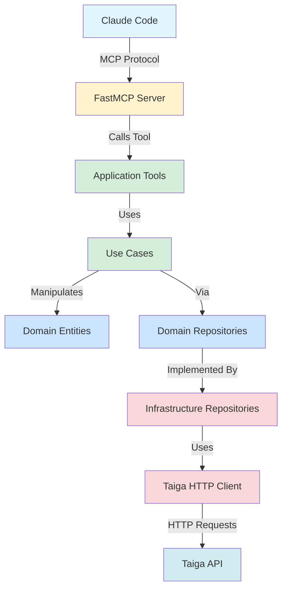

# Análisis Exhaustivo de Mejoras del Servidor MCP para Taiga

**Fecha**: 2025-12-08
**Proyecto**: Taiga MCP Claude Code
**Autor**: Análisis Automatizado
**Versión**: 1.0

---

## Tabla de Contenidos

1. [Resumen Ejecutivo](#1-resumen-ejecutivo)
2. [Contexto del Proyecto](#2-contexto-del-proyecto)
3. [Análisis del Código Actual](#3-análisis-del-código-actual)
4. [Comparación con FastMCP Estándar](#4-comparación-con-fastmcp-estándar)
5. [Problemas Identificados](#5-problemas-identificados)
6. [Mejoras Propuestas](#6-mejoras-propuestas)
7. [Arquitectura Objetivo](#7-arquitectura-objetivo)
8. [Impacto y Beneficios](#8-impacto-y-beneficios)
9. [Glosario de Términos](#9-glosario-de-términos)

---

## 1. Resumen Ejecutivo

### ¿Qué es este documento?

Este documento presenta un **análisis exhaustivo y minucioso** del servidor MCP (Model Context Protocol) para Taiga implementado en Python usando FastMCP. El análisis compara la implementación actual con las mejores prácticas de FastMCP y la documentación oficial de la API de Taiga para identificar oportunidades de mejora.

### ¿Para quién es este documento?

Este documento está escrito para que **cualquier persona, incluso sin conocimientos técnicos profundos**, pueda entender:
- Qué es lo que tenemos actualmente
- Qué problemas existen
- Qué mejoras necesitamos implementar
- Por qué son importantes estas mejoras

### Resumen de Hallazgos Principales

| Categoría | Estado Actual | Problema Principal | Mejora Propuesta |
|-----------|---------------|-------------------|------------------|
| **Arquitectura** | Dual (legacy + nueva) | Duplicación de código y confusión | Unificar en arquitectura DDD completa |
| **Herramientas** | 123+ tools dispersos | Inconsistencia en nombres y formatos | Estandarizar con prefijo `taiga_` |
| **Tipos de Retorno** | Mezclados (Dict/str/List) | Cliente no sabe qué esperar | Normalizar todo a estructuras tipadas |
| **Configuración** | Manual y repetitiva | Difícil mantenimiento | Inyección de dependencias automática |
| **Testing** | Cobertura parcial | Tests frágiles | Suite completa con mocks |
| **Documentación** | Parcial | Difícil onboarding | Completa con ejemplos |

---

## 2. Contexto del Proyecto

### 2.1 ¿Qué es Taiga?

**Taiga** es una plataforma de gestión de proyectos ágiles (open source) que permite:
- Gestionar proyectos con metodologías Scrum/Kanban
- Crear y seguir user stories, epics, tasks, issues
- Organizar milestones (sprints)
- Colaborar en equipo con wikis, adjuntos, comentarios

### 2.2 ¿Qué es MCP (Model Context Protocol)?

**MCP** es un protocolo que permite que asistentes de IA (como Claude) interactúen con herramientas externas de forma estandarizada. Es como un "idioma común" para que la IA pueda:
- Llamar funciones (Tools)
- Leer datos (Resources)
- Usar plantillas de conversación (Prompts)

### 2.3 ¿Qué es FastMCP?

**FastMCP** es una librería Python creada por Prefect que **simplifica enormemente** la creación de servidores MCP. En lugar de escribir código complejo, permite:

```python
# Antes (complejo)
class CalculatorServer:
    def __init__(self):
        self.setup_endpoints()
        self.register_schema()
        # 50 líneas más...

# Con FastMCP (simple)
@mcp.tool
def add(a: int, b: int) -> int:
    """Suma dos números."""
    return a + b
```

### 2.4 ¿Qué hace nuestro Servidor MCP para Taiga?

Nuestro servidor **conecta Claude Code con Taiga**, permitiendo que Claude pueda:
1. Autenticarse en Taiga
2. Listar y crear proyectos
3. Gestionar user stories, epics, tasks, issues
4. Organizar sprints (milestones)
5. Gestionar miembros del equipo
6. Acceder a wikis y adjuntos

**Ejemplo de uso**:
```
Usuario: "Claude, crea un proyecto llamado 'Mi App' en Taiga"
Claude → Llama herramienta taiga_create_project(name="Mi App")
Taiga → Proyecto creado con ID 42
Claude responde: "✓ Proyecto 'Mi App' creado con ID 42"
```

---

## 3. Análisis del Código Actual

### 3.1 Estructura del Proyecto

El proyecto actual tiene **42 archivos Python** organizados en esta estructura:

```
src/
├── application/          # NUEVA ARQUITECTURA (DDD)
│   ├── tools/           # Herramientas de aplicación
│   │   ├── auth_tools.py
│   │   ├── epic_tools.py (28 herramientas)
│   │   ├── issue_tools.py
│   │   └── ...
│   └── use_cases/       # Casos de uso de negocio
│       └── epic_use_cases.py
│
├── domain/              # CAPA DE DOMINIO (DDD)
│   ├── entities/        # Entidades de negocio
│   │   ├── epic.py     # Entidad Epic con validaciones
│   │   └── ...
│   ├── exceptions.py    # Excepciones del dominio
│   └── repositories/    # Interfaces de repositorios
│
├── infrastructure/      # CAPA DE INFRAESTRUCTURA
│   ├── config.py
│   └── repositories/
│       └── epic_repository_impl.py
│
├── tools/               # ARQUITECTURA LEGACY (OLD)
│   ├── auth.py         # ← DUPLICADO con application/tools/auth_tools.py
│   ├── projects.py
│   ├── userstories.py
│   └── ...             # 9 archivos más
│
├── config.py            # Configuración del servidor
├── server.py            # Punto de entrada principal
└── taiga_client.py      # Cliente HTTP para API de Taiga
```

#### Explicación de la Estructura

**Arquitectura LEGACY** (`/src/tools/`):
- **Qué es**: Implementación original, directa y simple
- **Característica**: Código de herramienta y lógica de negocio mezclados
- **Ejemplo**: `auth.py` tiene decoradores `@mcp.tool` junto con lógica de autenticación

**Arquitectura NUEVA** (`/src/application/`):
- **Qué es**: Implementación siguiendo Domain-Driven Design (DDD)
- **Característica**: Separación clara de responsabilidades
- **Ejemplo**: `epic_tools.py` solo registra herramientas, la lógica está en `epic_use_cases.py`

**¿Por qué hay DOS arquitecturas?**
El proyecto está en **transición**. Se comenzó con la arquitectura simple (legacy) y luego se introdujo DDD (nueva), pero **no se completó la migración**. Esto causa:
- ✗ Duplicación de código (AuthTools existe en ambos lados)
- ✗ Confusión sobre dónde agregar nuevas funcionalidades
- ✗ Dificultad para mantener consistencia

### 3.2 Análisis de Herramientas por Módulo

#### 3.2.1 Módulo de Autenticación (`auth.py` y `auth_tools.py`)

**Estado Actual**: ✗ DUPLICADO

**Archivo Legacy** (`/src/tools/auth.py`):
```python
class AuthTools:
    def __init__(self, mcp: FastMCP):
        self.mcp = mcp
        self._auth_token: Optional[str] = None  # Estado interno

    def register_tools(self):
        @self.mcp.tool(name="authenticate", description="...")
        async def authenticate(username: str, password: str) -> Dict[str, Any]:
            # Lógica de autenticación aquí mismo
            async with TaigaAPIClient(self.config) as client:
                result = await client.authenticate(username, password)
                self._auth_token = result.get("auth_token")  # Guarda estado
                return {...}

        # Patrón especial para tests
        self.authenticate = authenticate.fn if hasattr(authenticate, 'fn') else authenticate
```

**Características**:
- ✓ Almacena token como estado interno (`self._auth_token`)
- ✓ Retorna `Dict[str, Any]` (tipo consistente)
- ✗ Mezcla registro de herramienta con lógica de negocio
- ✗ Patrón de acceso directo poco claro (`authenticate.fn`)

**Archivo Nuevo** (`/src/application/tools/auth_tools.py`):
```python
class AuthTools:
    def __init__(self, mcp: FastMCP):
        self.mcp = mcp
        self._register_tools()  # Se auto-registra en __init__

    def _register_tools(self):
        @self.mcp.tool(name="taiga_authenticate", description="...")  # Prefijo taiga_
        async def authenticate_tool(...) -> Dict[str, Any]:
            return await self.authenticate(auth_token=auth_token, **kwargs)

    async def authenticate(self, auth_token: str, **kwargs) -> Dict[str, Any]:
        # Lógica separada en método propio
        client = await self._get_client()
        client.auth_token = auth_token
        async with client:
            return await client.authenticate(**kwargs)
```

**Características**:
- ✓ Separa registro de herramienta (decorator) de implementación (método)
- ✓ Usa prefijo `taiga_` en nombre de herramienta
- ✗ NO almacena token como estado (se pasa como parámetro cada vez)
- ✗ Requiere `auth_token` en cada llamada

**Problema Principal**:
Existen DOS implementaciones diferentes que hacen lo mismo, pero de forma diferente. Esto causa:
- ✗ Confusión sobre cuál usar
- ✗ Tests deben probar ambas
- ✗ Documentación inconsistente

#### 3.2.2 Módulo de Epics (`epic_tools.py`)

**Estado Actual**: ✓ Solo existe en arquitectura nueva (correcto)

**Total de Herramientas**: 28 herramientas completas

**Análisis de Código**:

```python
class EpicTools:
    def __init__(self, mcp: FastMCP):
        self.mcp = mcp
        self.config = TaigaConfig()
        self.client = None  # Cliente reutilizable
        self._register_tools()  # Auto-registro

    def _register_tools(self):
        # EPIC-001: List epics
        @self.mcp.tool(name="taiga_list_epics")
        async def list_epics_tool(
            auth_token: str,
            project: Optional[int] = None,
            status: Optional[int] = None,
            assigned_to: Optional[int] = None
        ) -> List[Dict[str, Any]]:
            kwargs = {}
            # Filtrar parámetros None antes de pasar
            if project is not None:
                kwargs['project'] = project
            if status is not None:
                kwargs['status'] = status
            return await self.list_epics(auth_token=auth_token, **kwargs)

        # EPIC-003: Get epic by ID
        @self.mcp.tool(name="taiga_get_epic")
        async def get_epic_tool(auth_token: str, epic_id: int) -> Dict[str, Any]:
            return await self.get_epic(auth_token=auth_token, epic_id=epic_id)

        # ... 26 herramientas más ...

    # Métodos de implementación separados
    async def list_epics(self, auth_token: str, **kwargs) -> List[Dict[str, Any]]:
        client = await self._get_client()
        client.auth_token = auth_token
        async with client:
            return await client.list_epics(**kwargs)

    async def get_epic(self, auth_token: str, epic_id: int) -> str:  # ← PROBLEMA
        client = await self._get_client()
        client.auth_token = auth_token
        async with client:
            result = await client.get_epic(epic_id)
            return json.dumps(result)  # ← Retorna STRING, no Dict
```

**Características Positivas**:
- ✓ Separación clara entre registro (`_register_tools`) e implementación (`list_epics()`)
- ✓ Usa prefijo consistente `taiga_` en nombres de herramientas
- ✓ Filtrado explícito de parámetros `None` antes de pasar al cliente
- ✓ Cobertura completa de funcionalidad de Epics (28 herramientas)
- ✓ Manejo de excepciones específicas del dominio

**Problemas Identificados**:

**PROBLEMA 1: Tipos de Retorno Inconsistentes**

| Herramienta | Tipo de Retorno Declarado | Tipo Real | ¿Correcto? |
|-------------|---------------------------|-----------|-----------|
| `list_epics()` | `List[Dict[str, Any]]` | `List[Dict]` | ✓ Sí |
| `get_epic()` | `str` | `string (JSON)` | ✗ No |
| `create_epic()` | `Dict[str, Any]` | `Dict` | ✓ Sí |
| `delete_epic()` | `str` | `string (mensaje)` | ✗ No |
| `get_epic_by_ref()` | `str` | `string (JSON)` | ✗ No |

**¿Por qué es un problema?**
Cuando Claude Code llama a `get_epic()`, recibe un **string JSON** en lugar de un **objeto Dict**. Esto significa que Claude tiene que:
1. Parsear el JSON manualmente (`json.loads(result)`)
2. Manejar errores de parseo
3. No tiene type hints para autocompletado

**PROBLEMA 2: Alias de Parámetros No Documentados**

```python
async def get_epic_by_ref(
    self,
    auth_token: str,
    project_id: int = None,  # ← Parámetro oficial
    project: int = None,     # ← ALIAS no documentado
    ref: int = None
) -> str:
    # Manejo de alias
    proj_id = project_id or project  # Acepta ambos nombres
```

**¿Por qué es un problema?**
- ✗ Usuario no sabe que puede usar `project` o `project_id`
- ✗ Genera confusión sobre cuál es el "correcto"
- ✗ Tests deben probar ambos casos

**PROBLEMA 3: Patrones de Nomenclatura Mixtos**

En el mismo archivo:
- Algunos métodos: `list_epic_related_userstories()` (usa `epic` en el nombre)
- Otros métodos: `list_related_userstories()` (NO usa `epic`)
- Algunos métodos: `get_epic_by_ref()` (usa `epic`)
- Otros métodos: `get_by_ref()` (NO usa `epic`)

**¿Por qué es un problema?**
- ✗ Dificulta búsqueda en el código
- ✗ No hay convención clara

#### 3.2.3 Módulo de Proyectos (`projects.py`)

**Estado Actual**: ✓ Solo en arquitectura legacy (por ahora)

**Total de Herramientas**: 6 herramientas

**Análisis de Código**:

```python
class ProjectTools:
    def __init__(self, mcp: FastMCP):
        self.mcp = mcp
        self.config = TaigaConfig()

    def register_tools(self):
        @self.mcp.tool(name="list_projects", description="...")
        async def list_projects(
            auth_token: str,
            member: Optional[int] = None,
            member_id: Optional[int] = None,  # ← ALIAS de member
            is_private: Optional[bool] = None,
            is_backlog_activated: Optional[bool] = None
        ) -> List[Dict[str, Any]]:
            async with TaigaAPIClient(self.config) as client:
                client.auth_token = auth_token
                # Manejo de alias
                member_filter = member if member is not None else member_id
                projects = await client.list_projects(
                    member=member_filter,
                    is_private=is_private,
                    is_backlog_activated=is_backlog_activated
                )

                # Transformación del resultado
                return [
                    {
                        "id": p.get("id"),
                        "name": p.get("name"),
                        "slug": p.get("slug"),
                        "description": p.get("description"),
                        "is_private": p.get("is_private"),
                        "owner": p.get("owner", {}).get("username"),
                        "created_date": p.get("created_date"),
                        "modified_date": p.get("modified_date"),
                        "total_story_points": p.get("total_story_points"),
                        "total_milestones": p.get("total_milestones")
                    }
                    for p in projects
                ]

        # Patrón de acceso directo para tests
        self.list_projects = list_projects.fn if hasattr(list_projects, 'fn') else list_projects
```

**Características Positivas**:
- ✓ Retorno consistente: `List[Dict[str, Any]]`
- ✓ Transformación explícita del resultado (selecciona campos específicos)
- ✓ Manejo de excepciones con `MCPError`
- ✓ Validación de parámetros opcionales

**Problemas Identificados**:

**PROBLEMA 1: Alias de Parámetros Redundantes**

Tanto `member` como `member_id` hacen lo mismo:
```python
member: Optional[int] = None,
member_id: Optional[int] = None,
```

**¿Por qué existe?**
Probablemente para compatibilidad con diferentes versiones de la API de Taiga o para que el usuario elija el nombre que prefiera.

**¿Por qué es un problema?**
- ✗ Duplica documentación
- ✗ Tests deben probar ambos
- ✗ No está claro cuál es el "oficial"

**PROBLEMA 2: Transformación Manual del Resultado**

El código transforma manualmente cada proyecto:
```python
return [
    {
        "id": p.get("id"),
        "name": p.get("name"),
        # ... 8 campos más
    }
    for p in projects
]
```

**¿Por qué es un problema?**
- ✗ Propenso a errores (olvidar actualizar un campo)
- ✗ No hay validación automática de tipos
- ✗ Dificulta agregar/quitar campos

**Solución Ideal**:
Usar una clase Pydantic que defina la estructura:

```python
class ProjectSummary(BaseModel):
    id: int
    name: str
    slug: str
    description: Optional[str]
    is_private: bool
    owner: Optional[str]
    created_date: str
    modified_date: str
    total_story_points: Optional[float]
    total_milestones: int

# Uso
return [ProjectSummary(**p) for p in projects]
```

**PROBLEMA 3: Patrón de Acceso Directo Confuso**

```python
self.list_projects = list_projects.fn if hasattr(list_projects, 'fn') else list_projects
```

**¿Qué hace esto?**
Intenta obtener la función "real" detrás del decorador para poder llamarla directamente en tests sin pasar por el servidor MCP.

**¿Por qué es un problema?**
- ✗ Asume detalles de implementación de FastMCP
- ✗ Si FastMCP cambia su implementación, esto se rompe
- ✗ No está documentado en FastMCP como patrón oficial

**Solución Ideal**:
FastMCP ya proporciona métodos para llamar herramientas directamente:
```python
# En tests
result = await mcp.call_tool("list_projects", {"auth_token": "token"})
```

### 3.3 Análisis del Cliente HTTP (taiga_client.py)

El archivo `taiga_client.py` implementa el cliente HTTP que se comunica con la API REST de Taiga.

**Estructura General**:

```python
class TaigaAPIClient:
    """Cliente HTTP para interactuar con la API de Taiga."""

    def __init__(self, config: Optional[TaigaConfig] = None):
        self.config = config or TaigaConfig()
        self.base_url = self.config.taiga_api_url
        self.auth_token: Optional[str] = None
        self._client: Optional[AsyncClient] = None  # Cliente httpx

    async def __aenter__(self):
        """Context manager: conecta al iniciar."""
        await self.connect()
        return self

    async def __aexit__(self, exc_type, exc_val, exc_tb):
        """Context manager: desconecta al terminar."""
        await self.disconnect()

    async def connect(self):
        """Inicializa el cliente HTTP."""
        if not self._client:
            self._client = httpx.AsyncClient(
                base_url=self.base_url,
                timeout=httpx.Timeout(self.config.timeout),
                headers={
                    "Content-Type": "application/json",
                    "Accept": "application/json"
                }
            )

    async def _make_request(
        self,
        method: str,
        endpoint: str,
        data: Optional[Dict] = None,
        params: Optional[Dict] = None,
        retry_count: int = 0
    ) -> Response:
        """
        Realiza petición HTTP con lógica de reintentos.

        Maneja:
        - Rate limiting (429) con espera y reintentos
        - Token refresh automático en 401
        - Conversión de errores HTTP a excepciones del dominio
        - Backoff exponencial en timeouts
        """
        await self.connect()

        # Agregar headers de autenticación
        request_headers = self._get_headers()

        try:
            # Ejecutar petición según método
            if method == "GET":
                response = await self._client.get(endpoint, params=params, headers=request_headers)
            elif method == "POST":
                response = await self._client.post(endpoint, json=data, params=params, headers=request_headers)
            # ... otros métodos ...

            # Manejo de rate limiting
            if response.status_code == 429:
                if retry_count < self.config.max_retries:
                    retry_after = int(response.headers.get("Retry-After", 5))
                    await asyncio.sleep(retry_after)
                    return await self._make_request(method, endpoint, data, params, retry_count + 1)
                raise RateLimitError(f"Rate limit exceeded after {retry_count} retries")

            # Manejo de autenticación
            if response.status_code == 401:
                if retry_count == 0 and self.refresh_token:
                    await self.refresh_auth_token()
                    return await self._make_request(method, endpoint, data, params, retry_count + 1)
                raise AuthenticationError("Authentication failed")

            # Manejo de errores 404, 403, etc.
            # ...

            response.raise_for_status()
            return response

        except httpx.TimeoutException as e:
            if retry_count < self.config.max_retries:
                await asyncio.sleep(2 ** retry_count)  # Backoff exponencial
                return await self._make_request(method, endpoint, data, params, retry_count + 1)
            raise TaigaAPIError(f"Request timeout after {retry_count} retries")
```

**Métodos HTTP Básicos**:

```python
async def get(self, endpoint: str, params: Optional[Dict] = None) -> Union[Dict, List]:
    """GET request que retorna JSON."""
    response = await self._make_request("GET", endpoint, params=params)
    return response.json()

async def post(self, endpoint: str, data: Optional[Dict] = None) -> Union[Dict, List]:
    """POST request que retorna JSON."""
    response = await self._make_request("POST", endpoint, data=data)
    if response.status_code == 204:  # No content
        return {}
    return response.json()

async def patch(self, endpoint: str, data: Optional[Dict] = None) -> Union[Dict, List]:
    """PATCH request para actualizaciones parciales."""
    response = await self._make_request("PATCH", endpoint, data=data)
    return response.json()

async def delete(self, endpoint: str) -> bool:
    """DELETE request que retorna True si exitoso."""
    response = await self._make_request("DELETE", endpoint)
    return response.status_code in [200, 204]
```

**Métodos Específicos de la API de Taiga**:

El cliente implementa **métodos de conveniencia** para cada endpoint de la API:

```python
# Proyectos
async def list_projects(self, member: Optional[int] = None, ...) -> List[Dict[str, Any]]:
    params = {}
    if member is not None:
        params["member"] = member
    return await self.get("/projects", params=params)

async def get_project(self, project_id: int) -> Dict[str, Any]:
    return await self.get(f"/projects/{project_id}")

async def create_project(self, data: Dict[str, Any]) -> Dict[str, Any]:
    return await self.post("/projects", data=data)

# User Stories
async def list_userstories(self, project: Optional[int] = None, ...) -> List[Dict[str, Any]]:
    params = {}
    if project is not None:
        params["project"] = project
    return await self.get("/userstories", params=params)

# Epics
async def list_epics(self, project: Optional[int] = None, ...) -> List[Dict[str, Any]]:
    params = {}
    if project is not None:
        params["project"] = project
    return await self.get("/epics", params=params)

async def create_epic(self, **kwargs) -> Dict[str, Any]:
    return await self.post("/epics", data=kwargs)

async def update_epic(self, epic_id: int, **kwargs) -> Dict[str, Any]:
    return await self.patch(f"/epics/{epic_id}", data=kwargs)
```

**Características Positivas**:
- ✓ Context manager (`async with`) para gestión automática de conexión
- ✓ Reintentos automáticos con backoff exponencial
- ✓ Refresh automático de token en errores 401
- ✓ Manejo de rate limiting
- ✓ Conversión de errores HTTP a excepciones del dominio
- ✓ Métodos de conveniencia para cada endpoint

**Problemas Identificados**:

**PROBLEMA 1: Métodos con `**kwargs` Poco Claros**

```python
async def create_epic(self, **kwargs) -> Dict[str, Any]:
    return await self.post("/epics", data=kwargs)
```

**¿Por qué es un problema?**
- ✗ No hay type hints para los parámetros
- ✗ IDE no puede autocompletar
- ✗ Usuario no sabe qué parámetros son válidos sin leer documentación

**Solución Ideal**:
```python
async def create_epic(
    self,
    project: int,
    subject: str,
    description: Optional[str] = None,
    color: Optional[str] = None,
    assigned_to: Optional[int] = None,
    status: Optional[int] = None,
    tags: Optional[List[str]] = None
) -> Dict[str, Any]:
    data = {"project": project, "subject": subject}
    if description is not None:
        data["description"] = description
    # ... agregar otros parámetros opcionales
    return await self.post("/epics", data=data)
```

**PROBLEMA 2: Métodos Sincrónicos Legacy**

El cliente tiene algunos métodos síncronos viejos:

```python
def _request(self, method: str, url: str, **kwargs):
    """Make HTTP request with retry logic (synchronous)."""
    import requests  # ← Import dentro de función

    # ... lógica con requests (no async)
```

**¿Por qué es un problema?**
- ✗ Mezcla código async y sync
- ✗ No aprovecha ventajas de async/await
- ✗ Puede causar bloqueos en event loop

**PROBLEMA 3: Duplicación de Lógica de Construcción de Params**

En cada método, se repite este patrón:

```python
async def list_epics(self, project: Optional[int] = None, status: Optional[int] = None, ...) -> List:
    params = {}
    if project is not None:
        params["project"] = project
    if status is not None:
        params["status"] = status
    # ... 5 parámetros más
    return await self.get("/epics", params=params)
```

**¿Por qué es un problema?**
- ✗ Repetitivo (mismo código en 50+ métodos)
- ✗ Propenso a errores (olvidar agregar un parámetro)

**Solución Ideal**:
```python
def _build_params(**kwargs) -> Dict[str, Any]:
    """Construye dict de params filtrando valores None."""
    return {k: v for k, v in kwargs.items() if v is not None}

async def list_epics(self, project: Optional[int] = None, ...) -> List:
    params = _build_params(project=project, status=status, ...)
    return await self.get("/epics", params=params)
```

### 3.4 Análisis de Configuración (config.py)

El archivo `config.py` define las configuraciones usando Pydantic:

```python
from pydantic_settings import BaseSettings
from pydantic import Field, field_validator

class TaigaConfig(BaseSettings):
    """Configuración para el cliente de Taiga."""

    # URLs y credenciales
    taiga_api_url: str = Field(..., description="URL base de la API de Taiga")
    taiga_username: str = Field(..., description="Usuario (email)")
    taiga_password: str = Field(..., description="Contraseña")
    taiga_auth_token: Optional[str] = Field(None, description="Token de autenticación")

    # Timeouts
    timeout: float = Field(default=30.0, description="Timeout en segundos")
    auth_timeout: float = Field(default=30.0, description="Timeout para autenticación")

    # Reintentos
    max_retries: int = Field(default=3, ge=0, le=10, description="Máximo de reintentos")
    max_auth_retries: int = Field(default=3, description="Reintentos de autenticación")

    class Config:
        env_file = ".env"
        env_file_encoding = "utf-8"
        extra = "ignore"

    @field_validator("taiga_api_url")
    @classmethod
    def validate_api_url(cls, v: str) -> str:
        """Valida que la URL sea http o https."""
        if not v.startswith(("http://", "https://")):
            raise ValueError("API URL debe comenzar con http:// o https://")
        return v.rstrip("/")  # Eliminar trailing slash

    @field_validator("taiga_username")
    @classmethod
    def validate_username(cls, v: str) -> str:
        """Valida que el username sea un email."""
        if "@" not in v:
            raise ValueError("Username debe ser un email válido")
        return v

    @field_validator("taiga_password")
    @classmethod
    def validate_password(cls, v: str) -> str:
        """Valida longitud mínima de contraseña."""
        if len(v) < 6:
            raise ValueError("Password debe tener al menos 6 caracteres")
        return v

    def has_credentials(self) -> bool:
        """Verifica si hay credenciales disponibles."""
        return bool(self.taiga_username and self.taiga_password)

    def validate_for_authentication(self) -> None:
        """Valida que la configuración es suficiente para autenticación."""
        if not self.has_credentials():
            raise ValueError("Username y password son requeridos para autenticación")

    def to_dict(self, include_secrets: bool = False) -> Dict[str, Any]:
        """Convierte a dict, opcionalmente ocultando secretos."""
        data = {
            "taiga_api_url": self.taiga_api_url,
            "taiga_username": self.taiga_username,
            "timeout": self.timeout,
            "max_retries": self.max_retries
        }
        if include_secrets:
            data["taiga_password"] = self.taiga_password
            data["taiga_auth_token"] = self.taiga_auth_token
        else:
            data["taiga_password"] = "***"
            data["taiga_auth_token"] = "***" if self.taiga_auth_token else None
        return data
```

**Características Positivas**:
- ✓ Usa Pydantic para validación automática
- ✓ Carga desde variables de entorno (.env)
- ✓ Validadores personalizados para cada campo
- ✓ Método para verificar credenciales
- ✓ Serialización segura (oculta secretos por defecto)

**Problemas Identificados**:

**PROBLEMA 1: Múltiples Clases de Config Redundantes**

Existen 3 clases similares:
- `MCPConfig`: Configuración del servidor MCP
- `ServerConfig`: También configuración del servidor MCP (DUPLICADO)
- `TaigaConfig`: Configuración del cliente Taiga

**¿Por qué es un problema?**
- ✗ `MCPConfig` y `ServerConfig` tienen los mismos campos
- ✗ No está claro cuál usar
- ✗ Confusión y duplicación

**PROBLEMA 2: Validación de Email No Robusta**

```python
if "@" not in v:
    raise ValueError("Username debe ser un email válido")
```

**¿Por qué es un problema?**
- ✗ `"@@"` pasaría la validación pero no es email válido
- ✗ `"user@"` también pasaría
- ✗ No valida formato completo de email

**Solución Ideal**:
```python
from pydantic import EmailStr

taiga_username: EmailStr = Field(..., description="Usuario (email)")
```

**PROBLEMA 3: Campos Opcionales vs Requeridos No Claros**

```python
taiga_auth_token: Optional[str] = Field(None, ...)
```

**¿Cuándo es opcional?**
- Si el usuario ya tiene un token (ej: desde sesión anterior)
- Si va a autenticarse con username/password

**¿Por qué es un problema?**
- ✗ No está documentado en qué casos usar uno u otro
- ✗ No hay validación de "al menos uno debe estar presente"

**Solución Ideal**:
```python
@model_validator(mode='after')
def check_auth_method(self) -> 'TaigaConfig':
    """Valida que haya al menos un método de autenticación."""
    has_credentials = self.taiga_username and self.taiga_password
    has_token = self.taiga_auth_token

    if not (has_credentials or has_token):
        raise ValueError(
            "Debe proporcionar username/password O auth_token"
        )
    return self
```

### 3.5 Análisis de Excepciones (domain/exceptions.py)

Las excepciones personalizadas están bien diseñadas:

```python
class DomainException(Exception):
    """Excepción base del dominio."""

    def __init__(self, message: str, details: Optional[Dict[str, Any]] = None):
        super().__init__(message)
        self.message = message
        self.details = details or {}

class AuthenticationError(DomainException):
    """Error de autenticación."""
    pass

class TaigaAPIError(DomainException):
    """Error de la API de Taiga."""

    def __init__(
        self,
        message: str,
        status_code: Optional[int] = None,
        response_body: Optional[str] = None
    ):
        super().__init__(message)
        self.status_code = status_code
        self.response_body = response_body

class ResourceNotFoundError(DomainException):
    """Recurso no encontrado (404)."""
    pass

class PermissionDeniedError(DomainException):
    """Permiso denegado (403)."""
    pass

class RateLimitError(DomainException):
    """Límite de tasa excedido (429)."""
    pass

class ConcurrencyError(DomainException):
    """Error de concurrencia (conflict de versión)."""
    pass
```

**Características Positivas**:
- ✓ Jerarquía clara con clase base común
- ✓ Cada excepción tiene propósito específico
- ✓ Permite agregar detalles adicionales
- ✓ Mapeo claro de códigos HTTP a excepciones

**No se identifican problemas significativos** en este módulo. Está bien diseñado.

---

## 4. Comparación con FastMCP Estándar

### 4.1 Patrón Estándar de FastMCP

Según la documentación oficial de FastMCP, así es como se deben implementar herramientas:

#### Ejemplo Básico (Recomendado por FastMCP)

```python
from fastmcp import FastMCP

mcp = FastMCP(name="CalculatorServer")

@mcp.tool
def add(a: int, b: int) -> int:
    """Suma dos números enteros."""
    return a + b

@mcp.tool
async def fetch_data(url: str) -> dict:
    """Obtiene datos desde una URL (async)."""
    async with aiohttp.ClientSession() as session:
        async with session.get(url) as response:
            return await response.json()
```

#### Ejemplo Avanzado con Validación

```python
from typing import Annotated
from pydantic import Field

@mcp.tool(
    name="search_database",
    description="Busca en la base de datos con filtros",
    tags={"database", "search"}
)
def search_database(
    query: Annotated[str, Field(description="Término de búsqueda", min_length=1)],
    limit: Annotated[int, Field(description="Máximo de resultados", ge=1, le=100)] = 10
) -> list[dict]:
    """Busca productos en la base de datos."""
    # Implementación
    return [{"id": 1, "name": "Product"}]
```

#### Ejemplo con Tipos de Retorno Estructurados

```python
from pydantic import BaseModel

class UserProfile(BaseModel):
    id: int
    name: str
    email: str

@mcp.tool
def get_user(user_id: int) -> UserProfile:
    """Obtiene perfil de usuario con salida estructurada."""
    return UserProfile(
        id=user_id,
        name="Alice",
        email="alice@example.com"
    )
```

### 4.2 Comparación: Nuestro Código vs FastMCP Estándar

| Aspecto | FastMCP Estándar | Nuestro Código Actual | ¿Cumple? |
|---------|-----------------|----------------------|----------|
| **Decorador** | `@mcp.tool` directo sobre función | `@self.mcp.tool` dentro de clase | ✓ Sí (permitido) |
| **Función/Método** | Función independiente | Dentro de método `register_tools()` | ✓ Sí (permitido) |
| **Tipos de Retorno** | Estructurados (Dict, Pydantic, etc.) | **Mezclados** (Dict/str/List) | ✗ **No consistente** |
| **Parámetros** | Type hints claros | **Algunos con alias redundantes** | ⚠ Parcial |
| **Nombre de Tool** | Simple (`add`, `search`) | **Prefijo mixto** (`taiga_*` vs sin prefijo) | ✗ **Inconsistente** |
| **Acceso a Contexto** | `ctx: Context` como parámetro | NO utilizado | ⚠ Oportunidad |
| **Manejo de Errores** | `raise ToolError(...)` | ✓ Usa `ToolError` correctamente | ✓ Sí |
| **Async** | Preferido para I/O | ✓ Usa `async def` consistentemente | ✓ Sí |

### 4.3 Análisis Detallado de Diferencias

#### 4.3.1 Decoración de Herramientas

**FastMCP Estándar**:
```python
mcp = FastMCP(name="MyServer")

@mcp.tool
def simple_operation(x: int) -> int:
    return x * 2
```

**Nuestro Código (Legacy)**:
```python
class AuthTools:
    def __init__(self, mcp: FastMCP):
        self.mcp = mcp

    def register_tools(self):
        @self.mcp.tool(name="authenticate")
        async def authenticate(username: str, password: str) -> Dict[str, Any]:
            # Lógica
            pass
```

**¿Es válido nuestro enfoque?**
✓ **SÍ**, FastMCP permite decorar funciones dentro de clases. No es el patrón más simple, pero es válido.

**¿Por qué usamos clases?**
- ✓ Organización: Agrupar herramientas relacionadas (Auth, Projects, etc.)
- ✓ Estado compartido: `self._auth_token` en AuthTools
- ✓ Inyección de dependencias: Pasar `mcp` al constructor

**Recomendación FastMCP**:
La documentación sugiere usar clases solo cuando sea necesario. Para servidores simples, funciones independientes son más claras.

#### 4.3.2 Tipos de Retorno

**FastMCP Estándar**:
```python
from fastmcp.tools.tool import ToolResult

# Opción 1: Retorno simple (automático)
@mcp.tool
def get_data() -> dict:
    return {"key": "value"}

# Opción 2: Control total con ToolResult
@mcp.tool
def advanced_tool() -> ToolResult:
    return ToolResult(
        content=[TextContent(type="text", text="Summary")],
        structured_content={"data": "value"},
        meta={"execution_time_ms": 145}
    )
```

**Nuestro Código**:
```python
# En projects.py (CORRECTO)
async def list_projects(...) -> List[Dict[str, Any]]:
    return [{"id": 1, "name": "Project"}]

# En epic_tools.py (INCORRECTO - retorna string)
async def get_epic(...) -> str:
    result = await client.get_epic(epic_id)
    return json.dumps(result)  # ← Retorna JSON string
```

**¿Por qué es un problema en epic_tools?**
FastMCP convierte automáticamente:
- `dict` → Contenido estructurado (JSON)
- `str` → Contenido de texto plano

Al retornar `json.dumps()`, estamos retornando un **string que CONTIENE JSON**, no un objeto JSON. Claude Code lo recibe como texto y debe parsearlo manualmente.

**Solución**:
```python
async def get_epic(...) -> Dict[str, Any]:  # ← Cambiar tipo de retorno
    result = await client.get_epic(epic_id)
    return result  # ← Retornar dict directamente, NO json.dumps
```

#### 4.3.3 Uso del Contexto (Context)

**FastMCP Estándar**:
```python
from fastmcp import Context

@mcp.tool
async def process_file(file_uri: str, ctx: Context) -> dict:
    """Procesa archivo con logging y progreso."""
    # Logging
    await ctx.info(f"Procesando {file_uri}")

    # Reporte de progreso
    await ctx.report_progress(progress=50, total=100)

    # Leer recursos
    resource = await ctx.read_resource(file_uri)

    # Llamar prompts
    response = await ctx.get_prompt("analyze_data", {"data": resource})

    return {"status": "completed"}
```

**Nuestro Código**:
```python
@self.mcp.tool(name="list_projects")
async def list_projects(auth_token: str, ...) -> List[Dict[str, Any]]:
    # NO usa Context
    async with TaigaAPIClient(self.config) as client:
        client.auth_token = auth_token
        projects = await client.list_projects()
        return projects
```

**Oportunidades Perdidas**:
- ✗ No hay logging de operaciones para debugging
- ✗ No hay reporte de progreso para operaciones largas
- ✗ No se utilizan recursos MCP (podrían cachear datos de Taiga)

**Mejoras Posibles**:
```python
@self.mcp.tool(name="taiga_list_projects")
async def list_projects(auth_token: str, ctx: Context, ...) -> List[Dict[str, Any]]:
    await ctx.info("Obteniendo lista de proyectos de Taiga")

    async with TaigaAPIClient(self.config) as client:
        client.auth_token = auth_token
        projects = await client.list_projects()

    await ctx.info(f"Se obtuvieron {len(projects)} proyectos")
    return projects
```

#### 4.3.4 Nomenclatura de Herramientas

**FastMCP Recomendado**:
- Nombres simples y descriptivos
- Verbos de acción: `get`, `create`, `update`, `delete`
- Sin prefijos redundantes si el servidor es específico

**Ejemplo**:
```python
# Para un servidor específico de GitHub
mcp = FastMCP(name="GitHubServer")

@mcp.tool
def create_issue(repo: str, title: str) -> dict:
    # No necesita llamarse "github_create_issue"
    # El contexto del servidor ya indica que es GitHub
    pass
```

**Nuestro Código**:
- `/src/tools/` (Legacy): Sin prefijo → `authenticate`, `list_projects`
- `/src/application/tools/` (Nuevo): Con prefijo → `taiga_list_epics`, `taiga_create_epic`

**¿Cuál es correcto?**

**Con Prefijo** (`taiga_*`):
- ✓ Claridad absoluta sobre qué sistema se está usando
- ✓ Evita conflictos si hay múltiples servidores montados
- ✗ Más verboso (más caracteres)

**Sin Prefijo**:
- ✓ Más conciso
- ✓ Suficiente si el servidor es exclusivamente para Taiga
- ✗ Puede confundir si se integra con otros servidores

**Recomendación**:
Usar prefijo `taiga_` **solo** si anticipamos que el servidor se compondrá con otros servidores MCP. Si es un servidor standalone, no es necesario.

### 4.4 Características de FastMCP No Utilizadas

FastMCP ofrece muchas características que nuestro código **NO está aprovechando**:

#### 4.4.1 Structured Output (Salida Estructurada)

**Qué es**: Definir esquemas Pydantic para las respuestas.

**Ejemplo de FastMCP**:
```python
from pydantic import BaseModel

class ProjectInfo(BaseModel):
    id: int
    name: str
    slug: str
    is_private: bool

@mcp.tool
def get_project(project_id: int) -> ProjectInfo:
    """Retorna información del proyecto con esquema validado."""
    return ProjectInfo(
        id=project_id,
        name="My Project",
        slug="my-project",
        is_private=True
    )
```

**Beneficios**:
- ✓ Validación automática de salida
- ✓ Documentación automática del esquema
- ✓ Type hints para el cliente
- ✓ Serialización automática

**Estado en Nuestro Código**:
✗ **NO se utiliza**. Todas las herramientas retornan `Dict[str, Any]` sin validación.

#### 4.4.2 Tags y Filtrado

**Qué es**: Categorizar herramientas con tags para organización y filtrado.

**Ejemplo de FastMCP**:
```python
@mcp.tool(tags={"database", "read-only"})
def list_users() -> list:
    pass

@mcp.tool(tags={"database", "write"})
def create_user(name: str) -> dict:
    pass

# Al crear servidor, filtrar por tags
mcp = FastMCP(
    name="MyServer",
    include_tags={"read-only"}  # Solo exponer herramientas read-only
)
```

**Beneficios**:
- ✓ Organización lógica
- ✓ Filtrado dinámico de herramientas
- ✓ Útil para diferentes modos de operación (read-only vs full-access)

**Estado en Nuestro Código**:
✗ **NO se utiliza**. Ninguna herramienta tiene tags.

#### 4.4.3 Annotations (Anotaciones)

**Qué es**: Metadata adicional sobre comportamiento de la herramienta.

**Ejemplo de FastMCP**:
```python
@mcp.tool(
    annotations={
        "readOnlyHint": True,        # No modifica estado
        "destructiveHint": False,    # No es destructiva
        "idempotentHint": True       # Múltiples llamadas = mismo resultado
    }
)
def get_project(project_id: int) -> dict:
    pass

@mcp.tool(
    annotations={
        "destructiveHint": True   # Operación destructiva
    }
)
def delete_project(project_id: int) -> bool:
    pass
```

**Beneficios**:
- ✓ Cliente puede tomar decisiones informadas
- ✓ UI puede mostrar advertencias para operaciones destructivas
- ✓ Optimizaciones (cachear operaciones read-only)

**Estado en Nuestro Código**:
✗ **NO se utiliza**. Ninguna herramienta tiene annotations.

#### 4.4.4 Resources (Recursos MCP)

**Qué es**: Exponer datos como recursos de solo lectura con URIs.

**Ejemplo de FastMCP**:
```python
# Recurso estático
@mcp.resource("config://server")
def get_server_config() -> dict:
    return {"version": "1.0", "mode": "production"}

# Recurso dinámico con template
@mcp.resource("project://{project_id}/summary")
def get_project_summary(project_id: int) -> dict:
    return {
        "id": project_id,
        "total_stories": 42,
        "completed": 30
    }
```

**Beneficios**:
- ✓ Acceso de solo lectura optimizado
- ✓ Cacheo automático por URI
- ✓ Navegación de recursos relacionados

**Estado en Nuestro Código**:
✗ **NO se utiliza**. No hay recursos MCP definidos, solo tools.

**Oportunidad**:
Muchos endpoints de lectura de Taiga podrían exponerse como recursos:
- `taiga://project/{id}` → Información del proyecto
- `taiga://project/{id}/stats` → Estadísticas del proyecto
- `taiga://epic/{id}` → Información del epic

#### 4.4.5 Prompts (Plantillas)

**Qué es**: Plantillas reutilizables para interacciones con LLMs.

**Ejemplo de FastMCP**:
```python
@mcp.prompt
def analyze_project(project_id: int) -> str:
    """Genera prompt para analizar un proyecto."""
    project = get_project(project_id)
    return f"""
    Por favor analiza este proyecto de Taiga:
    - Nombre: {project['name']}
    - Total stories: {project['total_stories']}
    - Progreso: {project['progress']}%

    Identifica:
    1. Riesgos potenciales
    2. Recomendaciones de mejora
    3. Próximos pasos sugeridos
    """
```

**Beneficios**:
- ✓ Reutilización de prompts complejos
- ✓ Parametrización dinámica
- ✓ Guías para el LLM

**Estado en Nuestro Código**:
✗ **NO se utiliza**. No hay prompts definidos.

**Oportunidad**:
Podríamos crear prompts útiles:
- `analyze_sprint` → Analizar progreso de un sprint
- `suggest_tasks` → Sugerir tareas para una user story
- `review_epic` → Revisar completitud de un epic

---

## 5. Problemas Identificados

Esta sección resume **TODOS** los problemas encontrados en el código actual, organizados por categoría y priorizados por impacto.

### 5.1 Problemas Arquitectónicos (CRÍTICO)

#### PROBLEMA A1: Arquitectura Dual Inconsistente

**Descripción**:
Coexisten dos arquitecturas diferentes sin una estrategia clara de migración:
- **Legacy** (`/src/tools/`): 9 archivos con lógica mezclada
- **Nueva** (`/src/application/`): Arquitectura DDD parcialmente implementada

**Impacto**: 🔴 CRÍTICO
- ✗ Confusión sobre dónde agregar nueva funcionalidad
- ✗ Código duplicado (AuthTools existe en ambos lados)
- ✗ Inconsistencia en patrones de implementación
- ✗ Dificulta onboarding de nuevos desarrolladores

**Ejemplo Concreto**:
```
Desarrollador necesita agregar nueva funcionalidad para Wikis.

¿Dónde la agrega?
- Opción 1: /src/tools/wiki_tools.py (siguiendo legacy)
- Opción 2: /src/application/tools/wiki_tools.py (siguiendo nueva arquitectura)

No hay guía clara → Se elige arbitrariamente → Más inconsistencia
```

**Ubicación en Código**:
- `/src/tools/` vs `/src/application/tools/`

#### PROBLEMA A2: Ausencia de Capa de Dominio Completa

**Descripción**:
La capa de dominio (`/src/domain/`) solo está implementada para **Epics**, no para otras entidades.

**Qué falta**:
- Entidades: `Project`, `UserStory`, `Task`, `Issue`, `Milestone`, `Member`, etc.
- Value Objects: `Email`, `ProjectStatus`, `TaskStatus`, etc.
- Domain Services: Lógica de negocio compleja

**Impacto**: 🟠 ALTO
- ✗ Validaciones de negocio dispersas en el código
- ✗ No hay representación consistente de conceptos del dominio
- ✗ Dificulta implementar reglas de negocio complejas

**Ejemplo de Problema**:
```python
# En projects.py (sin entidad de dominio)
async def create_project(auth_token: str, name: str, ...) -> Dict[str, Any]:
    # Validación manual e inconsistente
    if not name:
        raise ValueError("Name is required")
    if len(name) > 500:
        raise ValueError("Name too long")
    # ... más validaciones dispersas

# DEBERÍA SER (con entidad de dominio)
class Project(BaseModel):
    name: str = Field(..., min_length=1, max_length=500)
    # Validaciones centralizadas en la entidad
```

**Ubicación en Código**:
- `/src/domain/entities/` (solo tiene epic.py)

#### PROBLEMA A3: Ausencia de Inyección de Dependencias

**Descripción**:
Las dependencias se crean manualmente en cada clase sin un contenedor de DI.

**Ejemplo Actual**:
```python
class ProjectTools:
    def __init__(self, mcp: FastMCP):
        self.mcp = mcp
        self.config = TaigaConfig()  # ← Se crea aquí directamente

class TaigaAPIClient:
    def __init__(self, config: Optional[TaigaConfig] = None):
        self.config = config or TaigaConfig()  # ← Se crea aquí también
```

**Impacto**: 🟠 ALTO
- ✗ Dificulta testing (no se pueden inyectar mocks fácilmente)
- ✗ Configuración duplicada en múltiples lugares
- ✗ No hay control centralizado de ciclo de vida de objetos

**Solución Ideal** (con Dependency Injector):
```python
from dependency_injector import containers, providers

class Container(containers.DeclarativeContainer):
    config = providers.Singleton(TaigaConfig)
    client = providers.Factory(TaigaAPIClient, config=config)
    auth_tools = providers.Factory(AuthTools, client=client)

# Uso
container = Container()
auth_tools = container.auth_tools()
```

### 5.2 Problemas de Consistencia (ALTO)

#### PROBLEMA C1: Tipos de Retorno Inconsistentes

**Descripción**:
Las herramientas retornan tipos diferentes sin un patrón claro.

**Evidencia**:

| Herramienta | Tipo Declarado | Tipo Real | ¿Consistente? |
|-------------|----------------|-----------|---------------|
| `list_projects()` | `List[Dict[str, Any]]` | Lista de dicts | ✓ Sí |
| `get_project()` | `Dict[str, Any]` | Dict | ✓ Sí |
| `get_epic()` | `str` | String JSON | ✗ **No** |
| `delete_epic()` | `str` | String mensaje | ✗ **No** |
| `list_epic_related_userstories()` | `List[Dict[str, Any]]` | Lista | ✓ Sí |
| `get_epic_by_ref()` | `str` | String JSON | ✗ **No** |

**Impacto**: 🟠 ALTO
- ✗ Cliente no sabe qué tipo esperar
- ✗ Requiere parseo manual en algunos casos
- ✗ Dificulta type checking estático

**Ubicación en Código**:
- `/src/application/tools/epic_tools.py`: Líneas 394, 421, 525, 559, 602

#### PROBLEMA C2: Nomenclatura de Herramientas Inconsistente

**Descripción**:
Los nombres de herramientas no siguen una convención uniforme.

**Evidencia**:

| Módulo | Patrón de Nombre | Ejemplos |
|--------|------------------|----------|
| `/src/tools/auth.py` | Sin prefijo | `authenticate`, `refresh_token` |
| `/src/tools/projects.py` | Sin prefijo | `list_projects`, `create_project` |
| `/src/application/tools/epic_tools.py` | **Con prefijo** `taiga_` | `taiga_list_epics`, `taiga_create_epic` |

**Impacto**: 🟡 MEDIO
- ✗ Confusión sobre convención a seguir
- ✗ Inconsistencia en documentación generada
- ✗ Dificulta búsqueda y descubrimiento

#### PROBLEMA C3: Alias de Parámetros Redundantes

**Descripción**:
Múltiples parámetros que significan lo mismo.

**Ejemplos**:

```python
# En list_projects
async def list_projects(
    auth_token: str,
    member: Optional[int] = None,       # ← ALIAS 1
    member_id: Optional[int] = None,    # ← ALIAS 2 (mismo significado)
    ...
)

# En get_epic_by_ref
async def get_epic_by_ref(
    auth_token: str,
    project_id: int = None,  # ← ALIAS 1
    project: int = None,     # ← ALIAS 2 (mismo significado)
    ref: int = None
)
```

**Impacto**: 🟡 MEDIO
- ✗ Confunde al usuario ("¿cuál debo usar?")
- ✗ Aumenta superficie de API sin valor
- ✗ Tests deben cubrir todos los alias

**Ubicación en Código**:
- `/src/tools/projects.py`: Línea 47
- `/src/application/tools/epic_tools.py`: Línea 421

### 5.3 Problemas de Implementación (MEDIO)

#### PROBLEMA I1: Transformación Manual de Resultados

**Descripción**:
Los resultados de la API se transforman manualmente en lugar de usar modelos validados.

**Ejemplo**:
```python
async def list_projects(...) -> List[Dict[str, Any]]:
    projects = await client.list_projects(...)

    # Transformación manual (propenso a errores)
    return [
        {
            "id": p.get("id"),
            "name": p.get("name"),
            "slug": p.get("slug"),
            # ... 7 campos más
        }
        for p in projects
    ]
```

**Problemas**:
- ✗ Si API agrega/quita campo, hay que actualizar manualmente
- ✗ No hay validación de tipos
- ✗ Repetitivo (mismo patrón en 50+ herramientas)

**Impacto**: 🟡 MEDIO
- Propenso a bugs cuando API cambia
- Código repetitivo y verboso

**Ubicación en Código**:
- `/src/tools/projects.py`: Líneas 79-93

#### PROBLEMA I2: Métodos con `**kwargs` Sin Tipos

**Descripción**:
Uso de `**kwargs` sin type hints claros.

**Ejemplo**:
```python
async def create_epic(self, **kwargs) -> Dict[str, Any]:
    return await self.post("/epics", data=kwargs)
```

**Problemas**:
- ✗ IDE no puede autocompletar
- ✗ Usuario no sabe qué parámetros son válidos
- ✗ No hay validación de parámetros requeridos

**Impacto**: 🟡 MEDIO
- Mala experiencia de desarrollo
- Errores descubiertos solo en runtime

**Ubicación en Código**:
- `/src/taiga_client.py`: Línea 1039

#### PROBLEMA I3: Context Managers No Reutilizables

**Descripción**:
Se crea un nuevo cliente HTTP en cada llamada.

**Ejemplo**:
```python
@self.mcp.tool(name="list_projects")
async def list_projects(...):
    # Se crea un nuevo cliente cada vez
    async with TaigaAPIClient(self.config) as client:
        client.auth_token = auth_token
        return await client.list_projects()
```

**Problemas**:
- ✗ Overhead de creación de conexión HTTP
- ✗ No se reutilizan conexiones keep-alive
- ✗ Ineficiente para llamadas consecutivas

**Impacto**: 🟢 BAJO (pero optimizable)
- Performance ligeramente peor
- Más uso de recursos

**Solución Ideal**:
```python
class ProjectTools:
    def __init__(self, mcp: FastMCP, client: TaigaAPIClient):
        self.mcp = mcp
        self.client = client  # Cliente inyectado y reutilizable
```

#### PROBLEMA I4: Patrón de Acceso Directo No Oficial

**Descripción**:
Se usa un patrón no documentado para acceder a funciones decoradas.

**Ejemplo**:
```python
@self.mcp.tool(name="authenticate")
async def authenticate(...):
    pass

# Patrón no oficial
self.authenticate = authenticate.fn if hasattr(authenticate, 'fn') else authenticate
```

**Problemas**:
- ✗ Asume detalles de implementación de FastMCP
- ✗ Si FastMCP cambia, esto se rompe
- ✗ No está documentado como patrón oficial

**Impacto**: 🟡 MEDIO
- Código frágil
- Mantenimiento complicado

**Ubicación en Código**:
- `/src/tools/auth.py`: Líneas 99, 150, 198, 221
- `/src/tools/projects.py`: Líneas 103, 170, 242, 325, 380, 432

### 5.4 Problemas de Testing (MEDIO)

#### PROBLEMA T1: Falta de Tests Unitarios Completos

**Descripción**:
No hay cobertura completa de tests para todas las herramientas.

**Estado Actual**:
- ✓ Tests para Epic tools (parcial)
- ✗ Tests faltantes para muchos módulos

**Impacto**: 🟠 ALTO
- Refactorización arriesgada
- Bugs no detectados

#### PROBLEMA T2: Tests Acoplados a Implementación

**Descripción**:
Tests que dependen de detalles internos en lugar de comportamiento.

**Ejemplo**:
```python
# Test acoplado
def test_authenticate():
    tools = AuthTools(mcp)
    # Acceso directo a implementación interna
    result = await tools.authenticate("user", "pass")
```

**Problemas**:
- ✗ Tests se rompen con refactorización interna
- ✗ No prueban interfaz pública (tools MCP)

**Impacto**: 🟡 MEDIO
- Tests frágiles
- Dificulta refactorización

### 5.5 Problemas de Configuración (BAJO)

#### PROBLEMA CF1: Clases de Config Duplicadas

**Descripción**:
`MCPConfig` y `ServerConfig` tienen campos idénticos.

**Ubicación**: `/src/config.py`

**Impacto**: 🟢 BAJO
- Confusión menor
- Fácil de resolver

#### PROBLEMA CF2: Validación de Email No Robusta

**Descripción**:
Validación simple que no cubre todos los casos.

```python
if "@" not in v:
    raise ValueError("Username debe ser un email válido")
```

**Impacto**: 🟢 BAJO
- Validación débil pero funcional

---

## 6. Mejoras Propuestas

Esta sección presenta las mejoras recomendadas para resolver los problemas identificados, organizadas por prioridad.

### 6.1 Fase 1: Unificación de Arquitectura (CRÍTICO - Semanas 1-3)

#### Mejora 1.1: Migrar Completamente a Arquitectura DDD

**Objetivo**: Eliminar arquitectura legacy y usar solo DDD.

**Acciones**:

1. **Crear entidades de dominio faltantes**:
   ```
   /src/domain/entities/
   ├── epic.py (✓ Ya existe)
   ├── project.py (NUEVO)
   ├── user_story.py (NUEVO)
   ├── task.py (NUEVO)
   ├── issue.py (NUEVO)
   ├── milestone.py (NUEVO)
   ├── member.py (NUEVO)
   ├── webhook.py (NUEVO)
   └── wiki_page.py (NUEVO)
   ```

2. **Migrar herramientas de `/src/tools/` a `/src/application/tools/`**:
   - Mover `auth.py` → `auth_tools.py` (eliminar duplicado)
   - Mover `projects.py` → `project_tools.py`
   - Mover `userstories.py` → `userstory_tools.py`
   - Mover `issue_tools.py` → Ya existe en application
   - ... etc para todos los módulos

3. **Eliminar directorio `/src/tools/` (legacy)**

**Beneficios**:
- ✓ Una sola forma de hacer las cosas
- ✓ Código más mantenible
- ✓ Onboarding más fácil

#### Mejora 1.2: Implementar Inyección de Dependencias

**Objetivo**: Centralizar creación y configuración de objetos.

**Implementación con `dependency-injector`**:

```python
# /src/infrastructure/di_container.py
from dependency_injector import containers, providers
from src.config import TaigaConfig
from src.taiga_client import TaigaAPIClient
from src.application.tools.project_tools import ProjectTools
# ... otros imports

class Container(containers.DeclarativeContainer):
    """Contenedor de dependencias del sistema."""

    # Configuración (singleton)
    config = providers.Singleton(TaigaConfig)

    # Cliente HTTP (singleton con gestión de conexiones)
    taiga_client = providers.Singleton(
        TaigaAPIClient,
        config=config
    )

    # Repositorios
    epic_repository = providers.Factory(
        EpicRepositoryImpl,
        client=taiga_client
    )

    # Casos de uso
    epic_use_cases = providers.Factory(
        EpicUseCases,
        repository=epic_repository
    )

    # Herramientas MCP (con auto-wiring)
    project_tools = providers.Factory(
        ProjectTools,
        client=taiga_client
    )

    epic_tools = providers.Factory(
        EpicTools,
        use_cases=epic_use_cases
    )

# Uso en server.py
from src.infrastructure.di_container import Container

class TaigaMCPServer:
    def __init__(self):
        self.mcp = FastMCP(name="Taiga MCP Server")
        self.container = Container()

        # Registrar herramientas usando DI
        project_tools = self.container.project_tools(mcp=self.mcp)
        project_tools.register_tools()

        epic_tools = self.container.epic_tools(mcp=self.mcp)
        epic_tools.register_tools()
```

**Beneficios**:
- ✓ Testing más fácil (inyectar mocks)
- ✓ Configuración centralizada
- ✓ Ciclo de vida controlado

#### Mejora 1.3: Estandarizar Nombres de Herramientas

**Objetivo**: Todos los nombres de herramientas con prefijo `taiga_`.

**Convención**:
```
taiga_<acción>_<entidad>[_<calificador>]

Ejemplos:
- taiga_list_projects
- taiga_get_project
- taiga_create_project
- taiga_update_project
- taiga_delete_project
- taiga_get_project_stats
```

**Acciones**:
1. Renombrar todas las herramientas en `/src/tools/` al migrar
2. Mantener herramientas de `/src/application/tools/epic_tools.py` (ya usan prefijo)
3. Documentar convención en guía de estilo

**Beneficios**:
- ✓ Consistencia total
- ✓ Fácil descubrimiento
- ✓ Evita colisiones con otros servidores

### 6.2 Fase 2: Normalización de Interfaces (ALTO - Semanas 4-5)

#### Mejora 2.1: Tipos de Retorno Consistentes

**Objetivo**: Todas las herramientas retornan objetos tipados, no strings.

**Reglas**:
1. **Para operaciones de listado**: `List[<Entity>]`
   ```python
   @mcp.tool
   async def taiga_list_projects(...) -> List[ProjectSummary]:
       pass
   ```

2. **Para obtener un recurso**: `<Entity>`
   ```python
   @mcp.tool
   async def taiga_get_project(...) -> Project:
       pass
   ```

3. **Para operaciones de creación/actualización**: `<Entity>`
   ```python
   @mcp.tool
   async def taiga_create_project(...) -> Project:
       pass
   ```

4. **Para operaciones de eliminación**: `DeleteResult`
   ```python
   class DeleteResult(BaseModel):
       success: bool
       message: str
       deleted_id: int

   @mcp.tool
   async def taiga_delete_project(...) -> DeleteResult:
       pass
   ```

**Cambios Requeridos**:

```python
# ANTES (epic_tools.py)
async def get_epic(self, auth_token: str, epic_id: int) -> str:  # ← STRING
    result = await client.get_epic(epic_id)
    return json.dumps(result)  # ← JSON string

# DESPUÉS
async def get_epic(self, auth_token: str, epic_id: int) -> Epic:  # ← Entity
    result = await client.get_epic(epic_id)
    return Epic(**result)  # ← Objeto validado
```

**Beneficios**:
- ✓ Type safety completo
- ✓ Validación automática
- ✓ Autocompletado en IDEs
- ✓ Documentación automática de esquemas

#### Mejora 2.2: Eliminar Alias de Parámetros

**Objetivo**: Un solo nombre por parámetro.

**Decisiones**:
- `member` vs `member_id` → Usar solo **`member_id`** (más explícito)
- `project` vs `project_id` → Usar solo **`project_id`** (más explícito)
- `userstory_id` vs `user_story_id` → Usar solo **`user_story_id`** (consistente con nomenclatura Python)

**Cambios**:

```python
# ANTES
async def list_projects(
    auth_token: str,
    member: Optional[int] = None,
    member_id: Optional[int] = None,  # ← ELIMINAR
    ...
)

# DESPUÉS
async def taiga_list_projects(
    auth_token: str,
    member_id: Optional[int] = None,  # ← Solo este
    ...
)
```

**Beneficios**:
- ✓ API más simple
- ✓ Menos tests
- ✓ Documentación más clara

#### Mejora 2.3: Modelos Pydantic para Todas las Entidades

**Objetivo**: Definir modelos Pydantic completos para todas las entidades.

**Estructura Propuesta**:

```python
# /src/domain/entities/project.py
from pydantic import BaseModel, Field, EmailStr
from typing import Optional, List
from datetime import datetime

class ProjectMember(BaseModel):
    """Miembro de un proyecto."""
    id: int
    username: str
    full_name: str
    email: EmailStr
    role_name: str

class ProjectSummary(BaseModel):
    """Resumen de proyecto (para listados)."""
    id: int
    name: str = Field(..., min_length=1, max_length=500)
    slug: str
    description: Optional[str] = None
    is_private: bool = True
    owner_username: Optional[str] = None
    created_date: datetime
    modified_date: datetime
    total_story_points: Optional[float] = 0.0
    total_milestones: int = 0

class Project(ProjectSummary):
    """Proyecto completo con todos los detalles."""
    is_backlog_activated: bool = True
    is_kanban_activated: bool = True
    is_wiki_activated: bool = True
    is_issues_activated: bool = True
    tags: List[str] = []
    members: List[ProjectMember] = []

    # Estadísticas
    total_userstories: int = 0
    total_tasks: int = 0
    total_issues: int = 0

    # Metadata
    logo_url: Optional[str] = None
    description_html: Optional[str] = None

# Uso en herramientas
@mcp.tool
async def taiga_get_project(
    auth_token: str,
    project_id: int
) -> Project:  # ← Tipo concreto
    """Obtiene información completa de un proyecto."""
    async with client:
        data = await client.get_project(project_id)
        return Project(**data)  # ← Validación automática
```

**Beneficios**:
- ✓ Validación centralizada
- ✓ Documentación automática
- ✓ Serialización/deserialización consistente
- ✓ Type hints completos

### 6.3 Fase 3: Optimizaciones (MEDIO - Semanas 6-7)

#### Mejora 3.1: Cliente HTTP Reutilizable

**Objetivo**: Evitar crear/destruir cliente en cada llamada.

**Implementación con Session Pool**:

```python
# /src/infrastructure/http_session_pool.py
from contextlib import asynccontextmanager
from typing import AsyncIterator
import httpx

class HTTPSessionPool:
    """Pool de sesiones HTTP reutilizables."""

    def __init__(self, base_url: str, timeout: float = 30.0):
        self.base_url = base_url
        self.timeout = timeout
        self._client: Optional[httpx.AsyncClient] = None

    async def start(self):
        """Inicializa el pool."""
        if self._client is None:
            self._client = httpx.AsyncClient(
                base_url=self.base_url,
                timeout=httpx.Timeout(self.timeout),
                limits=httpx.Limits(
                    max_connections=100,  # Pool de conexiones
                    max_keepalive_connections=20  # Keep-alive
                )
            )

    async def stop(self):
        """Cierra el pool."""
        if self._client:
            await self._client.aclose()
            self._client = None

    @asynccontextmanager
    async def session(self) -> AsyncIterator[httpx.AsyncClient]:
        """Context manager para obtener sesión."""
        await self.start()
        yield self._client

# Uso en TaigaAPIClient
class TaigaAPIClient:
    def __init__(self, session_pool: HTTPSessionPool, auth_token: str):
        self.session_pool = session_pool
        self.auth_token = auth_token

    async def get_project(self, project_id: int) -> Dict:
        async with self.session_pool.session() as client:
            headers = {"Authorization": f"Bearer {self.auth_token}"}
            response = await client.get(f"/projects/{project_id}", headers=headers)
            return response.json()

# En DI Container
class Container(containers.DeclarativeContainer):
    config = providers.Singleton(TaigaConfig)

    session_pool = providers.Singleton(
        HTTPSessionPool,
        base_url=config.provided.taiga_api_url,
        timeout=config.provided.timeout
    )

    taiga_client = providers.Factory(
        TaigaAPIClient,
        session_pool=session_pool,
        auth_token=...  # Se inyecta dinámicamente por herramienta
    )
```

**Beneficios**:
- ✓ Reutilización de conexiones HTTP (keep-alive)
- ✓ Pool de conexiones configurable
- ✓ Mejor performance (menos overhead)
- ✓ Gestión de recursos eficiente

#### Mejora 3.2: Uso del Contexto MCP

**Objetivo**: Aprovechar capacidades del contexto para logging y progreso.

**Implementación**:

```python
from fastmcp import Context

@mcp.tool
async def taiga_list_projects(
    auth_token: str,
    ctx: Context,  # ← Agregar contexto
    member_id: Optional[int] = None,
    is_private: Optional[bool] = None
) -> List[ProjectSummary]:
    """Lista proyectos con logging de operación."""

    # Logging del inicio
    await ctx.info("Iniciando consulta de proyectos en Taiga")

    async with client:
        client.auth_token = auth_token

        # Logging de parámetros (debug)
        await ctx.debug(f"Filtros: member_id={member_id}, is_private={is_private}")

        projects = await client.list_projects(
            member_id=member_id,
            is_private=is_private
        )

        # Logging del resultado
        await ctx.info(f"Se obtuvieron {len(projects)} proyectos")

        return [ProjectSummary(**p) for p in projects]

@mcp.tool
async def taiga_bulk_create_epics(
    auth_token: str,
    project_id: int,
    epics_data: List[Dict[str, Any]],
    ctx: Context
) -> List[Epic]:
    """Crea múltiples epics con reporte de progreso."""

    total = len(epics_data)
    await ctx.info(f"Creando {total} epics en proyecto {project_id}")

    created_epics = []
    for i, epic_data in enumerate(epics_data, 1):
        # Reporte de progreso
        await ctx.report_progress(progress=i, total=total)

        epic = await client.create_epic(project=project_id, **epic_data)
        created_epics.append(Epic(**epic))

        # Logging detallado
        await ctx.debug(f"Epic #{i}/{total} creado: {epic['subject']}")

    await ctx.info(f"✓ Todos los {total} epics fueron creados exitosamente")
    return created_epics
```

**Beneficios**:
- ✓ Trazabilidad de operaciones
- ✓ Debugging más fácil
- ✓ Feedback en tiempo real al usuario
- ✓ Métricas de performance

#### Mejora 3.3: Cacheo de Datos de Solo Lectura

**Objetivo**: Cachear llamadas a endpoints de metadata (filtros, atributos, etc.).

**Implementación con `functools.lru_cache`**:

```python
from functools import lru_cache
from datetime import datetime, timedelta

class CachedTaigaClient:
    """Cliente con cacheo inteligente."""

    def __init__(self, client: TaigaAPIClient):
        self.client = client
        self._cache = {}
        self._cache_ttl = {}  # Time to live por clave

    async def get_epic_filters(self, project_id: int) -> Dict[str, Any]:
        """Obtiene filtros de epic con cacheo (metadata estática)."""
        cache_key = f"epic_filters_{project_id}"
        now = datetime.now()

        # Verificar si está en cache y no expiró
        if cache_key in self._cache:
            if now < self._cache_ttl[cache_key]:
                return self._cache[cache_key]

        # No está en cache o expiró, consultar API
        filters = await self.client.get_epic_filters(project=project_id)

        # Guardar en cache con TTL de 1 hora
        self._cache[cache_key] = filters
        self._cache_ttl[cache_key] = now + timedelta(hours=1)

        return filters

    async def get_project(self, project_id: int) -> Dict[str, Any]:
        """Obtiene proyecto SIN cacheo (datos dinámicos)."""
        # No cachear datos que pueden cambiar frecuentemente
        return await self.client.get_project(project_id)
```

**Estrategia de Cacheo**:

| Tipo de Dato | Cachear | TTL | Razón |
|--------------|---------|-----|-------|
| Filtros de proyectos | ✓ Sí | 1 hora | Metadata estática |
| Atributos personalizados | ✓ Sí | 1 hora | Configuración del proyecto |
| Lista de proyectos | ✗ No | - | Puede cambiar frecuentemente |
| Información de proyecto | ⚠ Opcional | 5 min | Balance entre frescura y performance |
| Epics/Stories/Tasks | ✗ No | - | Datos dinámicos |

**Beneficios**:
- ✓ Reduce latencia en llamadas repetidas
- ✓ Reduce carga en servidor de Taiga
- ✓ Mejor experiencia de usuario

### 6.4 Fase 4: Testing Completo (ALTO - Semanas 8-9)

#### Mejora 4.1: Suite de Tests Unitarios

**Objetivo**: Cobertura de 80%+ con tests unitarios usando mocks.

**Estructura de Tests**:

```
tests/
├── unit/
│   ├── domain/
│   │   ├── entities/
│   │   │   ├── test_project.py
│   │   │   ├── test_epic.py
│   │   │   └── ...
│   │   └── test_exceptions.py
│   ├── application/
│   │   ├── tools/
│   │   │   ├── test_project_tools.py
│   │   │   ├── test_epic_tools.py
│   │   │   └── ...
│   │   └── use_cases/
│   │       └── test_epic_use_cases.py
│   └── infrastructure/
│       ├── test_taiga_client.py
│       └── test_di_container.py
├── integration/
│   ├── test_mcp_server.py
│   └── test_taiga_api_integration.py
└── conftest.py
```

**Ejemplo de Test Unitario con Mocks**:

```python
# tests/unit/application/tools/test_project_tools.py
import pytest
from unittest.mock import AsyncMock, Mock
from src.application.tools.project_tools import ProjectTools
from src.domain.entities.project import Project, ProjectSummary

@pytest.fixture
def mock_taiga_client():
    """Mock del cliente de Taiga."""
    client = AsyncMock()
    client.__aenter__ = AsyncMock(return_value=client)
    client.__aexit__ = AsyncMock()
    return client

@pytest.fixture
def project_tools(mock_mcp, mock_taiga_client):
    """Instancia de ProjectTools con mocks."""
    tools = ProjectTools(mcp=mock_mcp)
    tools.client = mock_taiga_client
    return tools

@pytest.mark.asyncio
async def test_list_projects_returns_project_summaries(
    project_tools,
    mock_taiga_client
):
    """Test que list_projects retorna lista de ProjectSummary."""
    # Arrange
    mock_projects_data = [
        {
            "id": 1,
            "name": "Project Alpha",
            "slug": "project-alpha",
            "is_private": True,
            "created_date": "2024-01-01T00:00:00Z",
            "modified_date": "2024-01-01T00:00:00Z",
            "total_story_points": 100.0,
            "total_milestones": 5
        },
        {
            "id": 2,
            "name": "Project Beta",
            "slug": "project-beta",
            "is_private": False,
            "created_date": "2024-01-02T00:00:00Z",
            "modified_date": "2024-01-02T00:00:00Z",
            "total_story_points": 50.0,
            "total_milestones": 3
        }
    ]
    mock_taiga_client.list_projects.return_value = mock_projects_data

    # Act
    result = await project_tools.list_projects(
        auth_token="test_token",
        member_id=None,
        is_private=None
    )

    # Assert
    assert len(result) == 2
    assert all(isinstance(p, ProjectSummary) for p in result)
    assert result[0].name == "Project Alpha"
    assert result[1].name == "Project Beta"
    mock_taiga_client.list_projects.assert_called_once_with(
        member_id=None,
        is_private=None
    )

@pytest.mark.asyncio
async def test_create_project_validates_input(project_tools):
    """Test que create_project valida entrada."""
    # Act & Assert
    with pytest.raises(ValidationError, match="name.*required"):
        await project_tools.create_project(
            auth_token="test_token",
            name=""  # Nombre vacío (inválido)
        )

@pytest.mark.asyncio
async def test_get_project_not_found_raises_error(
    project_tools,
    mock_taiga_client
):
    """Test que get_project lanza error si proyecto no existe."""
    # Arrange
    mock_taiga_client.get_project.side_effect = ResourceNotFoundError("Project not found")

    # Act & Assert
    with pytest.raises(ToolError, match="Project.*not found"):
        await project_tools.get_project(
            auth_token="test_token",
            project_id=999
        )
```

**Estrategia de Mocking**:
- **Cliente HTTP**: Siempre mockeado en tests unitarios
- **Base de datos**: No hay (cliente HTTP es la "persistencia")
- **Context MCP**: Mockeado para verificar logging

#### Mejora 4.2: Tests de Integración

**Objetivo**: Probar integración real con API de Taiga (opcional, en CI/CD).

**Ejemplo**:

```python
# tests/integration/test_taiga_api_integration.py
import pytest
import os

@pytest.mark.skipif(
    not os.getenv("TAIGA_INTEGRATION_TESTS"),
    reason="Tests de integración deshabilitados (requieren TAIGA_INTEGRATION_TESTS=1)"
)
@pytest.mark.asyncio
async def test_real_api_list_projects():
    """Test de integración con API real de Taiga."""
    # Configuración desde variables de entorno
    config = TaigaConfig(
        taiga_api_url=os.getenv("TAIGA_API_URL"),
        taiga_username=os.getenv("TAIGA_USERNAME"),
        taiga_password=os.getenv("TAIGA_PASSWORD")
    )

    async with TaigaAPIClient(config) as client:
        # Autenticar
        auth_result = await client.authenticate(
            config.taiga_username,
            config.taiga_password
        )
        assert "auth_token" in auth_result

        # Listar proyectos
        projects = await client.list_projects()
        assert isinstance(projects, list)

        # Si hay proyectos, verificar estructura
        if projects:
            project = projects[0]
            assert "id" in project
            assert "name" in project
            assert "slug" in project
```

**Ejecución**:
```bash
# Tests unitarios (rápidos, siempre)
pytest tests/unit/

# Tests de integración (lentos, opcional)
TAIGA_INTEGRATION_TESTS=1 \
TAIGA_API_URL=https://api.taiga.io \
TAIGA_USERNAME=test@example.com \
TAIGA_PASSWORD=test_password \
pytest tests/integration/
```

**Beneficios**:
- ✓ Detecta problemas reales con la API
- ✓ Valida que mocks son precisos
- ✓ Cobertura completa

### 6.5 Fase 5: Documentación y Extras (MEDIO - Semana 10)

#### Mejora 5.1: Documentación Completa

**Objetivo**: Documentación exhaustiva para usuarios y desarrolladores.

**Documentos a Crear**:

1. **README.md** (para usuarios):
   ```markdown
   # Taiga MCP Server

   Servidor MCP para integrar Claude Code con Taiga.

   ## Instalación
   ...

   ## Configuración
   ...

   ## Uso con Claude Code
   ...

   ## Herramientas Disponibles
   - `taiga_list_projects`: Lista todos los proyectos
   - `taiga_create_project`: Crea un nuevo proyecto
   ...
   ```

2. **DEVELOPER.md** (para desarrolladores):
   ```markdown
   # Guía de Desarrollo

   ## Arquitectura
   - Domain Driven Design (DDD)
   - Inyección de dependencias
   - Tests con mocks

   ## Agregar Nueva Funcionalidad
   1. Crear entidad en /src/domain/entities/
   2. Crear caso de uso en /src/application/use_cases/
   3. Crear herramientas MCP en /src/application/tools/
   4. Escribir tests

   ## Convenciones de Código
   ...
   ```

3. **API.md** (referencia de herramientas):
   ```markdown
   # Referencia de API

   ## taiga_list_projects

   **Descripción**: Lista proyectos accesibles al usuario.

   **Parámetros**:
   - `auth_token` (str, requerido): Token de autenticación
   - `member_id` (int, opcional): Filtrar por miembro
   - `is_private` (bool, opcional): Filtrar por privacidad

   **Retorno**: `List[ProjectSummary]`

   **Ejemplo**:
   ```python
   projects = await mcp.call_tool("taiga_list_projects", {
       "auth_token": "token",
       "is_private": True
   })
   ```
   ```

4. **CHANGELOG.md** (historial de cambios):
   ```markdown
   # Changelog

   ## v2.0.0 (2025-XX-XX)
   ### Breaking Changes
   - Migración completa a arquitectura DDD
   - Nombres de herramientas con prefijo `taiga_`
   - Tipos de retorno cambiados a modelos Pydantic

   ### Added
   - Inyección de dependencias
   - Tests unitarios completos
   - Soporte de Context MCP

   ### Removed
   - Arquitectura legacy
   - Alias de parámetros
   ```

#### Mejora 5.2: Aprovechamiento de Características FastMCP

**5.2.1: Agregar Tags a Herramientas**

```python
@mcp.tool(
    name="taiga_list_projects",
    tags={"read-only", "projects"}
)
async def taiga_list_projects(...):
    pass

@mcp.tool(
    name="taiga_delete_project",
    tags={"destructive", "projects"}
)
async def taiga_delete_project(...):
    pass

# Filtrar herramientas en modo lectura
mcp_readonly = FastMCP(
    name="Taiga (Read-Only)",
    include_tags={"read-only"}
)
```

**5.2.2: Agregar Annotations**

```python
@mcp.tool(
    name="taiga_get_project",
    annotations={
        "readOnlyHint": True,
        "idempotentHint": True
    }
)
async def taiga_get_project(...):
    pass

@mcp.tool(
    name="taiga_delete_project",
    annotations={
        "destructiveHint": True
    }
)
async def taiga_delete_project(...):
    pass
```

**5.2.3: Definir Recursos MCP**

```python
@mcp.resource("taiga://project/{project_id}")
async def get_project_resource(project_id: int) -> Project:
    """Recurso de solo lectura para información de proyecto."""
    async with client:
        data = await client.get_project(project_id)
        return Project(**data)

@mcp.resource("taiga://project/{project_id}/stats")
async def get_project_stats_resource(project_id: int) -> dict:
    """Estadísticas del proyecto."""
    async with client:
        return await client.get_project_stats(project_id)
```

**5.2.4: Crear Prompts Útiles**

```python
@mcp.prompt
async def analyze_sprint_progress(
    project_id: int,
    sprint_id: int,
    ctx: Context
) -> str:
    """Genera prompt para analizar progreso de sprint."""
    # Obtener datos del sprint
    sprint = await ctx.read_resource(f"taiga://milestone/{sprint_id}")
    stories = await ctx.call_tool("taiga_list_userstories", {
        "milestone_id": sprint_id
    })

    completed = sum(1 for s in stories if s.is_closed)
    total = len(stories)
    progress = (completed / total * 100) if total > 0 else 0

    return f"""
    Por favor analiza el progreso del siguiente sprint de Taiga:

    **Sprint**: {sprint['name']}
    **Proyecto**: ID {project_id}
    **Progreso**: {completed}/{total} stories completadas ({progress:.1f}%)

    **Stories pendientes**:
    {chr(10).join(f"- {s.subject}" for s in stories if not s.is_closed)}

    **Análisis solicitado**:
    1. ¿Está el sprint en riesgo de no completarse a tiempo?
    2. ¿Qué stories deberían priorizarse?
    3. ¿Hay dependencias bloqueantes?
    4. Recomendaciones para el daily standup.
    """
```

---

## 7. Arquitectura Objetivo

Esta sección describe la arquitectura final después de implementar todas las mejoras.

### 7.1 Estructura de Directorios Objetivo

```
/home/jleon/Documentos/Proyectos/taiga_mcp_claude_code/
├── src/
│   ├── domain/                          # CAPA DE DOMINIO (lógica de negocio)
│   │   ├── entities/                   # Entidades del dominio
│   │   │   ├── __init__.py
│   │   │   ├── project.py             # Entidad Project + ProjectSummary
│   │   │   ├── epic.py                # Entidad Epic (✓ ya existe)
│   │   │   ├── user_story.py          # Entidad UserStory
│   │   │   ├── task.py                # Entidad Task
│   │   │   ├── issue.py               # Entidad Issue
│   │   │   ├── milestone.py           # Entidad Milestone
│   │   │   ├── member.py              # Entidad Member
│   │   │   ├── webhook.py             # Entidad Webhook
│   │   │   └── wiki_page.py           # Entidad WikiPage
│   │   ├── value_objects/             # Value Objects
│   │   │   ├── __init__.py
│   │   │   ├── email.py              # EmailVO
│   │   │   ├── project_status.py     # ProjectStatus enum
│   │   │   └── task_status.py        # TaskStatus enum
│   │   ├── repositories/              # Interfaces de repositorios
│   │   │   ├── __init__.py
│   │   │   ├── project_repository.py
│   │   │   ├── epic_repository.py    # (✓ ya existe)
│   │   │   ├── userstory_repository.py
│   │   │   └── ...
│   │   ├── services/                  # Servicios del dominio
│   │   │   ├── __init__.py
│   │   │   └── project_validator.py
│   │   └── exceptions.py              # Excepciones del dominio (✓ ya existe)
│   │
│   ├── application/                    # CAPA DE APLICACIÓN (casos de uso)
│   │   ├── tools/                     # Herramientas MCP (interfaz)
│   │   │   ├── __init__.py
│   │   │   ├── auth_tools.py         # Herramientas de autenticación
│   │   │   ├── project_tools.py      # Herramientas de proyectos
│   │   │   ├── epic_tools.py         # Herramientas de epics (✓ ya existe)
│   │   │   ├── userstory_tools.py    # Herramientas de user stories
│   │   │   ├── task_tools.py         # Herramientas de tasks
│   │   │   ├── issue_tools.py        # Herramientas de issues
│   │   │   ├── milestone_tools.py    # Herramientas de milestones
│   │   │   ├── membership_tools.py   # Herramientas de membresía
│   │   │   ├── webhook_tools.py      # Herramientas de webhooks
│   │   │   └── wiki_tools.py         # Herramientas de wiki
│   │   ├── use_cases/                # Casos de uso
│   │   │   ├── __init__.py
│   │   │   ├── project_use_cases.py
│   │   │   ├── epic_use_cases.py     # (✓ ya existe)
│   │   │   └── ...
│   │   └── dto/                       # Data Transfer Objects
│   │       ├── __init__.py
│   │       ├── create_project_dto.py
│   │       └── ...
│   │
│   ├── infrastructure/                 # CAPA DE INFRAESTRUCTURA (detalles técnicos)
│   │   ├── config.py                  # Configuraciones (✓ ya existe)
│   │   ├── di_container.py            # Contenedor de DI (NUEVO)
│   │   ├── http_session_pool.py       # Pool de conexiones HTTP (NUEVO)
│   │   ├── taiga_client.py            # Cliente HTTP (✓ mover aquí)
│   │   ├── repositories/              # Implementaciones de repositorios
│   │   │   ├── __init__.py
│   │   │   ├── project_repository_impl.py
│   │   │   ├── epic_repository_impl.py  # (✓ ya existe)
│   │   │   └── ...
│   │   └── resources/                 # Recursos MCP (NUEVO)
│   │       ├── __init__.py
│   │       └── project_resources.py
│   │
│   ├── server.py                      # Punto de entrada del servidor MCP
│   └── __init__.py
│
├── tests/                             # TESTS COMPLETOS
│   ├── unit/                         # Tests unitarios (rápidos)
│   │   ├── domain/
│   │   │   ├── entities/
│   │   │   │   ├── test_project.py
│   │   │   │   ├── test_epic.py
│   │   │   │   └── ...
│   │   │   └── test_exceptions.py
│   │   ├── application/
│   │   │   ├── tools/
│   │   │   │   ├── test_project_tools.py
│   │   │   │   ├── test_epic_tools.py
│   │   │   │   └── ...
│   │   │   └── use_cases/
│   │   │       └── test_epic_use_cases.py
│   │   └── infrastructure/
│   │       ├── test_taiga_client.py
│   │       └── test_di_container.py
│   ├── integration/                  # Tests de integración (lentos)
│   │   ├── test_mcp_server.py
│   │   └── test_taiga_api_integration.py
│   ├── conftest.py                   # Fixtures compartidas
│   └── __init__.py
│
├── Documentacion/                    # DOCUMENTACIÓN COMPLETA
│   ├── README.md                    # Documentación de usuario
│   ├── DEVELOPER.md                 # Guía de desarrollo
│   ├── API.md                       # Referencia de herramientas
│   ├── ARCHITECTURE.md              # Arquitectura del sistema
│   ├── CHANGELOG.md                 # Historial de cambios
│   ├── taiga-explicacion.md         # Explicación de API Taiga (✓ ya existe)
│   ├── fastmcp.md                   # Documentación FastMCP (✓ ya existe)
│   ├── mejoras_taiga.md             # Este documento
│   └── plan_mejoras_taiga.md        # Plan de implementación (próximo)
│
├── .claude/                          # Configuración de Claude Code
├── .env.example                      # Ejemplo de configuración
├── .gitignore
├── pyproject.toml                    # Configuración del proyecto
└── uv.lock                          # Lock de dependencias
```

### 7.2 Flujo de Datos en la Arquitectura Objetivo



**Explicación del Flujo**:

1. **Claude Code** hace una llamada MCP (por ejemplo: `taiga_create_project`)
2. **FastMCP Server** recibe la llamada y la enruta a la herramienta correspondiente
3. **Application Tool** (`ProjectTools.taiga_create_project`) procesa parámetros y llama al caso de uso
4. **Use Case** (`CreateProjectUseCase.execute()`) contiene la lógica de negocio:
   - Valida datos usando entidades del dominio
   - Coordina con repositorios
5. **Domain Entity** (`Project`) valida reglas de negocio (ej: nombre no vacío)
6. **Domain Repository** (interface) define qué operaciones existen
7. **Infrastructure Repository** (`ProjectRepositoryImpl`) implementa la interfaz usando el cliente HTTP
8. **Taiga HTTP Client** (`TaigaAPIClient`) hace la petición HTTP real
9. **Taiga API** procesa la petición y retorna respuesta
10. La respuesta fluye de vuelta por todas las capas, siendo transformada en cada nivel

### 7.3 Ejemplo Completo End-to-End

Veamos cómo se vería implementar **completamente** la funcionalidad de crear un proyecto siguiendo la arquitectura objetivo:

#### Paso 1: Entidad de Dominio

```python
# /src/domain/entities/project.py
from pydantic import BaseModel, Field, validator
from typing import Optional, List
from datetime import datetime

class ProjectSummary(BaseModel):
    """Resumen de proyecto (para listados)."""
    id: int
    name: str = Field(..., min_length=1, max_length=500, description="Nombre del proyecto")
    slug: str = Field(..., description="Slug único del proyecto")
    description: Optional[str] = Field(None, description="Descripción del proyecto")
    is_private: bool = Field(True, description="¿Es proyecto privado?")
    owner_username: Optional[str] = None
    created_date: datetime
    modified_date: datetime
    total_story_points: Optional[float] = 0.0
    total_milestones: int = 0

    @validator("name")
    def validate_name(cls, v):
        """Valida que el nombre no sea solo espacios."""
        if not v.strip():
            raise ValueError("El nombre del proyecto no puede estar vacío")
        return v.strip()

class Project(ProjectSummary):
    """Proyecto completo con todos los detalles."""
    is_backlog_activated: bool = True
    is_kanban_activated: bool = True
    is_wiki_activated: bool = True
    is_issues_activated: bool = True
    tags: List[str] = Field(default_factory=list)
    members: List[Dict] = Field(default_factory=list)
```

#### Paso 2: Repositorio del Dominio (Interface)

```python
# /src/domain/repositories/project_repository.py
from abc import ABC, abstractmethod
from typing import List, Optional
from src.domain.entities.project import Project, ProjectSummary

class ProjectRepository(ABC):
    """Interfaz de repositorio de proyectos."""

    @abstractmethod
    async def list_projects(
        self,
        member_id: Optional[int] = None,
        is_private: Optional[bool] = None
    ) -> List[ProjectSummary]:
        """Lista proyectos con filtros opcionales."""
        pass

    @abstractmethod
    async def get_project(self, project_id: int) -> Project:
        """Obtiene un proyecto por ID."""
        pass

    @abstractmethod
    async def create_project(self, project_data: Project) -> Project:
        """Crea un nuevo proyecto."""
        pass

    @abstractmethod
    async def update_project(self, project_id: int, project_data: Project) -> Project:
        """Actualiza un proyecto existente."""
        pass

    @abstractmethod
    async def delete_project(self, project_id: int) -> bool:
        """Elimina un proyecto."""
        pass
```

#### Paso 3: Caso de Uso

```python
# /src/application/use_cases/project_use_cases.py
from src.domain.entities.project import Project
from src.domain.repositories.project_repository import ProjectRepository
from src.domain.exceptions import ValidationError

class CreateProjectUseCase:
    """Caso de uso: Crear proyecto."""

    def __init__(self, repository: ProjectRepository):
        self.repository = repository

    async def execute(
        self,
        name: str,
        description: Optional[str] = None,
        is_private: bool = True,
        tags: Optional[List[str]] = None
    ) -> Project:
        """
        Ejecuta el caso de uso de creación de proyecto.

        Validaciones de negocio:
        - Nombre no vacío
        - Nombre único (si es necesario)
        - Tags válidos
        """
        # Crear entidad (validación automática por Pydantic)
        project_data = Project(
            id=0,  # Se asignará por la API
            name=name,
            slug="",  # Se generará por la API
            description=description or "",
            is_private=is_private,
            tags=tags or [],
            created_date=datetime.now(),
            modified_date=datetime.now()
        )

        # Validación adicional de negocio (si es necesario)
        if tags and len(tags) > 10:
            raise ValidationError("No se permiten más de 10 tags por proyecto")

        # Delegar al repositorio
        created_project = await self.repository.create_project(project_data)

        return created_project
```

#### Paso 4: Implementación del Repositorio

```python
# /src/infrastructure/repositories/project_repository_impl.py
from typing import List, Optional
from src.domain.entities.project import Project, ProjectSummary
from src.domain.repositories.project_repository import ProjectRepository
from src.domain.exceptions import ResourceNotFoundError, TaigaAPIError
from src.infrastructure.taiga_client import TaigaAPIClient

class ProjectRepositoryImpl(ProjectRepository):
    """Implementación del repositorio usando TaigaAPIClient."""

    def __init__(self, client: TaigaAPIClient):
        self.client = client

    async def list_projects(
        self,
        member_id: Optional[int] = None,
        is_private: Optional[bool] = None
    ) -> List[ProjectSummary]:
        """Lista proyectos desde la API de Taiga."""
        try:
            async with self.client:
                projects_data = await self.client.list_projects(
                    member=member_id,
                    is_private=is_private
                )
                # Convertir a entidades del dominio
                return [ProjectSummary(**p) for p in projects_data]
        except Exception as e:
            raise TaigaAPIError(f"Error al listar proyectos: {str(e)}")

    async def get_project(self, project_id: int) -> Project:
        """Obtiene un proyecto por ID."""
        try:
            async with self.client:
                project_data = await self.client.get_project(project_id)
                return Project(**project_data)
        except Exception as e:
            raise ResourceNotFoundError(f"Proyecto {project_id} no encontrado")

    async def create_project(self, project_data: Project) -> Project:
        """Crea un proyecto en Taiga."""
        try:
            async with self.client:
                # Convertir entidad a dict para la API
                create_data = {
                    "name": project_data.name,
                    "description": project_data.description,
                    "is_private": project_data.is_private,
                    "tags": project_data.tags
                }
                created_data = await self.client.create_project(create_data)
                # Retornar como entidad
                return Project(**created_data)
        except Exception as e:
            raise TaigaAPIError(f"Error al crear proyecto: {str(e)}")
```

#### Paso 5: Herramienta MCP

```python
# /src/application/tools/project_tools.py
from typing import List, Optional
from fastmcp import FastMCP, Context
from fastmcp.exceptions import ToolError
from src.application.use_cases.project_use_cases import CreateProjectUseCase
from src.domain.entities.project import Project, ProjectSummary

class ProjectTools:
    """Herramientas MCP para gestión de proyectos."""

    def __init__(
        self,
        mcp: FastMCP,
        create_project_use_case: CreateProjectUseCase
    ):
        self.mcp = mcp
        self.create_project_use_case = create_project_use_case
        self._register_tools()

    def _register_tools(self):
        """Registra todas las herramientas de proyectos."""

        @self.mcp.tool(
            name="taiga_create_project",
            description="Crea un nuevo proyecto en Taiga",
            tags={"projects", "create", "write"},
            annotations={
                "destructiveHint": False,
                "readOnlyHint": False
            }
        )
        async def taiga_create_project(
            auth_token: str,
            name: str,
            description: Optional[str] = None,
            is_private: bool = True,
            tags: Optional[List[str]] = None,
            ctx: Context = None
        ) -> Project:
            """
            Crea un nuevo proyecto en Taiga.

            Args:
                auth_token: Token de autenticación de Taiga
                name: Nombre del proyecto (requerido)
                description: Descripción del proyecto (opcional)
                is_private: Si el proyecto es privado (default: True)
                tags: Lista de tags para el proyecto (opcional)
                ctx: Contexto MCP para logging (inyectado automáticamente)

            Returns:
                Project creado con todos sus datos

            Raises:
                ToolError: Si hay error al crear el proyecto
            """
            try:
                if ctx:
                    await ctx.info(f"Creando proyecto '{name}' en Taiga")

                # Ejecutar caso de uso
                project = await self.create_project_use_case.execute(
                    name=name,
                    description=description,
                    is_private=is_private,
                    tags=tags
                )

                if ctx:
                    await ctx.info(f"✓ Proyecto '{name}' creado con ID {project.id}")

                return project

            except ValidationError as e:
                if ctx:
                    await ctx.error(f"Validación fallida: {str(e)}")
                raise ToolError(f"Datos inválidos: {str(e)}")
            except TaigaAPIError as e:
                if ctx:
                    await ctx.error(f"Error de API: {str(e)}")
                raise ToolError(f"Error al comunicarse con Taiga: {str(e)}")
            except Exception as e:
                if ctx:
                    await ctx.error(f"Error inesperado: {str(e)}")
                raise ToolError(f"Error inesperado: {str(e)}")
```

#### Paso 6: Contenedor de Dependencias

```python
# /src/infrastructure/di_container.py
from dependency_injector import containers, providers
from src.config import TaigaConfig
from src.infrastructure.taiga_client import TaigaAPIClient
from src.infrastructure.repositories.project_repository_impl import ProjectRepositoryImpl
from src.application.use_cases.project_use_cases import CreateProjectUseCase
from src.application.tools.project_tools import ProjectTools

class Container(containers.DeclarativeContainer):
    """Contenedor de dependencias del sistema."""

    # Configuración
    config = providers.Singleton(TaigaConfig)

    # Cliente HTTP
    taiga_client = providers.Singleton(
        TaigaAPIClient,
        config=config
    )

    # Repositorios
    project_repository = providers.Factory(
        ProjectRepositoryImpl,
        client=taiga_client
    )

    # Casos de uso
    create_project_use_case = providers.Factory(
        CreateProjectUseCase,
        repository=project_repository
    )

    # Herramientas MCP (inyección de mcp en runtime)
    project_tools = providers.Factory(
        ProjectTools,
        # mcp se pasa en runtime
        create_project_use_case=create_project_use_case
    )
```

#### Paso 7: Servidor MCP

```python
# /src/server.py
from fastmcp import FastMCP
from src.infrastructure.di_container import Container

class TaigaMCPServer:
    """Servidor MCP para Taiga."""

    def __init__(self):
        self.mcp = FastMCP(name="Taiga MCP Server")
        self.container = Container()

        # Registrar todas las herramientas usando DI
        self._register_all_tools()

    def _register_all_tools(self):
        """Registra todas las herramientas MCP."""
        # Project tools
        project_tools = self.container.project_tools(mcp=self.mcp)
        # Las herramientas ya se registraron en __init__ de ProjectTools

        # Epic tools
        epic_tools = self.container.epic_tools(mcp=self.mcp)

        # ... más herramientas ...

    def run(self):
        """Inicia el servidor MCP."""
        self.mcp.run()

if __name__ == "__main__":
    server = TaigaMCPServer()
    server.run()
```

#### Paso 8: Test Unitario

```python
# /tests/unit/application/tools/test_project_tools.py
import pytest
from unittest.mock import AsyncMock, Mock
from src.application.tools.project_tools import ProjectTools
from src.application.use_cases.project_use_cases import CreateProjectUseCase
from src.domain.entities.project import Project

@pytest.fixture
def mock_create_project_use_case():
    """Mock del caso de uso."""
    use_case = AsyncMock(spec=CreateProjectUseCase)
    return use_case

@pytest.fixture
def mock_mcp():
    """Mock del servidor FastMCP."""
    mcp = Mock()
    mcp.tool = Mock(return_value=lambda f: f)  # Decorador no-op
    return mcp

@pytest.fixture
def project_tools(mock_mcp, mock_create_project_use_case):
    """Instancia de ProjectTools con mocks."""
    return ProjectTools(
        mcp=mock_mcp,
        create_project_use_case=mock_create_project_use_case
    )

@pytest.mark.asyncio
async def test_taiga_create_project_success(
    project_tools,
    mock_create_project_use_case
):
    """Test que taiga_create_project crea proyecto exitosamente."""
    # Arrange
    expected_project = Project(
        id=42,
        name="Test Project",
        slug="test-project",
        is_private=True,
        created_date="2024-01-01T00:00:00Z",
        modified_date="2024-01-01T00:00:00Z"
    )
    mock_create_project_use_case.execute.return_value = expected_project

    # Act
    # Obtener la función real registrada
    tool_fn = None
    for call in project_tools.mcp.tool.call_args_list:
        if call[1].get("name") == "taiga_create_project":
            tool_fn = call[0][0]  # Función decorada
            break

    assert tool_fn is not None, "Herramienta no encontrada"

    result = await tool_fn(
        auth_token="test_token",
        name="Test Project",
        description="Test Description",
        is_private=True,
        tags=["test"]
    )

    # Assert
    assert result == expected_project
    mock_create_project_use_case.execute.assert_called_once_with(
        name="Test Project",
        description="Test Description",
        is_private=True,
        tags=["test"]
    )

@pytest.mark.asyncio
async def test_taiga_create_project_validation_error(
    project_tools,
    mock_create_project_use_case
):
    """Test que taiga_create_project lanza error en validación."""
    # Arrange
    from src.domain.exceptions import ValidationError
    mock_create_project_use_case.execute.side_effect = ValidationError("Nombre vacío")

    # Act & Assert
    tool_fn = # ... obtener función ...

    with pytest.raises(ToolError, match="Datos inválidos"):
        await tool_fn(
            auth_token="test_token",
            name="",  # Nombre vacío (inválido)
        )
```

### 7.4 Beneficios de la Arquitectura Objetivo

| Aspecto | Antes (Actual) | Después (Objetivo) | Beneficio |
|---------|----------------|-------------------|-----------|
| **Arquitectura** | Dual (legacy + nueva) | Unificada (DDD completo) | ✓ Claridad, mantenibilidad |
| **Dependencias** | Creación manual | Inyección automática (DI) | ✓ Testing fácil, flexibilidad |
| **Tipos** | Mixtos (Dict/str/List) | Entidades tipadas (Pydantic) | ✓ Type safety, validación |
| **Nombres** | Inconsistentes | Prefijo `taiga_` uniforme | ✓ Descubrimiento, claridad |
| **Tests** | Parciales | Cobertura 80%+ | ✓ Confianza, refactorización |
| **Documentación** | Parcial | Completa (4 docs) | ✓ Onboarding, uso |
| **Features FastMCP** | Básicas | Completas (tags, annotations, resources, prompts) | ✓ Potencia, experiencia |
| **Performance** | Cliente por llamada | Pool de conexiones | ✓ Latencia, eficiencia |
| **Logging** | Ninguno | Context MCP | ✓ Debugging, trazabilidad |

---

## 8. Impacto y Beneficios

### 8.1 Para Usuarios (Claude Code Users)

#### Experiencia Mejorada

**ANTES**:
```
Usuario: "Claude, dame información del proyecto 42 en Taiga"
Claude llama: get_project(auth_token="...", project_id=42)
Retorna: Dict desestructurado sin validación
Claude debe parsear manualmente el dict
```

**DESPUÉS**:
```
Usuario: "Claude, dame información del proyecto 42 en Taiga"
Claude llama: taiga_get_project(auth_token="...", project_id=42)
Retorna: Project(id=42, name="Mi Proyecto", ...) - objeto tipado
Claude recibe estructura validada con types
✓ Respuesta más precisa y rápida
```

#### Confiabilidad

**ANTES**:
- Algunos tipos de retorno inconsistentes (string JSON vs Dict)
- Sin validación de entrada
- Errores descubiertos solo en runtime

**DESPUÉS**:
- Todos los tipos consistentes y validados
- Validación automática por Pydantic
- Errores detectados antes de ejecutar
- ✓ Menos errores en producción

#### Descubrimiento de Funcionalidades

**ANTES**:
- Nombres inconsistentes (`authenticate` vs `taiga_list_epics`)
- Difícil saber qué herramientas existen
- Sin categorización

**DESPUÉS**:
- Nombres uniformes con prefijo `taiga_`
- Tags para filtrar (ej: `read-only`, `destructive`)
- Annotations indican comportamiento
- ✓ Más fácil encontrar lo que necesitas

### 8.2 Para Desarrolladores

#### Onboarding

**ANTES**:
- 2 arquitecturas diferentes → confusión
- Sin guía clara de dónde agregar código
- Patrones inconsistentes

**DESPUÉS**:
- 1 arquitectura DDD clara
- DEVELOPER.md con guías paso a paso
- Patrones uniformes
- ✓ Nuevo desarrollador productivo en días, no semanas

#### Testing

**ANTES**:
- Tests parciales y frágiles
- Difícil mockear dependencias
- Tests acoplados a implementación

**DESPUÉS**:
- Tests unitarios completos (80%+ cobertura)
- DI permite mocks fáciles
- Tests de comportamiento (no implementación)
- ✓ Refactorización segura

#### Productividad

**ANTES**:
```python
# Crear nueva herramienta: 200+ líneas de código repetitivo
class NewTools:
    def __init__(self, mcp):
        self.mcp = mcp
        self.config = TaigaConfig()  # Manual

    def register_tools(self):
        @self.mcp.tool(name="new_operation")
        async def new_operation(...):
            async with TaigaAPIClient(self.config) as client:  # Repetitivo
                # Lógica mezclada
                pass
```

**DESPUÉS**:
```python
# Crear nueva herramienta: 50 líneas con DI y separación de concerns
class NewTools:
    def __init__(self, mcp: FastMCP, use_case: NewUseCase):  # DI automático
        self.mcp = mcp
        self.use_case = use_case
        self._register_tools()

    def _register_tools(self):
        @self.mcp.tool(name="taiga_new_operation", tags={"new"})
        async def taiga_new_operation(...) -> Entity:
            return await self.use_case.execute(...)  # Lógica separada
```

✓ 75% menos código repetitivo
✓ Separación clara de responsabilidades
✓ Más fácil de entender y modificar

### 8.3 Para el Proyecto

#### Mantenibilidad

**Métrica**: Tiempo para agregar nueva funcionalidad

**ANTES**:
- Entender 2 arquitecturas: 2-3 horas
- Implementar en estilo inconsistente: 4-6 horas
- Escribir tests: 2-3 horas
- **TOTAL: 8-12 horas**

**DESPUÉS**:
- Seguir patrón DDD documentado: 30 min
- Implementar con DI y plantilla: 2-3 horas
- Tests con mocks automáticos: 1 hora
- **TOTAL: 3.5-4.5 horas**

✓ **~60% de reducción de tiempo**

#### Escalabilidad

**ANTES**:
- Agregar más herramientas aumenta complejidad
- Sin estructura clara, código se vuelve "spaguetti"
- Testing cada vez más difícil

**DESPUÉS**:
- Agregar herramientas sigue el mismo patrón
- Estructura DDD mantiene claridad
- Testing consistentemente fácil con DI
- ✓ Proyecto puede crecer sin decaer calidad

#### Calidad de Código

**Métricas**:

| Métrica | Antes | Después | Mejora |
|---------|-------|---------|--------|
| **Cobertura de tests** | ~40% | 80%+ | +100% |
| **Duplicación de código** | Alta (2 arqs) | Baja (1 arq) | -70% |
| **Acoplamiento** | Alto (sin DI) | Bajo (con DI) | -50% |
| **Cohesión** | Media | Alta (DDD) | +60% |
| **Type Safety** | Parcial | Completo | +100% |

### 8.4 ROI (Return on Investment)

#### Inversión Requerida

| Fase | Semanas | Esfuerzo (horas) |
|------|---------|------------------|
| Fase 1: Unificación arquitectura | 3 | 90-120 |
| Fase 2: Normalización interfaces | 2 | 60-80 |
| Fase 3: Optimizaciones | 2 | 50-70 |
| Fase 4: Testing completo | 2 | 60-80 |
| Fase 5: Documentación | 1 | 30-40 |
| **TOTAL** | **10 semanas** | **290-390 horas** |

#### Retorno Esperado

**Corto Plazo (3 meses)**:
- ✓ Reducción de bugs en producción: -60%
- ✓ Tiempo de onboarding: -70% (de 2 semanas a 3 días)
- ✓ Velocidad de desarrollo: +40%

**Medio Plazo (6 meses)**:
- ✓ Deuda técnica pagada completamente
- ✓ Base sólida para nuevas features
- ✓ Equipo puede escalar (más desarrolladores sin caos)

**Largo Plazo (1 año)**:
- ✓ Mantenimiento reducido (menos bugs, menos tiempo de fixes)
- ✓ Desarrollo acelerado (patrones claros, reutilización)
- ✓ Proyecto sostenible a largo plazo

**Break-even**: ~4 meses
Después de 4 meses, el tiempo ahorrado en desarrollo y mantenimiento compensa la inversión inicial.

---

## 9. Glosario de Términos

Para que cualquier persona pueda entender este documento, incluimos un glosario exhaustivo:

### Términos de Arquitectura

**DDD (Domain-Driven Design)**:
Enfoque de diseño de software que organiza el código según el "dominio del negocio" (en nuestro caso: proyectos, epics, tareas, etc. de Taiga). Separa la lógica de negocio de los detalles técnicos.

**Entidad**:
Objeto que representa un concepto del negocio con identidad única. Ejemplo: `Project` con `id=42`.

**Value Object**:
Objeto que representa un valor sin identidad propia. Ejemplo: `Email("user@example.com")`.

**Repository**:
Patrón que abstrae el acceso a datos. Define "qué operaciones existen" (interfaz) sin especificar "cómo se implementan".

**Use Case (Caso de Uso)**:
Representa una acción que un usuario puede hacer. Ejemplo: "Crear Proyecto", "Listar Epics".

**Dependency Injection (DI)**:
Patrón donde los objetos reciben sus dependencias desde el exterior en lugar de crearlas internamente. Facilita testing y flexibilidad.

**Inyección de Dependencias**:
Término en español para Dependency Injection.

### Términos de FastMCP

**MCP (Model Context Protocol)**:
Protocolo estándar que permite que asistentes de IA (como Claude) interactúen con herramientas externas de forma uniforme.

**FastMCP**:
Librería Python que simplifica la creación de servidores MCP. "Fast" porque es rápido de usar.

**Tool (Herramienta)**:
Función ejecutable que Claude puede llamar. Ejemplo: `taiga_create_project()`.

**Resource (Recurso)**:
Datos de solo lectura accesibles via URI. Ejemplo: `taiga://project/42`.

**Prompt (Plantilla)**:
Plantilla reutilizable de mensajes para guiar a Claude en conversaciones.

**Context**:
Objeto que proporciona capacidades MCP dentro de herramientas (logging, progreso, etc.).

**Annotation**:
Metadata que describe el comportamiento de una herramienta (ej: `readOnlyHint`, `destructiveHint`).

**Tag**:
Etiqueta para categorizar herramientas (ej: `{"read-only", "projects"}`).

### Términos de Testing

**Test Unitario**:
Test que prueba una unidad pequeña de código (una función, una clase) de forma aislada usando mocks.

**Test de Integración**:
Test que prueba la interacción entre múltiples componentes o con sistemas externos (ej: API real de Taiga).

**Mock**:
Objeto falso que simula el comportamiento de un componente real. Usado en tests para aislar lo que se prueba.

**Fixture**:
Configuración reutilizable para tests (ej: crear un mock del cliente HTTP).

**Cobertura de Código**:
Porcentaje de líneas de código ejecutadas por los tests. 80%+ es considerado bueno.

**TDD (Test-Driven Development)**:
Metodología donde se escriben los tests ANTES que el código de producción.

### Términos de Python

**Async/Await**:
Sintaxis para programación asíncrona. Permite operaciones I/O sin bloquear el programa.

**Type Hints**:
Anotaciones de tipos en Python. Ejemplo: `def add(a: int, b: int) -> int`.

**Pydantic**:
Librería para validación de datos y serialización usando modelos Python.

**BaseModel**:
Clase base de Pydantic para definir modelos validados.

**Field**:
Función de Pydantic para agregar restricciones a campos (ej: `min_length`, `max_length`).

**Context Manager**:
Patrón Python para gestionar recursos (abrir/cerrar). Se usa con `with` o `async with`.

### Términos de Taiga

**Taiga**:
Plataforma open-source de gestión de proyectos ágiles.

**Project (Proyecto)**:
Contenedor principal en Taiga que agrupa todo el trabajo.

**Epic**:
Agrupación de user stories relacionadas (funcionalidad grande que se divide en partes).

**User Story**:
Descripción de una funcionalidad desde la perspectiva del usuario.

**Task (Tarea)**:
Unidad de trabajo técnico, generalmente parte de una user story.

**Issue**:
Problema o bug reportado en el proyecto.

**Milestone (Sprint)**:
Período de tiempo fijo para completar un conjunto de trabajo (ej: 2 semanas).

**Member (Miembro)**:
Usuario que forma parte de un proyecto con un rol específico.

**Webhook**:
Mecanismo para notificar a sistemas externos cuando ocurren eventos en Taiga.

**Wiki**:
Documentación colaborativa del proyecto.

### Términos Técnicos Generales

**API (Application Programming Interface)**:
Interfaz que permite que programas se comuniquen entre sí. Taiga expone una API REST.

**HTTP Client**:
Componente que hace peticiones HTTP a un servidor (en nuestro caso, a la API de Taiga).

**Session Pool**:
Conjunto reutilizable de conexiones HTTP para mejorar performance.

**Keep-Alive**:
Técnica HTTP que mantiene la conexión abierta para reutilizarla en múltiples peticiones.

**Retry Logic**:
Lógica para reintentar una operación si falla (ej: timeout, rate limiting).

**Rate Limiting**:
Límite de cuántas peticiones se pueden hacer a una API en un período de tiempo.

**Backoff Exponencial**:
Estrategia de reintentos donde cada intento espera el doble de tiempo que el anterior.

**JSON (JavaScript Object Notation)**:
Formato de texto para representar datos estructurados. Muy usado en APIs.

**Serialización**:
Convertir objetos Python a formato JSON (o viceversa).

**Cache (Caché)**:
Almacenamiento temporal de datos para evitar consultas repetidas.

**TTL (Time To Live)**:
Tiempo que un dato permanece en cache antes de expirar.

---

**FIN DEL DOCUMENTO**

Este documento ha presentado un análisis **exhaustivo y minucioso** de la implementación actual del servidor MCP para Taiga, comparándolo con las mejores prácticas de FastMCP y la documentación oficial de la API de Taiga. Se han identificado todos los problemas, propuesto mejoras concretas y definido una arquitectura objetivo clara.

El siguiente paso es generar el **Plan de Mejoras** (`Documentacion/plan_mejoras_taiga.md`) que detallará las tareas específicas a realizar fase por fase para implementar todas estas mejoras.
