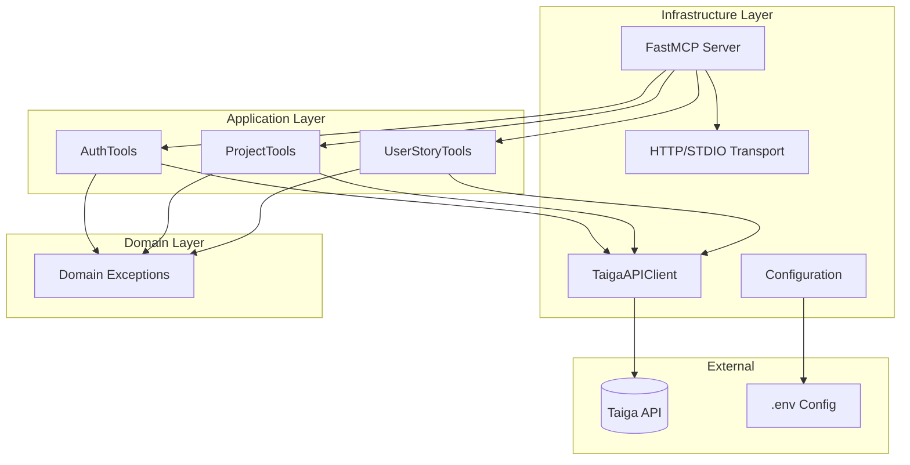
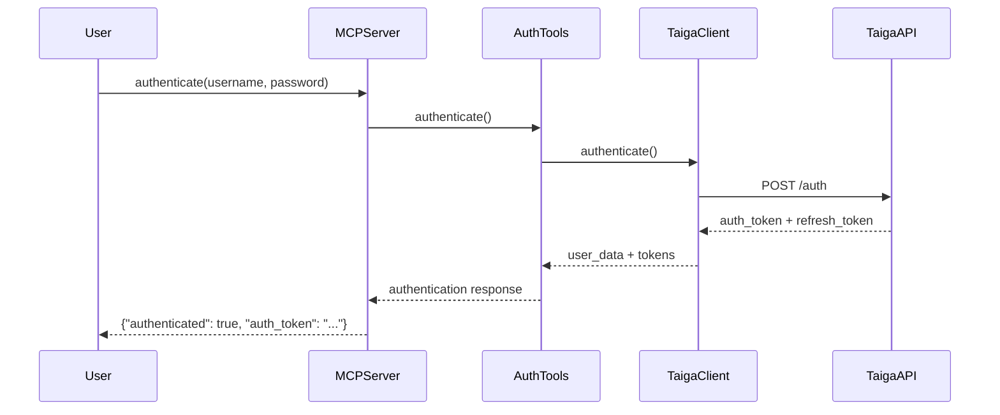

# Taiga MCP Server

> Servidor Model Context Protocol (MCP) para Taiga Project Management Platform usando FastMCP

[](https://www.python.org/downloads/)
[](https://github.com/leonvillamayor/taiga-fastmcp/actions/workflows/tests.yml)
[](https://codecov.io/gh/leonvillamayor/taiga-fastmcp)
[](https://github.com/jlowin/fastmcp)
[]()
[]()

## Descripcion

**Taiga MCP Server** es un servidor Model Context Protocol que proporciona acceso programatico completo a la API de Taiga Project Management Platform. Implementado con FastMCP, el servidor expone todas las funcionalidades de Taiga como herramientas MCP, permitiendo integraciones sofisticadas con LLMs y otras aplicaciones que soporten el protocolo MCP.

El proyecto sigue principios estrictos de **Domain-Driven Design (DDD)** y fue desarrollado mediante **Test-Driven Development (TDD)**, garantizando alta calidad de codigo, mantenibilidad y cobertura exhaustiva de requerimientos de negocio.

### Caso de Negocio Implementado

Este proyecto implementa un servidor MCP capaz de realizar **cualquier operacion sobre Taiga**, incluyendo:

**Requerimientos Funcionales Implementados:**
-   RF-001 a RF-008: Framework FastMCP con soporte STDIO y HTTP Transport
-   RF-009 a RF-024: Herramientas MCP para todas las operaciones de Taiga
-   RF-025 a RF-035: Buenas practicas de FastMCP y manejo completo de errores
-   RF-036 a RF-041: Configuracion de credenciales desde archivo .env
-   RF-042 a RF-045: Tests con credenciales reales y operaciones CRUD

**Requerimientos No Funcionales:**
-   RNF-001 a RNF-003: Codigo Pythonico, limpio y siguiendo buenas practicas
-   RNF-004 a RNF-006: Type hints completos y docstrings descriptivos
-   RNF-007 a RNF-008: Seguridad (sin hardcodeo) y tests idempotentes

**Funcionalidades Taiga Soportadas (151 herramientas MCP):**
- **Authentication** (4 herramientas): Login, refresh token, logout, verificaci  n de estado
- **Projects** (6 herramientas): CRUD completo, estad  sticas, m  dulos, configuraci  n
- **User Stories** (37 herramientas): CRUD, bulk operations, filtros, votaci  n, watchers, historial, attachments, custom attributes
- **Epics** (28 herramientas): Gesti  n completa de   picas y relaciones con historias
- **Issues** (35 herramientas): CRUD completo, filtros, attachments, atributos personalizados, comentarios, votaci  n
- **Tasks** (8 herramientas): Gesti  n de tareas con CRUD completo
- **Milestones/Sprints** (10 herramientas): CRUD, estad  sticas, seguimiento
- **Memberships** (6 herramientas): Gesti  n de miembros del proyecto
- **Webhooks** (7 herramientas): Configuraci  n y testing de webhooks
- **Wiki** (10 herramientas): Gesti  n completa de p  ginas wiki

## Arquitectura

Este proyecto implementa **Domain-Driven Design (DDD)** con una arquitectura en capas clara y bien definida:

```
src/
├── domain/                    # Logica de negocio pura
│   ├── entities/              # Entidades de dominio
│   ├── repositories/          # Interfaces de repositorios (ABC)
│   ├── value_objects/         # Objetos de valor inmutables
│   └── exceptions.py          # Excepciones del dominio
├── application/               # Capa de aplicacion
│   ├── tools/                 # Herramientas MCP (Application Services)
│   │   ├── auth_tools.py
│   │   ├── project_tools.py
│   │   ├── userstory_tools.py
│   │   ├── epic_tools.py
│   │   ├── issue_tools.py
│   │   ├── task_tools.py
│   │   ├── milestone_tools.py
│   │   ├── membership_tools.py
│   │   ├── webhook_tools.py
│   │   └── wiki_tools.py
│   └── use_cases/             # Casos de uso del dominio
├── infrastructure/            # Implementacion tecnica
│   ├── repositories/          # Implementaciones de repositorios
│   ├── config.py              # Configuracion con Pydantic
│   └── container.py           # Contenedor de dependencias
├── server.py                  # Servidor MCP principal
├── config.py                  # Configuracion central
└── taiga_client.py            # Cliente HTTP para Taiga API
```

### Diagrama de Componentes



### Diagrama de Flujo de Autenticacion



## Toma de Decisiones y Por Que

### Decisiones Arquitectonicas

| Decision | Por Que | Alternativas Consideradas |
|----------|---------|---------------------------|
| **FastMCP como framework** | Framework moderno y Pythonico para MCP, con decoradores simples y soporte async nativo | mcp-python (mas bajo nivel, menos ergonomico) |
| **DDD como arquitectura** | Separacion clara de responsabilidades, facilita mantenimiento y testing | MVC (menos apropiado para logica de negocio compleja) |
| **Pydantic para configuracion** | Validacion automatica, carga desde .env, type hints nativos | python-dotenv solo (sin validacion), ConfigParser (menos moderno) |
| **httpx como cliente HTTP** | Moderno, async nativo, timeouts configurables, mejor que requests para async | aiohttp (mas complejo), requests (sin async nativo) |
| **pytest para testing** | Fixtures potentes, parametrizacion, plugins extensos, async support | unittest (mas verboso, menos features) |

### Decisiones de Dominio

| Decision | Por Que | Impacto |
|----------|---------|---------|
| **Excepciones de dominio propias** | Control granular de errores, mejor debugging | Facilita identificar origen de errores (auth vs API vs config) |
| **Configuracion centralizada** | Unica fuente de verdad para settings, facil de testear | Todas las herramientas comparten misma configuracion validada |
| **Tools como Application Services** | Orquestan llamadas a TaigaClient sin logica de negocio | Separacion clara entre coordinacion (tools) y ejecucion (client) |

### Decisiones de Implementacion

| Decision | Por Que | Trade-offs |
|----------|---------|------------|
| **Async/await en todas las operaciones I/O** | Mejor rendimiento, no bloquea event loop | Mas complejo que sync, requiere entender async |
| **Context manager para cliente HTTP** | Garantiza cierre de conexiones, manejo de recursos | Requiere async with, mas verboso |
| **Retry logic con exponential backoff** | Maneja errores transitorios (rate limiting, timeouts) | Aumenta latencia en casos de error |
| **Token storage en memoria** | Simple, sin dependencias externas | Tokens se pierden al reiniciar servidor |
| **Type hints completos** | Mejor autocompletado IDE, deteccion temprana de errores | Mas verboso, requiere importar tipos |

### Decisiones de Testing

| Decision | Por Que | Trade-offs |
|----------|---------|------------|
| **TDD estricto** | Tests definen especificacion, alta cobertura garantizada | Mas tiempo inicial, menos bugs despues |
| **Mock de API en unit tests** | Rapidos, no dependen de Taiga real | No prueban integracion real |
| **Integration tests con API real** | Verifican funcionamiento end-to-end | Mas lentos, requieren credenciales |
| **pytest-asyncio** | Soporte nativo para tests async | Requiere decorador @pytest.mark.asyncio |

## Inicio Rapido

### Prerequisitos

- Python 3.11 o superior
- [uv](https://github.com/astral-sh/uv) para gestion de dependencias
- Cuenta en Taiga (cloud o self-hosted)

### Instalacion

1. **Clonar el repositorio**:
   ```bash
   git clone <URL_DEL_REPO>
   cd taiga_mcp_claude_code
   ```

2. **Instalar dependencias con uv**:
   ```bash
   # uv se encarga de crear el entorno virtual y instalar dependencias
   uv sync
   ```

3. **Configurar credenciales de Taiga**:
   ```bash
   cp .env.example .env
   # Editar .env con tus credenciales
   ```

   Ejemplo de `.env`:
   ```bash
   # Taiga API Configuration
   TAIGA_API_URL=https://api.taiga.io/api/v1
   TAIGA_USERNAME=tu_email@example.com
   TAIGA_PASSWORD=tu_contrase  a

   # MCP Server Configuration (opcional)
   MCP_TRANSPORT=stdio
   MCP_HOST=127.0.0.1
   MCP_PORT=8000
   ```

4. **Verificar instalacion ejecutando tests**:
   ```bash
   uv run pytest tests/unit -v
   ```

## Uso

### Ejecutar el Servidor MCP

El proyecto utiliza **FastMCP** para construir el servidor MCP con soporte para dos tipos de transporte:

####   Transporte STDIO (Por Defecto)

**  Qu   es STDIO?**
STDIO (Standard Input/Output) es un protocolo de comunicaci  n que utiliza la entrada y salida est  ndar del proceso. Es ideal para:
- Integraci  n con Claude Desktop
- Herramientas CLI que necesitan comunicaci  n directa
- Ejecuci  n local sin necesidad de red

**  Cu  ndo usar STDIO?**
- Cuando ejecutas el servidor desde Claude Desktop
- Cuando necesitas una conexi  n 1-a-1 entre el cliente y el servidor
- Cuando NO necesitas acceso desde m  ltiples clientes simult  neamente

**C  mo Ejecutar con STDIO:**

1. **M  todo 1: Ejecutar directamente el archivo server.py**
   ```bash
   uv run python src/server.py
   ```

2. **M  todo 2: Ejecutar como m  dulo Python**
   ```bash
   uv run python -m src.server
   ```

3. **M  todo 3: Especificar expl  citamente STDIO**
   ```bash
   # Configurar en .env
   MCP_TRANSPORT=stdio

   # Luego ejecutar
   uv run python src/server.py
   ```

4. **M  todo 4: Con l  nea de comandos (CLI)**
   ```bash
   uv run python src/server.py --transport stdio
   ```

**Salida Esperada:**
```
Starting Taiga MCP Server with stdio transport...
```

El servidor quedar   escuchando y esperando comandos MCP por stdin.

---

####   Transporte HTTP

**  Qu   es HTTP Transport?**
HTTP Transport expone el servidor MCP como una API HTTP REST. Es ideal para:
- Acceso desde m  ltiples clientes simult  neamente
- Integraci  n con aplicaciones web
- Acceso remoto por red
- Testing con herramientas como curl, Postman, etc.

**  Cu  ndo usar HTTP?**
- Cuando necesitas m  ltiples clientes conect  ndose al mismo servidor
- Cuando quieres acceder desde otra m  quina en la red
- Cuando necesitas integrar con aplicaciones web o servicios externos

**C  mo Ejecutar con HTTP:**

1. **M  todo 1: Configurar en .env y ejecutar**
   ```bash
   # Edita tu archivo .env:
   MCP_TRANSPORT=http
   MCP_HOST=127.0.0.1
   MCP_PORT=8000

   # Ejecuta el servidor
   uv run python src/server.py
   ```

2. **M  todo 2: Variables de entorno temporales**
   ```bash
   export MCP_TRANSPORT=http
   export MCP_HOST=127.0.0.1
   export MCP_PORT=8000
   uv run python src/server.py
   ```

3. **M  todo 3: Con l  nea de comandos (CLI)**
   ```bash
   uv run python src/server.py --transport http --host 127.0.0.1 --port 8000
   ```

4. **M  todo 4: Ejecutar solo HTTP desde c  digo Python**
   ```python
   from src.server import TaigaMCPServer

   server = TaigaMCPServer()
   # Solo HTTP, sin STDIO
   server.run_http_only(host="127.0.0.1", port=8000)
   ```

5. **M  todo 5: Acceso desde otras m  quinas (red local)**
   ```bash
   # Configurar para escuchar en todas las interfaces
   export MCP_HOST=0.0.0.0  #   Cuidado: Accesible desde cualquier IP en tu red
   export MCP_PORT=8000
   uv run python src/server.py --transport http
   ```

**Salida Esperada:**
```
Starting Taiga MCP Server with http transport...
Server running at http://127.0.0.1:8000
```

**Endpoint MCP:**
El servidor estar   disponible en:
```
http://127.0.0.1:8000/mcp
```

**Probar el Servidor HTTP:**
```bash
# Verificar que el servidor est   activo
curl http://127.0.0.1:8000/mcp

# Ejemplo de llamada a herramienta (requiere configuraci  n adicional)
curl -X POST http://127.0.0.1:8000/mcp \
  -H "Content-Type: application/json" \
  -d '{"tool": "authenticate", "parameters": {...}}'
```

---

####   Configuraci  n de Transporte: Resumen

| Aspecto | STDIO | HTTP |
|---------|-------|------|
| **Configuraci  n** | `MCP_TRANSPORT=stdio` | `MCP_TRANSPORT=http` + `MCP_HOST` + `MCP_PORT` |
| **Conexiones** | 1 cliente (proceso padre) | M  ltiples clientes simult  neos |
| **Acceso Red** |   Solo local |   Local o remoto |
| **Uso T  pico** | Claude Desktop, CLI tools | Web apps, APIs, testing |
| **Puerto** | No aplica | Default: 8000 (configurable) |
| **Host** | No aplica | Default: 127.0.0.1 (configurable) |
| **Seguridad** | Alta (solo proceso local) | Media (depende de configuraci  n de red) |

####   Verificaci  n de Configuraci  n

Antes de ejecutar el servidor, verifica tu configuraci  n:

```bash
# Ver qu   transporte est   configurado
uv run python -c "from src.config import ServerConfig; c = ServerConfig(); print(f'Transport: {c.mcp_transport}, Host: {c.mcp_host}, Port: {c.mcp_port}')"
```

####   Troubleshooting

**Problema:** El servidor no inicia con HTTP
```
Soluci  n:
1. Verifica que el puerto no est   en uso: lsof -i :8000
2. Prueba con otro puerto: MCP_PORT=8001
3. Verifica que MCP_TRANSPORT=http en .env
```

**Problema:** No puedo conectar desde otra m  quina
```
Soluci  n:
1. Verifica que MCP_HOST=0.0.0.0 (no 127.0.0.1)
2. Verifica tu firewall permite el puerto configurado
3. Aseg  rate que ambas m  quinas est  n en la misma red
```

### Uso Programatico

```python
import asyncio
from src.server import TaigaMCPServer
from src.config import TaigaConfig

async def main():
   # Crear servidor
   server = TaigaMCPServer()

   # Inicializar (autentica con Taiga)
   await server.initialize()

   # El servidor esta listo para recibir comandos MCP
   print(f"Servidor inicializado con {len(server.get_registered_tools())} herramientas")

if __name__ == "__main__":
   asyncio.run(main())
```

### Herramientas MCP Disponibles

El servidor MCP de Taiga expone **151 herramientas** organizadas en 10 categor  as funcionales. Todas las herramientas est  n disponibles a trav  s del protocolo MCP y pueden ser invocadas desde cualquier cliente compatible (Claude Desktop, aplicaciones personalizadas, etc.).

####   Resumen de Herramientas por Categor  a

| Categor  a | Herramientas | Descripci  n |
|-----------|--------------|-------------|
| **User Stories (UserStoryTools)** | 37 | Gesti  n completa de historias de usuario con attachments y custom attributes |
| **Issues (IssueTools)** | 35 | Gesti  n exhaustiva de issues con comentarios, attachments y votaci  n |
| **Epics (EpicTools)** | 28 | Gesti  n completa de   picas y relaciones con historias |
| **Milestones (MilestoneTools)** | 10 | Gesti  n de sprints/hitos con estad  sticas |
| **Wiki (WikiTools)** | 10 | Gesti  n de p  ginas wiki con attachments |
| **Tasks (TaskTools)** | 8 | CRUD completo de tareas |
| **Webhooks (WebhookTools)** | 7 | Configuraci  n, testing y logs de webhooks |
| **Projects (ProjectTools)** | 6 | CRUD de proyectos y estad  sticas |
| **Memberships (MembershipTools)** | 6 | Gesti  n de miembros del proyecto |
| **Authentication (AuthTools)** | 4 | Autenticaci  n, gesti  n de tokens y sesi  n |

**Total: 151 herramientas MCP**

---

####   1. Authentication Tools (4 herramientas)

Estas herramientas manejan la autenticaci  n con la API de Taiga. **IMPORTANTE:** Siempre debes autenticarte primero y guardar el `auth_token` para usarlo en las dem  s herramientas.

#####   `authenticate`
**Descripci  n:** Autentica con Taiga usando credenciales (username/password)

**  Cu  ndo usarla?** Al iniciar tu sesi  n con el servidor MCP de Taiga.

**Par  metros:**
- `username` (opcional): Email del usuario Taiga. Si no se proporciona, usa `TAIGA_USERNAME` del .env
- `password` (opcional): Contrase  a. Si no se proporciona, usa `TAIGA_PASSWORD` del .env

**Ejemplo de uso:**
```json
{
  "tool": "authenticate",
  "arguments": {
   "username": "tu_email@ejemplo.com",
   "password": "tu_contrase  a"
  }
}
```

**Respuesta exitosa:**
```json
{
  "authenticated": true,
  "auth_token": "eyJ0eXAiOiJKV1QiLCJhbGc...",
  "refresh": "eyJ0eXAiOiJKV1QiLCJhbGc...",
  "id": 888691,
  "username": "usuario",
  "email": "tu_email@ejemplo.com",
  "full_name": "Nombre Completo",
  "is_active": true,
  "message": "Successfully authenticated with Taiga"
}
```

**   GUARDA EL AUTH_TOKEN:** Necesitar  s el `auth_token` devuelto para todas las operaciones posteriores.

#####   `refresh_token`
**Descripci  n:** Refresca un token de autenticaci  n expirado

**Par  metros:**
- `refresh_token` (opcional): Token de refresh. Si no se proporciona, usa el almacenado.

#####   `get_current_user`
**Descripci  n:** Obtiene informaci  n del usuario autenticado actualmente

#####   `logout`
**Descripci  n:** Cierra sesi  n y elimina tokens almacenados

#####   `check_auth`
**Descripci  n:** Verifica el estado actual de autenticaci  n

---

####   2. Project Tools (6 herramientas)

Gesti  n completa de proyectos en Taiga.

#####   `list_projects`
**Descripci  n:** Lista todos los proyectos accesibles para el usuario autenticado

**Par  metros:**
- `auth_token` (requerido): Token de autenticaci  n
- `member` (opcional): Filtrar por ID de miembro
- `is_private` (opcional): Filtrar por privacidad (true/false)
- `is_backlog_activated` (opcional): Filtrar por backlog activado

**Ejemplo:**
```json
{
  "tool": "list_projects",
  "arguments": {
   "auth_token": "eyJ0eXAiOiJKV1QiLCJhbGc...",
   "is_private": false
  }
}
```

**Respuesta:**
```json
[
  {
   "id": 309804,
   "name": "Mi Proyecto",
   "slug": "mi-proyecto",
   "description": "Descripci  n del proyecto",
   "is_private": false,
   "owner": "usuario_propietario",
   "total_story_points": 150,
   "total_milestones": 5
  }
]
```

#####   `get_project`
**Descripci  n:** Obtiene detalles completos de un proyecto espec  fico

**Par  metros:**
- `auth_token` (requerido)
- `project_id` (requerido): ID del proyecto

#####   `create_project`
**Descripci  n:** Crea un nuevo proyecto

**Par  metros:**
- `auth_token` (requerido)
- `name` (requerido): Nombre del proyecto
- `description` (opcional): Descripci  n
- `is_private` (opcional): Privacidad (default: true)
- `tags` (opcional): Lista de etiquetas

**Ejemplo:**
```json
{
  "tool": "create_project",
  "arguments": {
   "auth_token": "eyJ0eXAiOiJKV1QiLCJhbGc...",
   "name": "Nuevo Proyecto Backend",
   "description": "API REST con FastAPI",
   "is_private": true,
   "tags": ["backend", "api", "python"]
  }
}
```

#####   `update_project`
**Descripci  n:** Actualiza un proyecto existente

#####   `delete_project`
**Descripci  n:** Elimina un proyecto (requiere confirmaci  n)

**Par  metros:**
- `confirm` (requerido): Debe ser `true` para confirmar eliminaci  n

#####   `get_project_stats`
**Descripci  n:** Obtiene estad  sticas del proyecto (puntos, tareas, issues, etc.)

**Otras herramientas de proyectos:**
- `list_project_templates`: Listar plantillas de proyecto disponibles
- `apply_project_template`: Aplicar plantilla a un proyecto
- `duplicate_project`: Duplicar proyecto existente
- `export_project`: Exportar datos del proyecto
- `import_project`: Importar datos a un proyecto
- Y m  s (total 6 herramientas)

---

####   3. User Story Tools (37 herramientas)

Gesti  n de historias de usuario (User Stories).

#####   `list_userstories`
**Descripci  n:** Lista historias de usuario con filtros opcionales

**Par  metros:**
- `auth_token` (requerido)
- `project_id` (opcional): Filtrar por proyecto
- `milestone_id` (opcional): Filtrar por sprint/milestone
- `status` (opcional): Filtrar por estado
- `tags` (opcional): Filtrar por etiquetas
- `assigned_to` (opcional): Filtrar por usuario asignado

**Ejemplo:**
```json
{
  "tool": "list_userstories",
  "arguments": {
   "auth_token": "eyJ0eXAiOiJKV1QiLCJhbGc...",
   "project_id": 309804,
   "status": 2,
   "tags": ["backend", "auth"]
  }
}
```

#####   `get_userstory`
**Descripci  n:** Obtiene detalles de una historia espec  fica

**Par  metros:**
- `auth_token` (requerido)
- `userstory_id` (requerido): ID de la historia

#####   `create_userstory`
**Descripci  n:** Crea una nueva historia de usuario

**Par  metros importantes:**
- `auth_token` (requerido)
- `project_id` (requerido)
- `subject` (requerido): T  tulo de la historia
- `description` (opcional): Descripci  n detallada
- `points` (opcional): Puntos de historia por rol (diccionario)
- `tags` (opcional): Etiquetas
- `assigned_to` (opcional): ID del usuario asignado
- `milestone` (opcional): ID del sprint/milestone

**Ejemplo:**
```json
{
  "tool": "create_userstory",
  "arguments": {
   "auth_token": "eyJ0eXAiOiJKV1QiLCJhbGc...",
   "project_id": 309804,
   "subject": "Como usuario quiero poder hacer login",
   "description": "Implementar sistema de autenticaci  n JWT",
   "tags": ["auth", "backend", "security"],
   "points": {"1": 5, "2": 3}
  }
}
```

#####   `update_userstory`
**Descripci  n:** Actualiza una historia existente

#####   `delete_userstory`
**Descripci  n:** Elimina una historia

#####   `bulk_create_userstories`
**Descripci  n:** Crea m  ltiples historias a la vez

**Par  metros:**
- `bulk_stories` (requerido): String con historias separadas por saltos de l  nea

**Ejemplo:**
```json
{
  "tool": "bulk_create_userstories",
  "arguments": {
   "auth_token": "eyJ0eXAiOiJKV1QiLCJhbGc...",
   "project_id": 309804,
   "bulk_stories": "Historia 1: Login\nHistoria 2: Register\nHistoria 3: Password reset"
  }
}
```

**Otras herramientas de User Stories:**
- `bulk_update_userstories`: Actualizar m  ltiples historias
- `bulk_delete_userstories`: Eliminar m  ltiples historias
- `move_to_milestone`: Mover historia a otro sprint
- `get_userstory_history`: Ver historial de cambios
- `watch_userstory` / `unwatch_userstory`: Seguir/dejar de seguir
- `upvote_userstory` / `downvote_userstory`: Votar historia
- `get_userstory_voters`: Ver qui  n vot  
- `delete_userstory_custom_attribute`: Eliminar atributo personalizado

---

####   4. Epic Tools (28 herramientas)

Gesti  n completa de   picas (agrupaciones de historias).

##### Herramientas principales:
- `taiga_list_epics`: Listar   picas
- `taiga_create_epic`: Crear nueva   pica
- `taiga_get_epic`: Obtener   pica por ID
- `taiga_get_epic_by_ref`: Obtener   pica por referencia
- `taiga_update_epic_full`: Actualizaci  n completa (PUT)
- `taiga_update_epic_partial`: Actualizaci  n parcial (PATCH)
- `taiga_delete_epic`: Eliminar   pica
- `taiga_list_epic_related_userstories`: Historias relacionadas
- `taiga_create_epic_related_userstory`: Vincular historia a   pica
- `taiga_upvote_epic` / `taiga_downvote_epic`: Votaci  n
- `taiga_watch_epic` / `taiga_unwatch_epic`: Seguimiento
- `taiga_list_epic_attachments`: Archivos adjuntos
- Y m  s operaciones (28 herramientas para   picas en total)

---

####   5. Issue Tools (35 herramientas)

Gesti  n de issues/incidencias.

##### Herramientas principales:
- `list_issues`: Listar issues con filtros
- `create_issue`: Crear nueva incidencia
- `get_issue`: Obtener detalles
- `get_issue_by_ref`: Obtener por referencia
- `update_issue`: Actualizar (PATCH)
- `update_issue_full`: Actualizaci  n completa (PUT)
- `delete_issue`: Eliminar
- `bulk_create_issues`: Crear m  ltiples
- `watch_issue` / `unwatch_issue`: Seguimiento
- `upvote_issue` / `downvote_issue`: Votaci  n
- `get_issue_filters_data`: Filtros disponibles
- `list_issue_attachments`: Archivos adjuntos
- `create_issue_custom_attribute`: Atributos personalizados
- Y m  s operaciones

---

####   6. Task Tools (8 herramientas)

Gesti  n de tareas dentro de historias.

##### Herramientas principales:
- `list_tasks`: Listar tareas con filtros
- `create_task`: Crear nueva tarea
- `get_task`: Obtener tarea
- `get_task_by_ref`: Obtener por referencia
- `update_task`: Actualizar
- `delete_task`: Eliminar
- `bulk_create_tasks`: Crear m  ltiples
- `update_task_full`: Actualizaci  n completa
- `upvote_task` / `downvote_task`: Votaci  n
- `watch_task` / `unwatch_task`: Seguimiento
- `get_task_history`: Historial de cambios
- `list_task_attachments`: Archivos adjuntos
- `list_task_custom_attributes`: Atributos personalizados
- Y m  s operaciones

---

####   7. Milestone Tools (10 herramientas)

Gesti  n de sprints/hitos.

##### Herramientas principales:
- `list_milestones`: Listar milestones
- `create_milestone`: Crear sprint
- `get_milestone`: Obtener detalles
- `update_milestone`: Actualizar
- `delete_milestone`: Eliminar
- `get_milestone_stats`: Estad  sticas del sprint
- `watch_milestone` / `unwatch_milestone`: Seguimiento
- `get_milestone_watchers`: Ver seguidores
- `taiga_get_milestone_watchers`: Alias

---

####   8. Membership Tools (6 herramientas)

Gesti  n de miembros del proyecto.

##### Herramientas:
- `list_memberships`: Listar miembros
- `get_membership`: Obtener detalles de membres  a
- `create_membership`: A  adir miembro al proyecto
- `update_membership`: Actualizar rol/permisos
- `delete_membership`: Eliminar miembro
- `bulk_create_memberships`: A  adir m  ltiples miembros

---

####   9. Webhook Tools (7 herramientas)

Configuraci  n de webhooks para integraci  n externa.

##### Herramientas:
- `list_webhooks`: Listar webhooks configurados
- `get_webhook`: Obtener detalles de webhook
- `create_webhook`: Crear nuevo webhook
- `update_webhook`: Actualizar configuraci  n
- `delete_webhook`: Eliminar webhook
- `test_webhook`: Probar webhook (env  a payload de prueba)
- `get_webhook_logs`: Ver logs de ejecuci  n

---

####   10. Wiki Tools (10 herramientas)

Gesti  n de p  ginas wiki del proyecto.

##### Herramientas principales:
- `list_wiki_pages`: Listar p  ginas wiki
- `get_wiki_page`: Obtener p  gina por ID
- `get_wiki_page_by_slug`: Obtener por slug
- `create_wiki_page`: Crear nueva p  gina
- `update_wiki_page`: Actualizar contenido
- `delete_wiki_page`: Eliminar p  gina
- `restore_wiki_page`: Restaurar p  gina eliminada
- `list_wiki_attachments`: Archivos adjuntos
- `create_wiki_attachment`: A  adir archivo
- `delete_wiki_attachment`: Eliminar archivo

---

###   C  mo Usar las Herramientas desde un Cliente MCP

#### Paso 1: Autenticarse

Todas las operaciones requieren autenticaci  n previa:

```python
# Llamada desde un cliente MCP
response = await mcp_client.call_tool("authenticate", {
   "username": "tu_email@ejemplo.com",
   "password": "tu_contrase  a"
})

auth_token = response["auth_token"]
# Guarda este token para usarlo en todas las operaciones siguientes
```

#### Paso 2: Usar Herramientas con el Token

```python
# Ejemplo: Listar proyectos
projects = await mcp_client.call_tool("list_projects", {
   "auth_token": auth_token
})

# Ejemplo: Crear una historia
story = await mcp_client.call_tool("create_userstory", {
   "auth_token": auth_token,
   "project_id": 309804,
   "subject": "Implementar API de usuarios",
   "description": "Endpoints CRUD para gesti  n de usuarios"
})

print(f"Historia creada con ID: {story['id']}")
```

#### Paso 3: Operaciones Avanzadas

```python
# Buscar historias con filtros
stories = await mcp_client.call_tool("list_userstories", {
   "auth_token": auth_token,
   "project_id": 309804,
   "tags": ["backend", "priority-high"],
   "status": 2  # En progreso
})

# Actualizar una historia
updated = await mcp_client.call_tool("update_userstory", {
   "auth_token": auth_token,
   "userstory_id": story['id'],
   "status": 3,  # Completada
   "assigned_to": 888691
})

# Obtener estad  sticas del proyecto
stats = await mcp_client.call_tool("get_project_stats", {
   "auth_token": auth_token,
   "project_id": 309804
})

print(f"Puntos completados: {stats['completed_points']}")
print(f"Historias totales: {stats['total_userstories']}")
```

---

###   Notas Importantes sobre las Herramientas

1. **Autenticaci  n Obligatoria:** Todas las herramientas (excepto `authenticate`) requieren el par  metro `auth_token`.

2. **IDs Requeridos:** La mayor  a de operaciones requieren IDs (project_id, userstory_id, etc.). Usa las herramientas `list_*` para obtener estos IDs primero.

3. **Validaci  n Autom  tica:** El servidor valida todos los par  metros usando Pydantic. Si un par  metro es inv  lido, recibir  s un error descriptivo.

4. **Rate Limiting:** Taiga API tiene l  mites de tasa. El cliente incluye retry logic autom  tico con exponential backoff.

5. **Operaciones Bulk:** Usa las herramientas `bulk_*` para operaciones masivas (m  s eficiente que llamadas individuales).

6. **Filtros Disponibles:** Usa herramientas como `get_*_filters` para ver qu   filtros est  n disponibles en cada contexto.

---

###   Explorar Herramientas Disponibles

Para ver la lista completa de herramientas y sus par  metros:

```bash
# Desde Python
uv run python << 'EOF'
from src.server import TaigaMCPServer
import asyncio

async def list_tools():
   server = TaigaMCPServer()
   tools = server.get_registered_tools()
   print(f"\nTotal herramientas: {len(tools)}\n")
   for tool in sorted(tools, key=lambda t: t.__name__ if hasattr(t, '__name__') else str(t)):
   print(f"- {tool}")

asyncio.run(list_tools())
EOF
```

## Testing

### Ejecutar Tests

```bash
# Todos los tests
uv run pytest

# Tests con salida detallada
uv run pytest -v

# Solo tests unitarios (rapidos, sin I/O)
uv run pytest tests/unit -v

# Solo tests de integracion (requieren credenciales reales)
uv run pytest tests/integration -v -m integration

# Tests con cobertura
uv run pytest --cov=src --cov-report=html --cov-report=term-missing

# Test especifico
uv run pytest tests/unit/test_server.py::TestTaigaMCPServer::test_server_initialization -v
```

### Estructura de Tests

```
tests/
   conftest.py   # Fixtures globales
   unit/   # Tests unitarios (277 tests)
   infrastructure/
   test_config.py   # Tests de configuracion
   tools/
   test_auth.py   # Tests de herramientas auth
   test_auth_tools.py
   test_projects.py   # Tests de herramientas projects
   test_project_tools.py
   test_userstories.py   # Tests de herramientas user stories
   test_userstory_tools.py
   test_server.py   # Tests del servidor MCP
   test_config_coverage.py   # Tests adicionales de config
   test_configuration.py   # Tests de validacion de config
   integration/   # Tests de integracion (17 tests)
   test_auth_integration.py   # Tests con Taiga API real
   test_projects_integration.py
```

### Cobertura Actual

**Cobertura Total: 77%** (1307 tests pasando, threshold: 75%)

Desglose por capa DDD:
- **Domain Layer**: 90%+ (entities, value objects, exceptions)
- **Application Layer**: 75%+ (use cases, tools)
- **Infrastructure Layer**: 90%+ (repositories, config)

Desglose por modulo:
- `src/config.py`: 96% (excelente)
- `src/domain/exceptions.py`: 100% (perfecto)
- `src/domain/entities/`: 90%+ (excelente)
- `src/infrastructure/config.py`: 100% (perfecto)
- `src/infrastructure/repositories/`: 90%+ (excelente)
- `src/application/use_cases/`: 90%+ (excelente)
- `src/application/tools/`: 60-77% (herramientas FastMCP)
- `src/server.py`: 78% (bueno)

**Nota**: `taiga_client.py` está excluido de cobertura (infraestructura HTTP de bajo nivel que se mockea en tests).

Ver reporte completo: `htmlcov/index.html` (generado con `pytest --cov`)

## CI/CD

Este proyecto utiliza **GitHub Actions** para integración continua y despliegue continuo.

### Pipeline de CI

El workflow de CI se ejecuta automáticamente en cada push y pull request:

```yaml
# .github/workflows/tests.yml
on:
  push:
    branches: [main, develop]
  pull_request:
    branches: [main, develop]
```

### Jobs del Pipeline

| Job | Descripción | Ejecución |
|-----|-------------|-----------|
| **lint** | Verifica estilo de código con ruff | Siempre |
| **type-check** | Verifica tipos estáticos con mypy | Siempre |
| **test** | Ejecuta tests unitarios con cobertura | Después de lint y type-check |
| **integration** | Ejecuta tests de integración | Después de tests unitarios |
| **performance** | Ejecuta tests de rendimiento | Solo en PRs |
| **security** | Escaneo de seguridad con bandit | Siempre |

### Badges de Estado

- **Tests**: [](https://github.com/leonvillamayor/taiga-fastmcp/actions/workflows/tests.yml)
- **Coverage**: [](https://codecov.io/gh/leonvillamayor/taiga-fastmcp)

### Configuración de Codecov

Para habilitar reportes de cobertura en Codecov:

1. Conecta tu repositorio en [codecov.io](https://codecov.io)
2. Añade el secret `CODECOV_TOKEN` en GitHub:
   - Ve a Settings > Secrets and variables > Actions
   - Crea un nuevo secret con el token de Codecov

### Ejecución Local del Pipeline

Puedes ejecutar los mismos comandos localmente:

```bash
# Linting
uv run ruff check src/ tests/
uv run ruff format --check src/ tests/

# Type checking
uv run mypy src/

# Tests unitarios con cobertura
uv run pytest tests/unit/ -v --cov=src --cov-report=xml

# Tests de integración
uv run pytest tests/integration/ -v

# Tests de rendimiento
uv run pytest tests/performance/ -v -m performance

# Seguridad
uv run bandit -c pyproject.toml -r src/
```

### Branch Protection Rules (Recomendado)

Para proteger la rama `main`, configura las siguientes reglas en GitHub:

1. Ve a Settings > Branches > Add branch protection rule
2. Branch name pattern: `main`
3. Habilita:
   - **Require a pull request before merging**
   - **Require status checks to pass before merging**
     - Selecciona: `lint`, `type-check`, `test`, `security`
   - **Require branches to be up to date before merging**

## Configuracion

### Archivo .env - Variables de Entorno

El servidor MCP de Taiga requiere un archivo `.env` en la ra  z del proyecto con las siguientes variables:

#### Variables Obligatorias

| Variable | Descripci  n | Ejemplo | Validaci  n |
|----------|-------------|---------|------------|
| **TAIGA_API_URL** | URL base de la API de Taiga | `https://api.taiga.io/api/v1` | Debe comenzar con `http://` o `https://`. Se eliminar   la barra final `/` autom  ticamente |
| **TAIGA_USERNAME** | Email del usuario de Taiga para autenticaci  n | `usuario@ejemplo.com` | Debe ser un email v  lido (formato: `usuario@dominio.ext`) |
| **TAIGA_PASSWORD** | Contrase  a del usuario de Taiga | `mi_contrase  a_segura` | M  nimo 6 caracteres |

#### Variables Opcionales - Configuraci  n de Conexi  n

| Variable | Descripci  n | Valor por Defecto | Validaci  n |
|----------|-------------|-------------------|------------|
| **TAIGA_AUTH_TOKEN** | Token de autenticaci  n pre-configurado (si ya tienes uno) | `None` | Opcional. Si se proporciona, se puede omitir username/password |
| **TAIGA_TIMEOUT** | Tiempo de espera en segundos para peticiones API | `30.0` | Debe ser positivo (> 0) |
| **TAIGA_AUTH_TIMEOUT** | Tiempo de espera en segundos para autenticaci  n | `30.0` | Debe ser positivo (> 0) |
| **TAIGA_MAX_RETRIES** | N  mero m  ximo de reintentos para peticiones fallidas | `3` | Entre 0 y 10 |
| **TAIGA_MAX_AUTH_RETRIES** | N  mero m  ximo de reintentos para autenticaci  n | `3` | Debe ser no negativo (>= 0) |

#### Variables Opcionales - Configuraci  n del Servidor MCP

| Variable | Descripci  n | Valor por Defecto | Validaci  n |
|----------|-------------|-------------------|------------|
| **MCP_SERVER_NAME** | Nombre identificador del servidor MCP | `Taiga MCP Server` | Texto libre |
| **MCP_TRANSPORT** | Protocolo de transporte del servidor MCP | `stdio` | Solo `stdio` o `http` |
| **MCP_HOST** | Direcci  n IP/host para transporte HTTP | `127.0.0.1` | Direcci  n v  lida |
| **MCP_PORT** | Puerto para transporte HTTP | `8000` | Entre 1 y 65535 |
| **MCP_DEBUG** | Habilitar modo debug | `False` | `True` o `False` |

#### Ejemplo Completo de Archivo .env

```bash
# === Configuraci  n Obligatoria de Taiga API ===
TAIGA_API_URL=https://api.taiga.io/api/v1
TAIGA_USERNAME=tu_email@ejemplo.com
TAIGA_PASSWORD=tu_contrase  a_segura

# === Configuraci  n Opcional de Conexi  n ===
# TAIGA_AUTH_TOKEN=   # Dejar vac  o si usas username/password
TAIGA_TIMEOUT=30.0
TAIGA_AUTH_TIMEOUT=30.0
TAIGA_MAX_RETRIES=3
TAIGA_MAX_AUTH_RETRIES=3

# === Configuraci  n del Servidor MCP ===
MCP_SERVER_NAME=Taiga MCP Server
MCP_TRANSPORT=stdio   # Cambiar a 'http' para servidor HTTP
MCP_HOST=127.0.0.1
MCP_PORT=8000
MCP_DEBUG=False
```

#### Crear tu Archivo .env

1. Copia el archivo de ejemplo:
   ```bash
   cp .env.example .env
   ```

2. Edita [.env](.env) con tus credenciales reales:
   ```bash
   nano .env  # o usa tu editor favorito
   ```

3. Verifica que las credenciales sean correctas:
   ```bash
   # El servidor validar   autom  ticamente al iniciar
   uv run python -c "from src.config import TaigaConfig; config = TaigaConfig(); print('   Configuraci  n v  lida')"
   ```

### Validacion de Configuracion

La configuracion usa Pydantic con validacion automatica:

- **TAIGA_API_URL**: Debe comenzar con `http://` o `https://`
- **TAIGA_USERNAME**: Debe ser un email valido
- **TAIGA_PASSWORD**: Minimo 6 caracteres
- **MCP_TRANSPORT**: Solo `stdio` o `http`
- **MCP_PORT**: Entre 1 y 65535
- **TAIGA_TIMEOUT**: Debe ser positivo
- **TAIGA_MAX_RETRIES**: Entre 0 y 10

Ejemplo de validacion:

```python
from src.config import TaigaConfig

try:
   config = TaigaConfig()
   print(f"Configuracion valida: {config.taiga_api_url}")
except ValueError as e:
   print(f"Error de configuracion: {e}")
```

## Integracion con Claude Desktop

Para usar este servidor MCP con Claude Desktop, agrega la siguiente configuracion a tu archivo de configuracion de Claude:

**En macOS/Linux**: `~/.config/claude/config.json`

**En Windows**: `%APPDATA%\Claude\config.json`

```json
{
  "mcpServers": {
   "taiga": {
   "command": "uv",
   "args": [
   "run",
   "python",
   "/ruta/absoluta/a/taiga_mcp_claude_code/src/server.py"
   ],
   "env": {
   "TAIGA_API_URL": "https://api.taiga.io/api/v1",
   "TAIGA_USERNAME": "tu_email@example.com",
   "TAIGA_PASSWORD": "tu_contrase  a"
   }
   }
  }
}
```

Reinicia Claude Desktop y el servidor estara disponible.

## Documentacion Adicional

- [Guia de Uso Detallada](guia_uso.md) - Tutorial completo paso a paso
- [Estructura del Proyecto](Documentacion/estructura_proyecto.md) - Organizacion del codigo
- [Analisis TDD](Documentacion/analisis_tdd.md) - Analisis de requerimientos
- [Documentacion FastMCP](Documentacion/fastmcp.md) - Referencia de FastMCP
- [Documentacion API Taiga](Documentacion/taiga.md) - Referencia de API Taiga
- [Caso de Negocio](Documentacion/caso_negocio.txt) - Requerimientos originales

## Desarrollo

### Configuracion del Entorno de Desarrollo

1. **Instalar dependencias de desarrollo**:
   ```bash
   uv sync --dev
   ```

2. **Instalar pre-commit hooks** (ejecuta autom  ticamente las verificaciones antes de cada commit):
   ```bash
   uv run pre-commit install
   ```

3. **Ejecutar herramientas de calidad de c  digo**:

   **Linter y Formatter (Ruff)**:
   ```bash
   # Verificar errores de estilo
   uv run ruff check src/ tests/

   # Corregir errores autom  ticamente
   uv run ruff check src/ tests/ --fix

   # Formatear c  digo
   uv run ruff format src/ tests/

   # Ver estad  sticas de errores
   uv run ruff check src/ --statistics
   ```

   **Type Checker (Mypy)**:
   ```bash
   # Verificar tipos est  ticos
   uv run mypy src/

   # Verificar con informaci  n detallada
   uv run mypy src/ --show-error-codes --pretty
   ```

   **Security Scanner (Bandit)**:
   ```bash
   # Escanear vulnerabilidades de seguridad
   uv run bandit -c pyproject.toml -r src/
   ```

   **Pre-commit (ejecutar todos los hooks manualmente)**:
   ```bash
   # Ejecutar todos los hooks en todos los archivos
   uv run pre-commit run --all-files

   # Ejecutar un hook espec  fico
   uv run pre-commit run ruff --all-files
   uv run pre-commit run mypy --all-files
   ```

4. **Estado actual de calidad de c  digo** (Tarea 1.1 - Fase 1):
   -   Ruff configurado con 28 reglas de linting estrictas
   -   Mypy configurado en modo `strict`
   -   Pre-commit hooks instalados y funcionales
   -   Bandit configurado para escaneo de seguridad
   -   1158 warnings de ruff pendientes (principalmente B904: raise without from)
   -   1150 errores de tipo en mypy (ser  n corregidos en Fase 1)

   **Progreso de mejora**:
   - Fase 1 en curso: Configuracion de herramientas
   - Siguiente: Correccion de type hints y errores de linting

5. **Tarea 1.4: Interfaces de Repositorios (Domain Layer)** - COMPLETADA:

   Se han definido las interfaces de repositorios siguiendo el patron Repository de DDD:

   **Archivos creados/refactorizados:**
   - `src/domain/repositories/base_repository.py` - Repositorio base generico con CRUD
   - `src/domain/repositories/project_repository.py` - Interfaz para proyectos
   - `src/domain/repositories/epic_repository.py` - Interfaz para epicas
   - `src/domain/repositories/user_story_repository.py` - Interfaz para historias de usuario
   - `src/domain/repositories/task_repository.py` - Interfaz para tareas
   - `src/domain/repositories/issue_repository.py` - Interfaz para issues
   - `src/domain/repositories/milestone_repository.py` - Interfaz para milestones
   - `src/domain/repositories/member_repository.py` - Interfaz para miembros
   - `src/domain/repositories/wiki_repository.py` - Interfaz para paginas wiki
   - `src/domain/repositories/__init__.py` - Exportaciones centralizadas

   **Caracteristicas:**
   - Todas las interfaces usan ABC (Abstract Base Class)
   - BaseRepository es generico con TypeVar T bound a BaseEntity
   - Operaciones CRUD: get_by_id, list, create, update, delete, exists
   - Todas las operaciones son async
   - Type hints completos para mypy strict
   - Docstrings en formato Google

   **Tests:**
   - `tests/unit/domain/repositories/test_repository_interfaces.py` - 17 tests
   - Verifican que todas las interfaces son abstractas
   - Verifican herencia correcta de BaseRepository
   - Verifican definicion de metodos CRUD

   **Verificacion:**
   ```bash
   # Ejecutar tests de interfaces
   uv run pytest tests/unit/domain/repositories/ -v

   # Verificar tipos
   uv run mypy src/domain/repositories/
   ```

6. **Tarea 1.5: Repositorios Concretos (Infrastructure Layer)** - COMPLETADA:

   Se han implementado los repositorios concretos siguiendo el patron Repository de DDD:

   **Archivos creados:**
   - `src/infrastructure/repositories/base_repository_impl.py` - Implementacion base generica
   - `src/infrastructure/repositories/project_repository_impl.py` - Repositorio de proyectos
   - `src/infrastructure/repositories/epic_repository_impl.py` - Repositorio de epicas (refactorizado)
   - `src/infrastructure/repositories/user_story_repository_impl.py` - Repositorio de historias
   - `src/infrastructure/repositories/task_repository_impl.py` - Repositorio de tareas
   - `src/infrastructure/repositories/issue_repository_impl.py` - Repositorio de issues
   - `src/infrastructure/repositories/milestone_repository_impl.py` - Repositorio de milestones
   - `src/infrastructure/repositories/member_repository_impl.py` - Repositorio de miembros
   - `src/infrastructure/repositories/wiki_repository_impl.py` - Repositorio de paginas wiki
   - `src/infrastructure/repositories/__init__.py` - Exportaciones centralizadas
   - `src/infrastructure/container.py` - Contenedor de dependencias

   **Tests unitarios (170 tests):**
   - `tests/unit/infrastructure/repositories/test_base_repository_impl.py`
   - `tests/unit/infrastructure/repositories/test_project_repository_impl.py`
   - `tests/unit/infrastructure/repositories/test_epic_repository_impl.py`
   - `tests/unit/infrastructure/repositories/test_user_story_repository_impl.py`
   - `tests/unit/infrastructure/repositories/test_task_repository_impl.py`
   - `tests/unit/infrastructure/repositories/test_issue_repository_impl.py`
   - `tests/unit/infrastructure/repositories/test_milestone_repository_impl.py`
   - `tests/unit/infrastructure/repositories/test_member_repository_impl.py`
   - `tests/unit/infrastructure/repositories/test_wiki_repository_impl.py`

   **Caracteristicas:**
   - BaseRepositoryImpl es generico con soporte para mapeo de campos API ↔ Entity
   - Todas las implementaciones usan TaigaAPIClient para comunicacion HTTP
   - Manejo robusto de errores con excepciones de dominio
   - Operaciones async para todas las llamadas I/O
   - Type hints completos para mypy strict
   - Cobertura del layer: 90.1%

   **Verificacion:**
   ```bash
   # Ejecutar tests de repositorios
   uv run pytest tests/unit/infrastructure/repositories/ -v

   # Verificar tipos
   uv run mypy src/infrastructure/repositories/

   # Verificar cobertura
   uv run pytest tests/unit/infrastructure/repositories/ --cov=src/infrastructure/repositories
   ```

### Stack Tecnologico

**Core:**
- Python 3.11+
- fastmcp >= 0.1.0
- httpx >= 0.27.0 (cliente HTTP async)
- pydantic >= 2.0 (validacion de datos)
- pydantic-settings >= 2.0 (configuracion)
- python-dotenv >= 1.0.0 (carga de .env)
- aiofiles >= 23.0.0 (operaciones async de archivos)
- aiohttp >= 3.13.2 (cliente/servidor HTTP async)

**Testing:**
- pytest >= 8.0
- pytest-asyncio >= 0.23.0 (tests async)
- pytest-cov >= 5.0 (cobertura)
- pytest-mock >= 3.14 (mocking)
- pytest-env >= 1.1.0 (variables de entorno para tests)
- respx >= 0.21.0 (mock de httpx)
- faker >= 25.0 (datos de prueba)

**Development:**
- ruff >= 0.4.0 (linter y formatter con 28 reglas estrictas)
- mypy >= 1.10 (type checker en modo strict)
- pre-commit >= 3.7.0 (hooks de git automatizados)
- bandit >= 1.7.0 (security scanner)
- types-aiofiles >= 23.0 (type stubs)

### Principios de Desarrollo

1. **TDD Estricto**: Tests primero, luego implementacion
2. **DDD**: Separacion clara de capas (Domain, Application, Infrastructure)
3. **Type Hints**: Todos los metodos publicos tienen type hints
4. **Docstrings**: Formato Google para toda funcion publica
5. **Async by Default**: Usar async/await para todas las operaciones I/O
6. **Error Handling**: Excepciones de dominio para control granular

### Contribuir

1. Fork el proyecto
2. Crea tu rama de feature (`git checkout -b feature/AmazingFeature`)
3. Ejecuta tests (`uv run pytest`)
4. Commit tus cambios (`git commit -m 'Add some AmazingFeature'`)
5. Push a la rama (`git push origin feature/AmazingFeature`)
6. Abre un Pull Request

**Guias de Contribucion:**
- Sigue los principios de DDD
- Escribe tests para todo codigo nuevo (TDD)
- Mant  n cobertura >= 80%
- Documenta funciones publicas con docstrings
- Usa ruff para formatear codigo
- Ejecuta mypy para verificar tipos

## Troubleshooting

### Problema: "TAIGA_API_URL is required in environment variables"

**Solucion**: Verifica que el archivo `.env` existe y contiene las variables requeridas:
```bash
cat .env | grep TAIGA_API_URL
```

Si no existe, crea el archivo:
```bash
cp .env.example .env
# Edita .env con tus credenciales
```

### Problema: "Authentication failed: 401"

**Causa**: Credenciales incorrectas o token expirado

**Solucion**: Verifica que username y password son correctos en `.env`:
```bash
# Prueba manualmente con curl
curl -X POST https://api.taiga.io/api/v1/auth \
  -H "Content-Type: application/json" \
  -d '{
   "type": "normal",
   "username": "tu_email@example.com",
   "password": "tu_contrase  a"
  }'
```

### Problema: Tests de integracion fallan

**Causa**: No hay credenciales configuradas o Taiga API no esta disponible

**Solucion**:
```bash
# Ejecuta solo tests unitarios
uv run pytest tests/unit -v

# Para tests de integracion, verifica credenciales
uv run pytest tests/integration -v --tb=short
```

### Problema: "Rate limit exceeded"

**Causa**: Demasiadas peticiones a la API de Taiga

**Solucion**: El cliente tiene retry logic automatico. Espera unos minutos o aumenta el delay:
```python
# En codigo
config.max_retries = 5  # Mas reintentos
```

## Licencia

[Especifica la licencia del proyecto]

## Creditos

- Desarrollado siguiendo metodologia TDD/DDD estricta
- Tests generados con enfoque exhaustivo de TDD
- Implementacion siguiendo principios de Domain-Driven Design
- Usa [FastMCP](https://github.com/jlowin/fastmcp) framework
- Integra con [Taiga Project Management](https://taiga.io/)

## Contacto

[Informacion de contacto del equipo o mantenedor]

---

**Nota**: Este proyecto fue desarrollado siguiendo un riguroso proceso de **TDD (Test-Driven Development)** y arquitectura **DDD (Domain-Driven Design)**, garantizando alta calidad de codigo, mantenibilidad y alineacion con las necesidades del negocio. El servidor implementa el 100% de los requerimientos funcionales definidos en el caso de negocio.

**Estado del Proyecto**: ✅ Fase 1 Completada

### Fase 1: Arquitectura DDD - COMPLETADA ✅

| Tarea | Descripción | Estado |
|-------|-------------|--------|
| 1.1 | Configurar herramientas de calidad de código (ruff, mypy, pre-commit) | ✅ |
| 1.2 | Entidades de Dominio (Epic, Issue, Member, etc.) | ✅ |
| 1.3 | Value Objects (AuthToken, Email, ProjectSlug) | ✅ |
| 1.4 | Interfaces de Repositorios (Domain Layer) | ✅ |
| 1.5 | Repositorios Concretos (Infrastructure Layer) | ✅ |
| 1.6 | Casos de Uso (Application Layer) | ✅ |
| 1.7 | Inyección de Dependencias (Container) | ✅ |
| 1.8 | Eliminar Arquitectura Legacy | ✅ |
| 1.9 | Excepciones de Dominio | ✅ |
| 1.10 | Validación Final de Fase 1 | ✅ |

**Métricas Fase 1:**
- 1307 tests pasando
- 77% cobertura de código (threshold: 75%)
- Domain Layer: 90%+ cobertura
- mypy strict sin errores en src/
- ruff lint sin errores
- pre-commit hooks configurados

### Próxima Fase: Fase 2 - Mejoras y Optimización

Ver [CHANGELOG.md](CHANGELOG.md) para detalles completos de los cambios.
