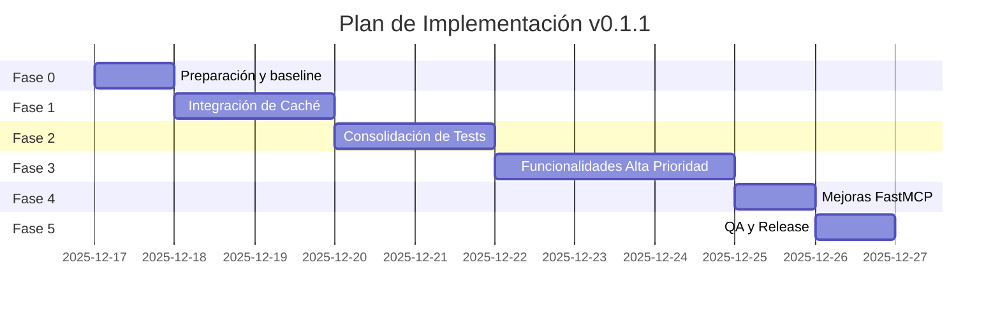

# Plan de Implementación - Release 0.1.1

## Información General

| Campo | Valor |
|-------|-------|
| Versión Objetivo | 0.1.1 |
| Fecha de Inicio | 2025-12-17 |
| Documentos Base | [mejoras.md](mejoras.md), [test_duplicados](test_duplicados) |
| Criterio de Éxito | Tests verdes, cobertura ≥80%, funcionalidades implementadas |

---

## Resumen de Fases



| Fase | Nombre | Prioridad | Dependencias | Estimación |
|------|--------|-----------|--------------|------------|
| 0 | Preparación y Baseline | Crítica | - | 0.5 días |
| 1 | Integración de Caché | Crítica | Fase 0 | 1-2 días |
| 2 | Consolidación de Tests | Alta | Fase 0 | 1-2 días |
| 3 | Funcionalidades Alta Prioridad | Alta | Fases 1, 2 | 2-3 días |
| 4 | Mejoras FastMCP | Media | Fase 3 | 0.5-1 día |
| 5 | QA y Release | Crítica | Todas | 0.5 días |

---

## Fase 0: Preparación y Baseline

### Objetivo
Establecer el estado inicial y crear rama de desarrollo.

### Tareas

#### F0-T1: Crear rama de desarrollo
```bash
git checkout -b release/0.1.1
git push -u origin release/0.1.1
```

**Criterio de aceptación:** Rama creada y pusheada.

#### F0-T2: Ejecutar tests actuales y documentar baseline
```bash
uv run pytest tests/ -v --tb=short 2>&1 | tee mejoras_0.1.1/baseline_tests.log
uv run pytest --cov=src --cov-report=html --cov-report=term 2>&1 | tee mejoras_0.1.1/baseline_coverage.log
```

**Criterio de aceptación:**
- Log de tests guardado
- Cobertura actual documentada
- Identificar tests que fallan (si los hay)

#### F0-T3: Verificar estructura de archivos clave
```bash
ls -la src/infrastructure/cache.py
ls -la src/infrastructure/cached_client.py
ls -la src/application/tools/*.py
```

**Criterio de aceptación:** Todos los archivos existen.

### Checklist Fase 0
- [ ] Rama `release/0.1.1` creada
- [ ] Baseline de tests documentado
- [ ] Cobertura actual: _____% (completar)
- [ ] Tests fallando: _____ (completar)

---

## Fase 1: Integración de Caché

### Objetivo
Activar el sistema de caché existente en todos los tools MCP.

### Contexto
El proyecto tiene `MemoryCache` y `CachedTaigaClient` implementados pero **NO integrados** con los tools.

### Tareas

#### F1-T1: Crear módulo centralizado de cliente cacheado

**Archivo:** `src/infrastructure/client_factory.py`

```python
"""
Factory para crear clientes Taiga con caché compartido.
"""
from src.infrastructure.cache import MemoryCache
from src.infrastructure.cached_client import CachedTaigaClient
from src.taiga_client import TaigaAPIClient
from src.config import TaigaConfig

# Caché global compartido - singleton
_global_cache: MemoryCache | None = None

def get_global_cache() -> MemoryCache:
    """Obtiene la instancia global del caché."""
    global _global_cache
    if _global_cache is None:
        _global_cache = MemoryCache(default_ttl=3600, max_size=1000)
    return _global_cache

def get_cached_taiga_client(auth_token: str | None = None) -> CachedTaigaClient:
    """
    Crea un cliente Taiga con caché.

    Args:
        auth_token: Token de autenticación opcional.

    Returns:
        CachedTaigaClient configurado con caché global.
    """
    config = TaigaConfig()
    base_client = TaigaAPIClient(config)
    if auth_token:
        base_client.auth_token = auth_token
    return CachedTaigaClient(base_client, cache=get_global_cache())

def invalidate_project_cache(project_id: int) -> None:
    """Invalida caché relacionado con un proyecto."""
    cache = get_global_cache()
    # Usar asyncio si es necesario
    import asyncio
    asyncio.create_task(cache.invalidate(f"project_id={project_id}"))
```

**Criterio de aceptación:**
- Archivo creado
- Tests unitarios para factory
- Import sin errores

#### F1-T2: Actualizar `project_tools.py` para usar caché

**Cambios en:** `src/application/tools/project_tools.py`

```python
# ANTES
from src.taiga_client import TaigaAPIClient

def get_taiga_client(auth_token: str | None = None) -> TaigaAPIClient:
    config = TaigaConfig()
    client = TaigaAPIClient(config)
    if auth_token:
        client.auth_token = auth_token
    return client

# DESPUÉS
from src.infrastructure.client_factory import get_cached_taiga_client

def get_taiga_client(auth_token: str | None = None):
    """Get cached Taiga API client."""
    return get_cached_taiga_client(auth_token)
```

**Criterio de aceptación:**
- Tests existentes siguen pasando
- Llamadas a endpoints cacheables usan caché

#### F1-T3: Actualizar todos los tools para usar cliente cacheado

**Archivos a modificar:**
1. `src/application/tools/userstory_tools.py`
2. `src/application/tools/issue_tools.py`
3. `src/application/tools/task_tools.py`
4. `src/application/tools/epic_tools.py`
5. `src/application/tools/wiki_tools.py`
6. `src/application/tools/webhook_tools.py`
7. `src/application/tools/milestone_tools.py`
8. `src/application/tools/membership_tools.py`
9. `src/application/tools/user_tools.py`

**Patrón de cambio:**
```python
# Reemplazar imports y función get_taiga_client en cada archivo
from src.infrastructure.client_factory import get_cached_taiga_client

# Eliminar definición local de get_taiga_client
# Usar get_cached_taiga_client en su lugar
```

**Criterio de aceptación:**
- Todos los archivos actualizados
- Tests siguen pasando
- No hay definiciones duplicadas de `get_taiga_client`

#### F1-T4: Implementar invalidación en operaciones de escritura

**Patrón a aplicar en todas las operaciones POST/PUT/PATCH/DELETE:**

```python
async def create_userstory_tool(project_id: int, ...):
    result = await client.create_userstory(...)
    # Invalidar caché del proyecto
    from src.infrastructure.client_factory import get_global_cache
    await get_global_cache().invalidate(f"project_id={project_id}")
    return result
```

**Operaciones que requieren invalidación:**
- `create_*` → invalidar proyecto
- `update_*` → invalidar proyecto y entidad
- `delete_*` → invalidar proyecto y entidad
- `bulk_*` → invalidar proyecto

**Criterio de aceptación:**
- Todas las operaciones de escritura invalidan caché
- Tests verifican invalidación

#### F1-T5: Agregar tools de gestión de caché

**Archivo:** `src/application/tools/cache_tools.py`

```python
"""
Cache management tools for Taiga MCP Server.
"""
from fastmcp import FastMCP
from src.infrastructure.client_factory import get_global_cache

class CacheTools:
    def __init__(self, mcp: FastMCP):
        self.mcp = mcp

    def register_tools(self):
        @self.mcp.tool(
            name="taiga_cache_stats",
            description="Get cache statistics including hit rate, miss rate, and size"
        )
        async def get_cache_stats() -> dict:
            cache = get_global_cache()
            return await cache.get_stats()

        @self.mcp.tool(
            name="taiga_cache_clear",
            description="Clear cache entries. Optionally filter by project ID."
        )
        async def clear_cache(project_id: int | None = None) -> dict:
            cache = get_global_cache()
            if project_id:
                count = await cache.invalidate(f"project_id={project_id}")
            else:
                count = await cache.clear()
            return {"cleared_entries": count, "message": f"Cleared {count} cache entries"}
```

**Criterio de aceptación:**
- Tools registrados en servidor MCP
- Tests unitarios
- Documentación de tools

#### F1-T6: Registrar CacheTools en servidor

**Archivo:** `src/server.py`

```python
from src.application.tools.cache_tools import CacheTools

# En la función de inicialización
cache_tools = CacheTools(mcp)
cache_tools.register_tools()
```

**Criterio de aceptación:**
- Tools disponibles en servidor MCP
- Test de integración verifica registro

#### F1-T7: Tests para sistema de caché integrado

**Archivo:** `tests/unit/infrastructure/test_client_factory.py`

```python
"""Tests for client factory with caching."""
import pytest
from src.infrastructure.client_factory import (
    get_global_cache,
    get_cached_taiga_client,
)

class TestClientFactory:
    def test_get_global_cache_singleton(self):
        cache1 = get_global_cache()
        cache2 = get_global_cache()
        assert cache1 is cache2

    def test_get_cached_taiga_client_returns_cached_client(self):
        client = get_cached_taiga_client("test_token")
        assert hasattr(client, '_cache')

    @pytest.mark.asyncio
    async def test_cache_invalidation(self):
        cache = get_global_cache()
        await cache.set("test_key", "test_value")
        await cache.invalidate("test")
        result = await cache.get("test_key")
        assert result is None
```

**Criterio de aceptación:**
- Tests pasan
- Cobertura de client_factory ≥ 90%

### Verificación Fase 1
```bash
# Ejecutar todos los tests
uv run pytest tests/ -v

# Verificar cobertura de caché
uv run pytest --cov=src/infrastructure/cache --cov=src/infrastructure/cached_client --cov=src/infrastructure/client_factory --cov-report=term

# Verificar que los tools de caché están registrados
uv run python -c "from src.server import mcp; print([t for t in dir(mcp) if 'cache' in t.lower()])"
```

### Checklist Fase 1
- [ ] F1-T1: client_factory.py creado
- [ ] F1-T2: project_tools.py actualizado
- [ ] F1-T3: Todos los tools actualizados
- [ ] F1-T4: Invalidación implementada
- [ ] F1-T5: cache_tools.py creado
- [ ] F1-T6: CacheTools registrado en server
- [ ] F1-T7: Tests de caché pasan
- [ ] Cobertura ≥ 80%

---

## Fase 2: Consolidación de Tests

### Objetivo
Eliminar tests duplicados y estandarizar estrategia de mocking.

### Tareas

#### F2-T1: Analizar cobertura de archivos duplicados

```bash
# User Stories
uv run pytest --cov=src/application/tools/userstory_tools --cov-report=term tests/unit/tools/test_userstories.py
uv run pytest --cov=src/application/tools/userstory_tools --cov-report=term tests/unit/tools/test_userstory_tools.py

# Projects
uv run pytest --cov=src/application/tools/project_tools --cov-report=term tests/unit/tools/test_project_tools.py
uv run pytest --cov=src/application/tools/project_tools --cov-report=term tests/unit/tools/test_projects.py
```

**Criterio de aceptación:**
- Documentar qué tests únicos tiene cada archivo
- Identificar tests a migrar

#### F2-T2: Consolidar tests de User Stories

**Decisión:** Mantener `test_userstories.py`, eliminar `test_userstory_tools.py`

**Pasos:**
1. Leer `test_userstory_tools.py` e identificar tests únicos
2. Migrar tests únicos a `test_userstories.py`
3. Verificar cobertura ≥ 80%
4. Eliminar `test_userstory_tools.py`

```bash
# Verificar después de migración
uv run pytest tests/unit/tools/test_userstories.py -v
uv run pytest --cov=src/application/tools/userstory_tools --cov-fail-under=80 tests/unit/tools/test_userstories.py

# Si todo OK, eliminar
rm tests/unit/tools/test_userstory_tools.py
```

**Criterio de aceptación:**
- `test_userstory_tools.py` eliminado
- Cobertura de userstory_tools ≥ 80%
- Todos los tests pasan

#### F2-T3: Consolidar tests de Projects

**Decisión:** Mantener `test_project_tools.py`, eliminar `test_projects.py`

**Pasos:**
1. Leer `test_projects.py` e identificar tests únicos
2. Migrar tests únicos a `test_project_tools.py`
3. Verificar cobertura ≥ 80%
4. Eliminar `test_projects.py`

```bash
# Verificar después de migración
uv run pytest tests/unit/tools/test_project_tools.py -v
uv run pytest --cov=src/application/tools/project_tools --cov-fail-under=80 tests/unit/tools/test_project_tools.py

# Si todo OK, eliminar
rm tests/unit/tools/test_projects.py
```

**Criterio de aceptación:**
- `test_projects.py` eliminado
- Cobertura de project_tools ≥ 80%
- Todos los tests pasan

#### F2-T4: Revisar tests de cobertura adicional

**Archivos a revisar:**
- `tests/unit/test_additional_coverage.py`
- `tests/unit/test_config_coverage.py`
- `tests/unit/test_server_coverage.py`

**Acción por archivo:**
1. Identificar qué módulos testea
2. Verificar si tests están duplicados
3. Migrar tests únicos al archivo correspondiente
4. Eliminar si está vacío o es redundante

**Criterio de aceptación:**
- Tests útiles migrados
- Archivos redundantes eliminados
- Cobertura general no disminuye

#### F2-T5: Estandarizar estrategia de mocking

**Decisión:**
- Tests unitarios: `patch` + `AsyncMock` (rápido, estable)
- Tests de integración: `respx/httpx` (realista)

**Actualizar `tests/conftest.py` si es necesario:**
```python
"""
Standard fixtures for unit tests.
Mocking strategy: patch + AsyncMock for unit tests.
"""
from unittest.mock import AsyncMock, patch
import pytest

@pytest.fixture
def mock_taiga_client():
    """Standard mock for TaigaAPIClient."""
    with patch("src.taiga_client.TaigaAPIClient") as mock:
        client = AsyncMock()
        mock.return_value = client
        yield client
```

**Criterio de aceptación:**
- Fixtures estandarizados
- Documentación de estrategia de mocking
- Tests consistentes

#### F2-T6: Actualizar conftest.py con fixtures comunes

**Archivo:** `tests/unit/tools/conftest.py`

```python
"""
Common fixtures for tool unit tests.
"""
from unittest.mock import AsyncMock, Mock, patch
import pytest
from fastmcp import FastMCP

@pytest.fixture
def mock_mcp():
    """Mock FastMCP instance."""
    mcp = Mock(spec=FastMCP)
    mcp.tool = Mock(side_effect=lambda **kwargs: lambda func: func)
    return mcp

@pytest.fixture
def mock_taiga_client():
    """Mock TaigaAPIClient with common methods."""
    client = AsyncMock()
    client.get = AsyncMock(return_value={})
    client.post = AsyncMock(return_value={})
    client.patch = AsyncMock(return_value={})
    client.delete = AsyncMock(return_value=None)
    client.__aenter__ = AsyncMock(return_value=client)
    client.__aexit__ = AsyncMock(return_value=None)
    return client

@pytest.fixture
def mock_config():
    """Mock TaigaConfig."""
    config = Mock()
    config.taiga_url = "https://api.taiga.io"
    config.taiga_username = "test@example.com"
    config.taiga_password = "testpass"
    return config
```

**Criterio de aceptación:**
- Fixtures comunes disponibles
- Tests actualizados para usar fixtures comunes

### Verificación Fase 2
```bash
# Ejecutar todos los tests
uv run pytest tests/ -v

# Verificar que no hay duplicados
ls tests/unit/tools/test_userstory*.py  # Solo debe mostrar test_userstories.py
ls tests/unit/tools/test_project*.py   # Solo debe mostrar test_project_tools.py

# Verificar cobertura general
uv run pytest --cov=src --cov-fail-under=80 --cov-report=term
```

### Checklist Fase 2
- [ ] F2-T1: Análisis de cobertura documentado
- [ ] F2-T2: test_userstory_tools.py eliminado
- [ ] F2-T3: test_projects.py eliminado
- [ ] F2-T4: Tests de cobertura revisados
- [ ] F2-T5: Estrategia de mocking estandarizada
- [ ] F2-T6: conftest.py actualizado
- [ ] Cobertura general ≥ 80%
- [ ] Todos los tests pasan

---

## Fase 3: Funcionalidades Alta Prioridad

### Objetivo
Implementar funcionalidades faltantes de alta prioridad.

### Tareas

#### F3-T1: Implementar Filters Data para User Stories

**Archivo:** Agregar a `src/application/tools/userstory_tools.py`

```python
@self.mcp.tool(
    name="taiga_get_userstory_filters",
    description="Get available filter options for user stories in a project (statuses, tags, assigned users, etc.)"
)
async def get_userstory_filters(
    project_id: int,
    auth_token: str
) -> dict:
    """Get filter options for user stories."""
    async with get_cached_taiga_client(auth_token) as client:
        # Usar método cacheado
        return await client.get_userstory_filters(project_id)
```

**Tests:** `tests/unit/tools/test_userstories.py`

```python
@pytest.mark.asyncio
async def test_get_userstory_filters(userstory_tools, mock_taiga_client):
    mock_taiga_client.get.return_value = {
        "statuses": [{"id": 1, "name": "New"}],
        "tags": ["bug", "feature"],
        "assigned_to": [{"id": 1, "username": "user1"}]
    }
    result = await userstory_tools.get_userstory_filters(123, "token")
    assert "statuses" in result
    assert "tags" in result
```

**Criterio de aceptación:**
- Tool registrado
- Tests pasan
- Respuesta cacheada

#### F3-T2: Implementar Filters Data para Issues y Tasks

**Archivos:**
- `src/application/tools/issue_tools.py` → `taiga_get_issue_filters`
- `src/application/tools/task_tools.py` → `taiga_get_task_filters`

**Patrón similar a F3-T1**

**Criterio de aceptación:**
- Tools registrados
- Tests pasan
- Respuestas cacheadas

#### F3-T3: Implementar Bulk Create Tasks

**Archivo:** `src/application/tools/task_tools.py`

```python
@self.mcp.tool(
    name="taiga_bulk_create_tasks",
    description="Create multiple tasks at once for a user story"
)
async def bulk_create_tasks(
    project_id: int,
    user_story_id: int,
    tasks: list[dict],  # [{"subject": "Task 1"}, {"subject": "Task 2"}]
    auth_token: str
) -> list[dict]:
    """Create multiple tasks in bulk."""
    async with get_cached_taiga_client(auth_token) as client:
        result = await client.post("/tasks/bulk_create", json={
            "project_id": project_id,
            "user_story_id": user_story_id,
            "bulk_tasks": [t["subject"] for t in tasks]
        })
        # Invalidar caché
        await get_global_cache().invalidate(f"project_id={project_id}")
        return result
```

**Tests:** `tests/unit/tools/test_task_tools.py`

**Criterio de aceptación:**
- Tool registrado
- Tests pasan
- Caché invalidado después de crear

#### F3-T4: Implementar Bulk Create Related User Stories en Epics

**Archivo:** `src/application/tools/epic_tools.py`

```python
@self.mcp.tool(
    name="taiga_bulk_link_userstories_to_epic",
    description="Link multiple user stories to an epic at once"
)
async def bulk_link_userstories_to_epic(
    epic_id: int,
    userstory_ids: list[int],
    auth_token: str
) -> dict:
    """Link multiple user stories to an epic."""
    async with get_cached_taiga_client(auth_token) as client:
        result = await client.post(
            f"/epics/{epic_id}/related_userstories/bulk_create",
            json={"bulk_userstories": userstory_ids}
        )
        return result
```

**Criterio de aceptación:**
- Tool registrado
- Tests pasan

#### F3-T5: Implementar Wiki Get by Slug

**Archivo:** `src/application/tools/wiki_tools.py`

```python
@self.mcp.tool(
    name="taiga_get_wiki_page_by_slug",
    description="Get a wiki page by its slug"
)
async def get_wiki_page_by_slug(
    project_id: int,
    slug: str,
    auth_token: str
) -> dict:
    """Get wiki page by slug."""
    async with get_cached_taiga_client(auth_token) as client:
        return await client.get(f"/wiki/by_slug?project={project_id}&slug={slug}")
```

**Criterio de aceptación:**
- Tool registrado
- Tests pasan

#### F3-T6: Implementar Test Webhook

**Archivo:** `src/application/tools/webhook_tools.py`

```python
@self.mcp.tool(
    name="taiga_test_webhook",
    description="Send a test payload to a webhook to verify it's working"
)
async def test_webhook(
    webhook_id: int,
    auth_token: str
) -> dict:
    """Test a webhook by sending a sample payload."""
    async with get_cached_taiga_client(auth_token) as client:
        return await client.post(f"/webhooks/{webhook_id}/test")
```

**Criterio de aceptación:**
- Tool registrado
- Tests pasan

#### F3-T7: Implementar Get User by ID

**Archivo:** `src/application/tools/user_tools.py`

```python
@self.mcp.tool(
    name="taiga_get_user",
    description="Get a user by their ID"
)
async def get_user(
    user_id: int,
    auth_token: str
) -> dict:
    """Get user details by ID."""
    async with get_cached_taiga_client(auth_token) as client:
        return await client.get(f"/users/{user_id}")
```

**Criterio de aceptación:**
- Tool registrado
- Tests pasan

### Verificación Fase 3
```bash
# Tests de nuevas funcionalidades
uv run pytest tests/unit/tools/ -v -k "filters or bulk or slug or webhook_test or get_user"

# Verificar registro de tools
uv run python -c "
from src.server import create_mcp_server
mcp = create_mcp_server()
# Listar tools
"

# Cobertura general
uv run pytest --cov=src --cov-fail-under=80
```

### Checklist Fase 3
- [ ] F3-T1: get_userstory_filters implementado
- [ ] F3-T2: get_issue_filters y get_task_filters implementados
- [ ] F3-T3: bulk_create_tasks implementado
- [ ] F3-T4: bulk_link_userstories_to_epic implementado
- [ ] F3-T5: get_wiki_page_by_slug implementado
- [ ] F3-T6: test_webhook implementado
- [ ] F3-T7: get_user implementado
- [ ] Todos los tests pasan
- [ ] Cobertura ≥ 80%

---

## Fase 4: Mejoras FastMCP

### Objetivo
Aplicar mejores prácticas de FastMCP a los tools existentes.

### Tareas

#### F4-T1: Agregar tags a tools de alta frecuencia

**Archivos a modificar:** Todos los `*_tools.py`

**Ejemplo:**
```python
@self.mcp.tool(
    name="taiga_list_projects",
    description="List all Taiga projects",
    tags={"projects", "read", "list"}
)
```

**Tags sugeridos:**
- Operaciones: `read`, `write`, `delete`, `bulk`
- Entidades: `projects`, `userstories`, `issues`, `tasks`, `epics`, `wiki`
- Especiales: `auth`, `cache`, `admin`

**Criterio de aceptación:**
- Todos los tools tienen tags
- Tags son consistentes

#### F4-T2: Agregar annotations a operaciones destructivas

**Operaciones destructivas:**
- `taiga_delete_*`
- `taiga_bulk_delete_*`

```python
@self.mcp.tool(
    name="taiga_delete_project",
    description="Permanently delete a project",
    tags={"projects", "delete"},
    annotations={
        "destructiveHint": True,
        "title": "Delete Project"
    }
)
```

**Criterio de aceptación:**
- Todas las operaciones destructivas tienen `destructiveHint: True`

#### F4-T3: Mejorar descripciones de tools

**Patrón:**
```python
@self.mcp.tool(
    name="taiga_create_userstory",
    description="""Create a new user story in a Taiga project.

Args:
    project_id: The ID of the project
    subject: The title of the user story
    description: Detailed description (supports Markdown)
    status: Status ID (get available statuses with taiga_get_userstory_filters)

Returns:
    The created user story with its ID and reference number.
"""
)
```

**Criterio de aceptación:**
- Tools complejos tienen descripciones detalladas
- Incluyen información sobre argumentos y retorno

### Verificación Fase 4
```bash
# Verificar que tools tienen tags
uv run python -c "
from src.server import create_mcp_server
# Verificar configuración de tools
"

# Tests siguen pasando
uv run pytest tests/ -v
```

### Checklist Fase 4
- [ ] F4-T1: Tags agregados a todos los tools
- [ ] F4-T2: Annotations en operaciones destructivas
- [ ] F4-T3: Descripciones mejoradas
- [ ] Todos los tests pasan

---

## Fase 5: QA y Release

### Objetivo
Verificar calidad y preparar release.

### Tareas

#### F5-T1: Ejecutar suite completa de tests

```bash
# Tests unitarios
uv run pytest tests/unit/ -v

# Tests de integración
uv run pytest tests/integration/ -v

# Tests e2e (si aplica)
uv run pytest tests/e2e/ -v

# Todos los tests
uv run pytest tests/ -v --tb=long 2>&1 | tee mejoras_0.1.1/final_tests.log
```

**Criterio de aceptación:**
- 100% de tests pasan
- No hay warnings críticos

#### F5-T2: Verificar cobertura final

```bash
uv run pytest --cov=src --cov-report=html --cov-report=term --cov-fail-under=80 2>&1 | tee mejoras_0.1.1/final_coverage.log
```

**Criterio de aceptación:**
- Cobertura ≥ 80%
- Reporte HTML generado

#### F5-T3: Ejecutar linters y formatters

```bash
# Formatear código
uv run black src/ tests/
uv run isort src/ tests/

# Verificar tipos (si mypy está configurado)
uv run mypy src/ --ignore-missing-imports

# Verificar estilo
uv run ruff check src/ tests/
```

**Criterio de aceptación:**
- Código formateado
- Sin errores de linting críticos

#### F5-T4: Actualizar documentación

**Archivos a actualizar:**
1. `README.md` - Agregar nuevos tools
2. `CHANGELOG.md` - Crear si no existe

**Contenido CHANGELOG.md:**
```markdown
# Changelog

## [0.1.1] - 2025-12-XX

### Added
- Cache system integration with all MCP tools
- Cache management tools (`taiga_cache_stats`, `taiga_cache_clear`)
- Filter data tools for user stories, issues, and tasks
- Bulk create tasks tool
- Bulk link user stories to epic tool
- Wiki get by slug tool
- Test webhook tool
- Get user by ID tool

### Changed
- Consolidated duplicate test files
- Standardized mocking strategy in tests
- Improved tool descriptions and tags

### Fixed
- Cache was implemented but not integrated with tools

### Removed
- Duplicate test files (test_userstory_tools.py, test_projects.py)
```

**Criterio de aceptación:**
- README actualizado
- CHANGELOG creado/actualizado

#### F5-T5: Actualizar versión

**Archivo:** `pyproject.toml`

```toml
[project]
version = "0.1.1"
```

**Criterio de aceptación:**
- Versión actualizada a 0.1.1

#### F5-T6: Crear commit y tag

```bash
git add .
git commit -m "Release v0.1.1

- Integrate cache system with all MCP tools
- Add cache management tools
- Consolidate duplicate tests
- Add new high-priority tools (filters, bulk operations, etc.)
- Improve FastMCP tool metadata
- Update documentation

"

git tag -a v0.1.1 -m "Release v0.1.1"
git push origin release/0.1.1
git push origin v0.1.1
```

**Criterio de aceptación:**
- Commit creado
- Tag creado
- Pusheado a remote

#### F5-T7: Merge a main

```bash
git checkout main
git merge release/0.1.1
git push origin main
```

**Criterio de aceptación:**
- Merge completado sin conflictos
- Main actualizado

### Checklist Fase 5
- [ ] F5-T1: Todos los tests pasan
- [ ] F5-T2: Cobertura ≥ 80%
- [ ] F5-T3: Código formateado y sin errores
- [ ] F5-T4: Documentación actualizada
- [ ] F5-T5: Versión actualizada a 0.1.1
- [ ] F5-T6: Commit y tag creados
- [ ] F5-T7: Merge a main completado

---

## Resumen de Entregables

### Archivos Nuevos
| Archivo | Fase | Descripción |
|---------|------|-------------|
| `src/infrastructure/client_factory.py` | F1 | Factory para clientes cacheados |
| `src/application/tools/cache_tools.py` | F1 | Tools de gestión de caché |
| `tests/unit/infrastructure/test_client_factory.py` | F1 | Tests de factory |
| `tests/unit/tools/conftest.py` | F2 | Fixtures comunes |
| `CHANGELOG.md` | F5 | Historial de cambios |

### Archivos Modificados
| Archivo | Fase | Cambio |
|---------|------|--------|
| Todos los `*_tools.py` | F1, F3, F4 | Integrar caché, nuevos tools, tags |
| `src/server.py` | F1 | Registrar CacheTools |
| `tests/unit/tools/*.py` | F2 | Consolidar y estandarizar |
| `README.md` | F5 | Documentar nuevas funcionalidades |
| `pyproject.toml` | F5 | Actualizar versión |

### Archivos Eliminados
| Archivo | Fase | Razón |
|---------|------|-------|
| `tests/unit/tools/test_userstory_tools.py` | F2 | Duplicado |
| `tests/unit/tools/test_projects.py` | F2 | Duplicado |
| (posiblemente) `test_*_coverage.py` | F2 | Redundantes |

---

## Métricas de Éxito

| Métrica | Antes | Objetivo | Cómo Verificar |
|---------|-------|----------|----------------|
| Tests pasando | ?% | 100% | `uv run pytest` |
| Cobertura | ?% | ≥80% | `pytest --cov-fail-under=80` |
| Archivos de test duplicados | 2+ | 0 | `ls tests/unit/tools/` |
| Tools con caché | 0 | 100% | Revisar imports |
| Nuevos tools implementados | 0 | 7+ | Listar tools registrados |
| Tools con tags | 0 | 100% | Revisar decoradores |

---

## Riesgos y Mitigaciones

| Riesgo | Probabilidad | Impacto | Mitigación |
|--------|--------------|---------|------------|
| Tests fallan al integrar caché | Media | Alto | Hacer cambios incrementales, verificar después de cada archivo |
| Pérdida de cobertura al eliminar tests | Media | Medio | Migrar tests únicos antes de eliminar |
| Conflictos de merge | Baja | Bajo | Trabajar en rama separada |
| API de Taiga cambia | Baja | Alto | Tests de integración detectarán cambios |

---

## Comandos Útiles

```bash
# Ejecutar tests específicos
uv run pytest tests/unit/tools/test_userstories.py -v

# Ver cobertura de módulo específico
uv run pytest --cov=src/application/tools/userstory_tools --cov-report=term

# Ejecutar tests con filtro
uv run pytest -k "cache" -v

# Formatear código
uv run black src/ tests/

# Verificar tipos
uv run mypy src/

# Ejecutar servidor para probar
uv run python -m src.server
```

---

**Fecha de creación:** 2025-12-17
**Versión del plan:** 1.0
